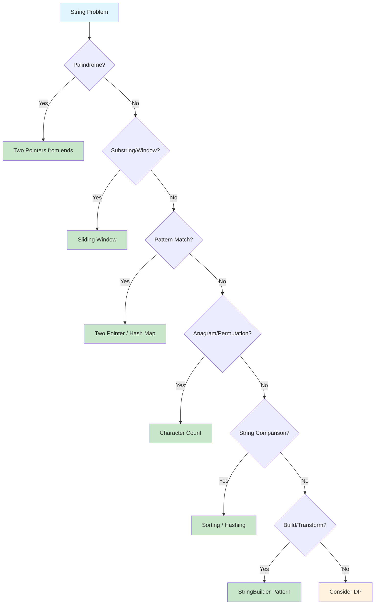

# String Manipulation

> **Essential techniques for text processing problems**

---

## Overview

A **string** is a sequence of characters used to represent text. In Python, strings are **immutable** - once created, they cannot be modified. This fundamental property has significant implications for algorithm design and performance optimization.

### String Immutability in Python

```python
s = "hello"
s[0] = "H"  # TypeError: 'str' object does not support item assignment

# Instead, create a new string
s = "H" + s[1:]  # Creates new string "Hello"
```

**Key Implications:**
- String concatenation in a loop creates O(n) new strings, leading to O(n²) time complexity
- Use `"".join(list)` for efficient string building - O(n) time
- Slicing creates new string objects (memory consideration)

### Character Encoding

```python
# ASCII conversion
ord('a')     # 97 - character to ASCII value
chr(97)      # 'a' - ASCII value to character
ord('A')     # 65
ord('0')     # 48

# Unicode support
ord('é')     # 233
len('café')  # 4 (counts characters, not bytes)
```

### Common String Properties

| Property | Python Behavior | Interview Relevance |
|----------|----------------|---------------------|
| Immutability | Cannot modify in-place | Use list conversion for manipulation |
| Unicode | Full Unicode support | Handle international characters |
| Indexing | 0-based, negative allowed | `s[-1]` is last character |
| Slicing | Creates new strings | `s[i:j]` excludes index j |
| Comparison | Lexicographic order | `"apple" < "banana"` is True |

---

## Document Structure

| Problem | Difficulty | Pattern | Link |
|---------|------------|---------|------|
| Valid Palindrome | Easy | Two Pointer | [Link](./palindrome-common) |
| Reverse String | Easy | Two Pointer | [Link](./reverse-string) |
| Valid Anagram | Easy | Character Count | [Link](./anagram-problems) |
| First Unique Character | Easy | Hash Map | [Link](./first-unique-char) |
| Longest Common Prefix | Easy | Vertical Scanning | [Link](./longest-common-prefix) |
| Longest Substring Without Repeat | Medium | Sliding Window | [Link](./substring-problems) |
| Longest Palindromic Substring | Medium | Expand Around Center | [Link](./longest-palindromic-substring) |
| Group Anagrams | Medium | Hash Map + Sorting | [Link](./group-anagrams) |
| String to Integer (atoi) | Medium | State Machine | [Link](./string-to-integer) |
| Palindrome Partitioning | Medium | Backtracking + DP | [Link](./palindrome-partitioning) |
| Minimum Window Substring | Hard | Sliding Window | [Link](./minimum-window-substring) |
| Edit Distance | Hard | Dynamic Programming | [Link](./edit-distance) |
| Regular Expression Matching | Hard | Dynamic Programming | [Link](./regex-matching) |
| Wildcard Matching | Hard | Dynamic Programming | [Link](./wildcard-matching) |

---

## String Operations in Python

### Basic Operations

```python
# Common operations
s = "hello"
s.lower(), s.upper()        # Case conversion: ('hello', 'HELLO')
s.strip()                   # Remove leading/trailing whitespace
s.split(" ")                # Split into list: ['hello']
"-".join(["a", "b", "c"])   # Join list: 'a-b-c'
s[::-1]                     # Reverse: 'olleh'
s.isalnum()                 # Check alphanumeric: True
s.isalpha()                 # Check alphabetic: True
s.isdigit()                 # Check numeric: False
ord('a'), chr(97)           # ASCII conversion: (97, 'a')
```

### String Methods Reference

```python
# Searching
s.find("ll")                # 2 (returns -1 if not found)
s.index("ll")               # 2 (raises ValueError if not found)
s.count("l")                # 2
s.startswith("he")          # True
s.endswith("lo")            # True
"ell" in s                  # True (membership test)

# Modification (returns new string)
s.replace("l", "L")         # "heLLo"
s.capitalize()              # "Hello"
s.title()                   # "Hello" (each word capitalized)
s.swapcase()                # "HELLO" (if s was "hello")
s.zfill(10)                 # "00000hello" (zero-padding)
s.center(11)                # "   hello   " (center with spaces)
s.ljust(10), s.rjust(10)    # Left/right justify

# Splitting and Joining
"a,b,c".split(",")          # ['a', 'b', 'c']
"a  b  c".split()           # ['a', 'b', 'c'] (splits on whitespace)
"a\nb\nc".splitlines()      # ['a', 'b', 'c']
" ".join(['a', 'b', 'c'])   # 'a b c'
```

### Efficient String Building

```python
# WRONG: O(n²) due to string concatenation
result = ""
for char in chars:
    result += char  # Creates new string each iteration

# CORRECT: O(n) using list and join
result = []
for char in chars:
    result.append(char)
return "".join(result)

# BEST: O(n) using list comprehension
result = "".join([char for char in chars])
```

---

## String Patterns Overview

### Pattern Selection Flowchart



### Pattern Quick Reference

| Pattern | When to Use | Example Problems | Time Complexity |
|---------|-------------|------------------|-----------------|
| **Two Pointers** | Palindrome check, reverse, compare | Valid Palindrome, Reverse String | O(n) |
| **Sliding Window** | Substring with constraints | Longest Substring Without Repeat | O(n) |
| **Character Count** | Anagrams, frequency-based | Valid Anagram, Group Anagrams | O(n) |
| **Hash Map** | Pattern matching, lookups | Two Sum (string variant) | O(n) |
| **StringBuilder** | String construction | String building in loops | O(n) |
| **Dynamic Programming** | Edit distance, subsequence | Edit Distance, LCS | O(n*m) |
| **Trie** | Prefix matching, autocomplete | Search Autocomplete System | O(n) per operation |

---

## Common String Techniques

### 1. Two Pointers (Palindrome, Reverse)

```python
def is_palindrome(s: str) -> bool:
    """Check if string is palindrome, ignoring non-alphanumeric."""
    left, right = 0, len(s) - 1

    while left < right:
        # Skip non-alphanumeric
        while left < right and not s[left].isalnum():
            left += 1
        while left < right and not s[right].isalnum():
            right -= 1

        if s[left].lower() != s[right].lower():
            return False

        left += 1
        right -= 1

    return True

def reverse_string(s: list) -> None:
    """Reverse string in-place (given as list of chars)."""
    left, right = 0, len(s) - 1
    while left < right:
        s[left], s[right] = s[right], s[left]
        left += 1
        right -= 1
```

### 2. Sliding Window (Substring Problems)

```python
def longest_unique_substring(s: str) -> int:
    """Find length of longest substring without repeating characters."""
    char_index = {}  # char -> last seen index
    max_length = 0
    left = 0

    for right, char in enumerate(s):
        # If char seen and within current window, shrink window
        if char in char_index and char_index[char] >= left:
            left = char_index[char] + 1

        char_index[char] = right
        max_length = max(max_length, right - left + 1)

    return max_length
```

### 3. Hash Map for Character Counting

```python
from collections import Counter

def is_anagram(s: str, t: str) -> bool:
    """Check if two strings are anagrams."""
    if len(s) != len(t):
        return False
    return Counter(s) == Counter(t)

def group_anagrams(strs: list) -> list:
    """Group strings that are anagrams of each other."""
    groups = {}
    for s in strs:
        key = tuple(sorted(s))  # or use character count tuple
        groups.setdefault(key, []).append(s)
    return list(groups.values())

# Efficient character count using array (for lowercase letters only)
def char_count_array(s: str) -> list:
    """Count character frequencies using array instead of dict."""
    count = [0] * 26
    for char in s:
        count[ord(char) - ord('a')] += 1
    return count
```

### 4. StringBuilder Pattern for Efficiency

```python
def efficient_string_build(words: list) -> str:
    """Build string efficiently using list and join."""
    result = []
    for word in words:
        result.append(word)
    return " ".join(result)

# String transformation with list
def to_uppercase_manual(s: str) -> str:
    """Convert to uppercase without using .upper()"""
    result = []
    for char in s:
        if 'a' <= char <= 'z':
            result.append(chr(ord(char) - 32))  # ASCII difference
        else:
            result.append(char)
    return "".join(result)
```

### 5. Expand Around Center (Palindrome Substrings)

```python
def longest_palindrome(s: str) -> str:
    """Find longest palindromic substring using expand around center."""
    def expand(left: int, right: int) -> str:
        while left >= 0 and right < len(s) and s[left] == s[right]:
            left -= 1
            right += 1
        return s[left + 1:right]

    result = ""
    for i in range(len(s)):
        # Odd length palindrome (single center)
        odd = expand(i, i)
        if len(odd) > len(result):
            result = odd

        # Even length palindrome (two centers)
        even = expand(i, i + 1)
        if len(even) > len(result):
            result = even

    return result
```

---

## String Complexity Reference

| Operation | Time | Space | Notes |
|-----------|------|-------|-------|
| Access `s[i]` | O(1) | O(1) | Direct index access |
| Slice `s[i:j]` | O(j-i) | O(j-i) | Creates new string |
| Concatenate `s + t` | O(n+m) | O(n+m) | Creates new string |
| Find `s.find(t)` | O(n*m) | O(1) | Naive search |
| Split `s.split()` | O(n) | O(n) | Creates list of strings |
| Join `"".join(list)` | O(n) | O(n) | Total length of strings |
| Compare `s == t` | O(n) | O(1) | Character by character |
| Sort chars | O(n log n) | O(n) | `sorted(s)` returns list |
| `in` operator | O(n*m) | O(1) | Substring search |
| Counter(s) | O(n) | O(k) | k = unique characters |

---

## Google Interview Focus

Based on recent Google SDE interview patterns (2025-2026), these string topics are most frequently tested:

### High Priority Topics

1. **Palindrome Variations** - Check palindrome, longest palindromic substring, partition into palindromes
2. **Substring Problems** - Finding substrings with specific properties (unique chars, anagrams)
3. **String Matching** - Pattern matching, subsequence verification
4. **Anagram Problems** - Check anagrams, group anagrams, find anagram indices
5. **String Manipulation** - State transitions, character movements, transformations

### Common Google String Questions

| Question Type | Example Problem | Key Insight |
|--------------|-----------------|-------------|
| Palindrome Check | "Valid Palindrome" | Two pointers, skip non-alphanumeric |
| Longest Palindrome | "Longest Palindromic Substring" | Expand around center technique |
| Unique Substring | "Longest Substring Without Repeat" | Sliding window with hash map |
| Anagram Detection | "Group Anagrams" | Sorted string or char count as key |
| String State Machine | "String to Integer (atoi)" | Handle edge cases systematically |
| Subsequence Match | "Is Subsequence" | Two pointers technique |
| Pattern Matching | "Find all anagrams in string" | Sliding window with frequency map |

### Recent Google Interview Examples

From 2025 interview reports:
- **String Manipulation with State Transitions**: Analyze character movements based on rules, determine reachability between states
- **Substring Pattern Matching**: "Find all matches of a small string in a big string" - start with naive solution, optimize to rolling hash or KMP
- **Special Subsequences**: Determine if all subsequences of length >= 3 are "special" based on given criteria

### What Interviewers Look For

1. **Edge Cases to Consider**
   - Empty string
   - Single character
   - All same characters
   - Unicode/special characters
   - Very long strings (efficiency matters)

2. **Common Follow-ups**
   - "Can you do it in-place?"
   - "What if the string is very large?"
   - "How would you handle Unicode?"
   - "Can you optimize the space complexity?"

3. **Clean Code Practices**
   - Handle edge cases first
   - Use meaningful variable names
   - Consider string immutability in design
   - Prefer `join()` over concatenation

---

## Practice Progression

### Week 1: Foundations

| Day | Focus | Problems |
|-----|-------|----------|
| 1 | Basic Operations | Valid Palindrome, Reverse String, Valid Anagram |
| 2 | Two Pointers | Is Subsequence, Longest Common Prefix |
| 3 | Character Counting | First Unique Character, Ransom Note |

### Week 2: Intermediate

| Day | Focus | Problems |
|-----|-------|----------|
| 4 | Sliding Window | Longest Substring Without Repeat, Minimum Window Substring |
| 5 | Palindrome Patterns | Longest Palindromic Substring, Palindrome Partitioning |
| 6 | Anagram Problems | Group Anagrams, Find All Anagrams in String |

### Week 3: Advanced

| Day | Focus | Problems |
|-----|-------|----------|
| 7 | Dynamic Programming | Edit Distance, Longest Common Subsequence |
| 8 | Pattern Matching | Regular Expression Matching, Wildcard Matching |
| 9 | Mixed Practice | String to Integer, Decode Ways, Word Break |

---

## Quick Reference Card

### Time Complexity Cheat Sheet

```
Access:       O(1)       - s[i]
Slice:        O(k)       - s[i:j] where k = j-i
Concatenate:  O(n+m)     - s + t (avoid in loops!)
Find/in:      O(n*m)     - substring search
Split/Join:   O(n)       - total character count
Sort chars:   O(n log n) - sorted(s)
```

### Pattern Recognition Triggers

| If you see... | Think about... |
|--------------|----------------|
| "Palindrome" | Two Pointers, Expand Around Center |
| "Anagram" | Character Count (Counter or array) |
| "Substring" | Sliding Window |
| "Subsequence" | Two Pointers, DP |
| "Pattern matching" | Hash Map, Two Pointers |
| "In-place modify" | Convert to list, two pointers |
| "Longest/shortest with constraint" | Sliding Window |
| "Edit/transform" | Dynamic Programming |
| "Prefix matching" | Trie |

### ASCII Quick Reference

```
'A' = 65    'Z' = 90    (uppercase letters)
'a' = 97    'z' = 122   (lowercase letters)
'0' = 48    '9' = 57    (digits)

# Conversions
lowercase to uppercase: chr(ord(c) - 32)
uppercase to lowercase: chr(ord(c) + 32)
char to digit: ord(c) - ord('0')
digit to char: chr(d + ord('0'))
```

---

## Resources

### Recommended Practice

- [LeetCode String Problems](https://leetcode.com/tag/string/)
- [NeetCode String Playlist](https://neetcode.io/roadmap)
- [Grind 75 - String Section](https://www.techinterviewhandbook.org/grind75)

### Further Reading

- [GeeksforGeeks - Top 50 String Problems](https://www.geeksforgeeks.org/top-50-string-coding-problems-for-interviews/)
- [Tech Interview Handbook - String Cheatsheet](https://www.techinterviewhandbook.org/algorithms/string/)
- [Google SDE Sheet - Interview Questions](https://www.geeksforgeeks.org/google-sde-sheet-interview-questions-and-answers/)
- [HackerRank - String Manipulation Interview Kit](https://www.hackerrank.com/interview/interview-preparation-kit/strings/challenges)
- [TakeUForward - String Interview Questions](https://takeuforward.org/string/top-string-interview-questions-structured-path-with-video-solutions)

---

*Last updated: January 2026*

*Strings are fundamental to coding interviews. Understanding Python's immutability, mastering the core patterns (two pointers, sliding window, character counting), and practicing efficient string building will prepare you for the majority of string problems you'll encounter.*
