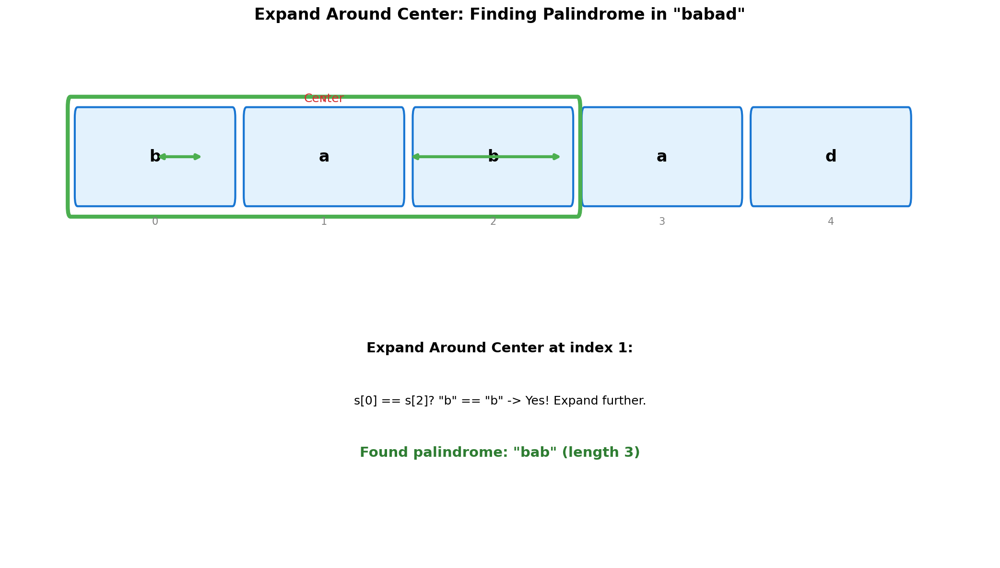
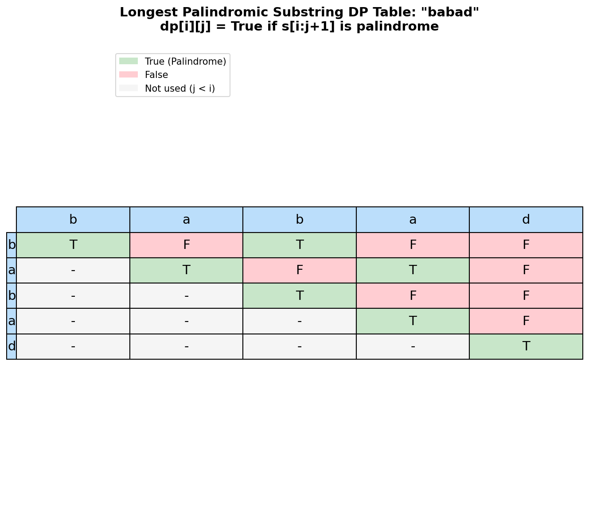

# Longest Palindromic Substring

> **Expand around center and dynamic programming approaches**

Finding the longest palindromic substring is one of the most classic string problems in technical interviews. It tests your understanding of palindrome properties, dynamic programming, and the efficient "expand around center" technique.

---

## Problem Statement

Given a string `s`, return the **longest palindromic substring** in `s`.

A **palindrome** is a string that reads the same forward and backward.

This is [LeetCode Problem #5](https://leetcode.com/problems/longest-palindromic-substring/) - a Medium difficulty problem.

### Examples

| Input | Output | Explanation |
|-------|--------|-------------|
| `"babad"` | `"bab"` or `"aba"` | Both are valid length-3 palindromes |
| `"cbbd"` | `"bb"` | Longest palindrome has length 2 |
| `"a"` | `"a"` | Single character is a palindrome |
| `"racecar"` | `"racecar"` | Entire string is a palindrome |
| `"ac"` | `"a"` or `"c"` | No length-2 palindrome |

### Constraints

- `1 <= s.length <= 1000`
- `s` consist of only digits and English letters

---

## Approach 1: Expand Around Center (Recommended)

### Key Insight

Every palindrome has a **center**:
- **Odd-length palindromes**: Center is a single character (e.g., "aba" centered at 'b')
- **Even-length palindromes**: Center is between two characters (e.g., "abba" centered between the two 'b's)

### Algorithm

1. For each index `i` from 0 to n-1:
   - Expand around `i` as center (odd-length)
   - Expand around `(i, i+1)` as center (even-length)
2. Track the longest palindrome found
3. Return the longest substring

### Visualization



### Mermaid Diagram

```mermaid
flowchart TD
    A[Start: result = ''] --> B[For each index i]
    B --> C[Expand odd: center at i]
    C --> D[While s[left] == s[right]]
    D --> E[Expand left--, right++]
    E --> D
    D --> F{Palindrome > result?}
    F -->|Yes| G[Update result]
    F -->|No| H[Keep result]
    G --> I[Expand even: center at i, i+1]
    H --> I
    I --> J[While s[left] == s[right]]
    J --> K[Expand left--, right++]
    K --> J
    J --> L{Palindrome > result?}
    L -->|Yes| M[Update result]
    L -->|No| N[Keep result]
    M --> O{More indices?}
    N --> O
    O -->|Yes| B
    O -->|No| P[Return result]

    style P fill:#c8e6c9
```

### Visual Walkthrough

For input `"babad"`:

```
Index 0 ('b'):
  Odd:  Expand (0,0) -> "b"
        Can't expand further (left would be -1)
  Even: Expand (0,1) -> 'b' != 'a', stop
  Best so far: "b"

Index 1 ('a'):
  Odd:  Expand (1,1) -> "a"
        Expand (0,2) -> 'b' == 'b'? YES! "bab"
        Expand (-1,3) -> out of bounds
  Even: Expand (1,2) -> 'a' != 'b', stop
  Best so far: "bab" (length 3)

Index 2 ('b'):
  Odd:  Expand (2,2) -> "b"
        Expand (1,3) -> 'a' == 'a'? YES! "aba"
        Expand (0,4) -> 'b' != 'd', stop
  Even: Expand (2,3) -> 'b' != 'a', stop
  Best so far: "bab" (still length 3)

Index 3 ('a'):
  Odd:  Expand (3,3) -> "a"
        Can expand (2,4) -> 'b' != 'd', stop
  Even: Expand (3,4) -> 'a' != 'd', stop
  Best so far: "bab"

Index 4 ('d'):
  Odd:  Expand (4,4) -> "d"
  Even: Can't expand (5 out of bounds)
  Best so far: "bab"

Result: "bab"
```

### Solution

::: code-group

```python [Python]
def longestPalindrome(s: str) -> str:
    """
    Find the longest palindromic substring using expand around center.

    Args:
        s: Input string

    Returns:
        Longest palindromic substring

    Time: O(n^2) - for each center, expand up to n/2 times
    Space: O(1) - only using pointers
    """
    if not s:
        return ""

    def expand(left: int, right: int) -> str:
        """Expand around center and return the palindrome."""
        while left >= 0 and right < len(s) and s[left] == s[right]:
            left -= 1
            right += 1
        # When loop exits, left and right are one step beyond the palindrome
        return s[left + 1:right]

    result = ""

    for i in range(len(s)):
        # Odd length palindrome (single center)
        odd = expand(i, i)
        if len(odd) > len(result):
            result = odd

        # Even length palindrome (center between i and i+1)
        even = expand(i, i + 1)
        if len(even) > len(result):
            result = even

    return result
```

```java [Java]
public String longestPalindrome(String s) {
    if (s == null || s.isEmpty()) return "";
    int start = 0, maxLen = 1;

    for (int i = 0; i < s.length(); i++) {
        // Odd length
        int len1 = expand(s, i, i);
        // Even length
        int len2 = expand(s, i, i + 1);
        int len = Math.max(len1, len2);
        if (len > maxLen) {
            maxLen = len;
            start = i - (len - 1) / 2;
        }
    }
    return s.substring(start, start + maxLen);
}

private int expand(String s, int left, int right) {
    while (left >= 0 && right < s.length() && s.charAt(left) == s.charAt(right)) {
        left--;
        right++;
    }
    return right - left - 1;
}
```

:::


::: info Complexity: Time O(n^2) - Space O(1)
- **Time:** O(n^2) because for each of n centers, expansion can take up to O(n/2) steps in the worst case (all same characters).
- **Space:** O(1) as we only use a few pointer variables. The returned substring is just a slice reference.
:::

### Optimized Version (Return Indices)

```python
def longestPalindrome_optimized(s: str) -> str:
    """
    Optimized to avoid creating substring objects during search.
    """
    if not s:
        return ""

    start, max_len = 0, 1

    def expand(left: int, right: int) -> tuple[int, int]:
        """Return (start_index, length) of palindrome."""
        while left >= 0 and right < len(s) and s[left] == s[right]:
            left -= 1
            right += 1
        return left + 1, right - left - 1

    for i in range(len(s)):
        # Odd length
        odd_start, odd_len = expand(i, i)
        if odd_len > max_len:
            start, max_len = odd_start, odd_len

        # Even length
        even_start, even_len = expand(i, i + 1)
        if even_len > max_len:
            start, max_len = even_start, even_len

    return s[start:start + max_len]
```

::: info Complexity: Time O(n^2) - Space O(1)
- **Time:** O(n^2) - same as basic version, but avoids creating substring objects during search by tracking indices.
- **Space:** O(1) - only stores start index and max length as integers.
:::

---

## Approach 2: Dynamic Programming

### Key Insight

Define `dp[i][j]` = True if substring `s[i:j+1]` is a palindrome.

**Recurrence:**
- Base case: `dp[i][i] = True` (single characters)
- Base case: `dp[i][i+1] = (s[i] == s[i+1])` (two characters)
- General: `dp[i][j] = (s[i] == s[j]) AND dp[i+1][j-1]`

### DP Table Visualization



### Solution

```python
def longestPalindrome_dp(s: str) -> str:
    """
    Find longest palindromic substring using dynamic programming.

    Time: O(n^2) - fill n x n table
    Space: O(n^2) - store n x n table
    """
    n = len(s)
    if n == 0:
        return ""

    # dp[i][j] = True if s[i:j+1] is a palindrome
    dp = [[False] * n for _ in range(n)]

    start = 0
    max_len = 1

    # Base case: single characters are palindromes
    for i in range(n):
        dp[i][i] = True

    # Base case: check length 2 substrings
    for i in range(n - 1):
        if s[i] == s[i + 1]:
            dp[i][i + 1] = True
            start = i
            max_len = 2

    # Check substrings of length 3 and greater
    for length in range(3, n + 1):
        for i in range(n - length + 1):
            j = i + length - 1  # Ending index

            # s[i:j+1] is palindrome if s[i]==s[j] and s[i+1:j] is palindrome
            if s[i] == s[j] and dp[i + 1][j - 1]:
                dp[i][j] = True
                start = i
                max_len = length

    return s[start:start + max_len]
```

::: info Complexity: Time O(n^2) - Space O(n^2)
- **Time:** O(n^2) to fill the n x n DP table, checking each possible substring once.
- **Space:** O(n^2) for the 2D boolean DP table storing palindrome status for all substrings.
:::

### Space-Optimized DP

```python
def longestPalindrome_dp_optimized(s: str) -> str:
    """
    Space-optimized DP - only store current and previous rows.

    Note: This is complex and the expand-around-center approach
    is usually preferred for O(1) space.

    Time: O(n^2)
    Space: O(n)
    """
    n = len(s)
    if n <= 1:
        return s

    # We can reduce to O(n) space by only keeping necessary info
    # But expand-around-center is simpler for O(1) space
    # Including this for completeness

    longest = s[0]

    # For each ending position
    for j in range(1, n):
        # Check odd-length palindromes ending at j
        for i in range(j + 1):
            length = j - i + 1
            if length > len(longest):
                # Check if s[i:j+1] is palindrome
                if s[i:j+1] == s[i:j+1][::-1]:
                    longest = s[i:j+1]

    return longest
```

::: info Complexity: Time O(n^3) - Space O(n)
- **Time:** O(n^3) because for each ending position j (O(n)), we check all starting positions (O(n)), and reversing/comparing takes O(n).
- **Space:** O(n) for storing the longest palindrome substring and temporary reversed strings.
:::

---

## Approach 3: Manacher's Algorithm (O(n))

For optimal O(n) time complexity, use Manacher's algorithm. This is rarely expected in interviews but worth knowing.

```python
def longestPalindrome_manacher(s: str) -> str:
    """
    Find longest palindromic substring using Manacher's algorithm.

    Time: O(n)
    Space: O(n)

    Key idea: Transform string to handle odd/even uniformly,
    then use previously computed palindrome info to skip work.
    """
    # Transform: "abc" -> "^#a#b#c#$"
    # This makes all palindromes odd-length
    T = '^#' + '#'.join(s) + '#$'
    n = len(T)
    P = [0] * n  # P[i] = radius of palindrome centered at i

    center = right = 0  # Current rightmost palindrome

    for i in range(1, n - 1):
        if i < right:
            # Mirror of i with respect to center
            mirror = 2 * center - i
            P[i] = min(right - i, P[mirror])

        # Try to expand palindrome centered at i
        while T[i + P[i] + 1] == T[i - P[i] - 1]:
            P[i] += 1

        # Update center and right boundary
        if i + P[i] > right:
            center, right = i, i + P[i]

    # Find the maximum element in P
    max_len, center_index = max((val, idx) for idx, val in enumerate(P))

    # Convert back to original string indices
    start = (center_index - max_len) // 2
    return s[start:start + max_len]
```

::: info Complexity: Time O(n) - Space O(n)
- **Time:** O(n) because each position is visited at most twice due to the center/right boundary optimization that skips redundant work.
- **Space:** O(n) for the transformed string T (length 2n+3) and the P array storing palindrome radii.
:::

---

## Complexity Comparison

| Approach | Time | Space | Interview Preference |
|----------|------|-------|---------------------|
| Brute Force | O(n^3) | O(1) | Never use |
| Expand Around Center | O(n^2) | O(1) | **Recommended** |
| Dynamic Programming | O(n^2) | O(n^2) | Good for explanation |
| Manacher's | O(n) | O(n) | If asked specifically |

---

## Edge Cases

| Case | Input | Output | Note |
|------|-------|--------|------|
| Empty | `""` | `""` | Handle early |
| Single char | `"a"` | `"a"` | Always palindrome |
| Two same | `"aa"` | `"aa"` | Even-length palindrome |
| Two different | `"ab"` | `"a"` or `"b"` | Either char works |
| All same | `"aaaa"` | `"aaaa"` | Whole string |
| No palindrome > 1 | `"abcd"` | `"a"` | Any single char |

---

## Related Problem: Count Palindromic Substrings

LeetCode 647: Count all palindromic substrings.

```python
def countSubstrings(s: str) -> int:
    """
    Count the number of palindromic substrings.

    Same expand-around-center technique, just count instead of track max.

    Time: O(n^2)
    Space: O(1)
    """
    def expand(left: int, right: int) -> int:
        count = 0
        while left >= 0 and right < len(s) and s[left] == s[right]:
            count += 1
            left -= 1
            right += 1
        return count

    total = 0
    for i in range(len(s)):
        total += expand(i, i)      # Odd length
        total += expand(i, i + 1)  # Even length

    return total
```

::: info Complexity: Time O(n^2) - Space O(1)
- **Time:** O(n^2) - same expand-around-center technique, summing counts instead of tracking max.
- **Space:** O(1) - only uses integer counter and loop variables.
:::

---

## Interview Tips

1. **Start with expand-around-center**: It's O(1) space and intuitive
2. **Explain odd vs even**: Show you understand both cases
3. **Mention DP if asked**: Good for explaining the subproblem structure
4. **Know Manacher's exists**: Mention it's O(n) but complex

### Common Follow-up Questions

- **"Can you do better than O(n^2)?"** - Yes, Manacher's is O(n)
- **"What about counting all palindromes?"** - Same technique, just count
- **"What if we need the longest palindromic subsequence?"** - Different problem, use DP

---

## Related Problems

::: details Palindromic Substrings (LeetCode 647)
**Problem:** Given a string s, return the number of palindromic substrings in it. Substrings with different start/end indexes are counted separately.

**Key Insight:** Use the same expand-around-center technique, but count instead of tracking max length.

**Approach:** For each center (both single character and between characters), expand outward and increment count for each valid palindrome found.

**Complexity:** O(n^2) time, O(1) space
:::

::: details Longest Palindromic Subsequence (LeetCode 516)
**Problem:** Given a string s, find the longest palindromic subsequence's length. Unlike substrings, subsequences don't need to be contiguous.

**Key Insight:** This is equivalent to finding the Longest Common Subsequence (LCS) between s and its reverse.

**Approach:** Use 2D DP where dp[i][j] represents the longest palindromic subsequence in s[i:j+1]. If characters match, add 2 to inner result; otherwise, take max of excluding either end.

**Complexity:** O(n^2) time, O(n^2) space (can be optimized to O(n))
:::

::: details Palindrome Partitioning (LeetCode 131)
**Problem:** Partition a string such that every substring is a palindrome. Return all possible palindrome partitionings.

**Key Insight:** Use backtracking to explore all partition points, only proceeding when current partition is a palindrome.

**Approach:** At each position, try all possible palindrome prefixes and recursively partition the remainder. Precompute palindrome table for O(1) checks.

**Complexity:** O(n * 2^n) time, O(n^2) space for DP table
:::

::: details Valid Palindrome (LeetCode 125)
**Problem:** Given a string, determine if it is a palindrome considering only alphanumeric characters and ignoring case.

**Key Insight:** Use two pointers from both ends, skipping non-alphanumeric characters.

**Approach:** Initialize left and right pointers. Skip non-alphanumeric chars, compare lowercase versions, move pointers inward until they meet.

**Complexity:** O(n) time, O(1) space
:::

::: details Shortest Palindrome (LeetCode 214)
**Problem:** Given a string s, add characters in front of it to make it a palindrome. Return the shortest such palindrome.

**Key Insight:** Find the longest palindrome starting from index 0, then prepend the reverse of the remaining suffix.

**Approach:** Use KMP failure function on s + "#" + reverse(s) to find the longest palindromic prefix. Or use rolling hash for O(n) solution.

**Complexity:** O(n) time with KMP, O(n) space
:::

---

## Summary

| Key Point | Details |
|-----------|---------|
| Best Approach | Expand Around Center |
| Time Complexity | O(n^2) |
| Space Complexity | O(1) |
| Key Insight | Every palindrome has a center |

**Takeaway:** The expand-around-center technique is the go-to approach for palindrome substring problems. It's intuitive, efficient (O(1) space), and easy to implement correctly under interview pressure.

---

## References

- [LeetCode - Longest Palindromic Substring](https://leetcode.com/problems/longest-palindromic-substring/)
- [GeeksforGeeks - Longest Palindromic Substring](https://www.geeksforgeeks.org/longest-palindrome-substring-set-1/)
- [NeetCode - Longest Palindromic Substring](https://neetcode.io/problems/longest-palindromic-substring)
