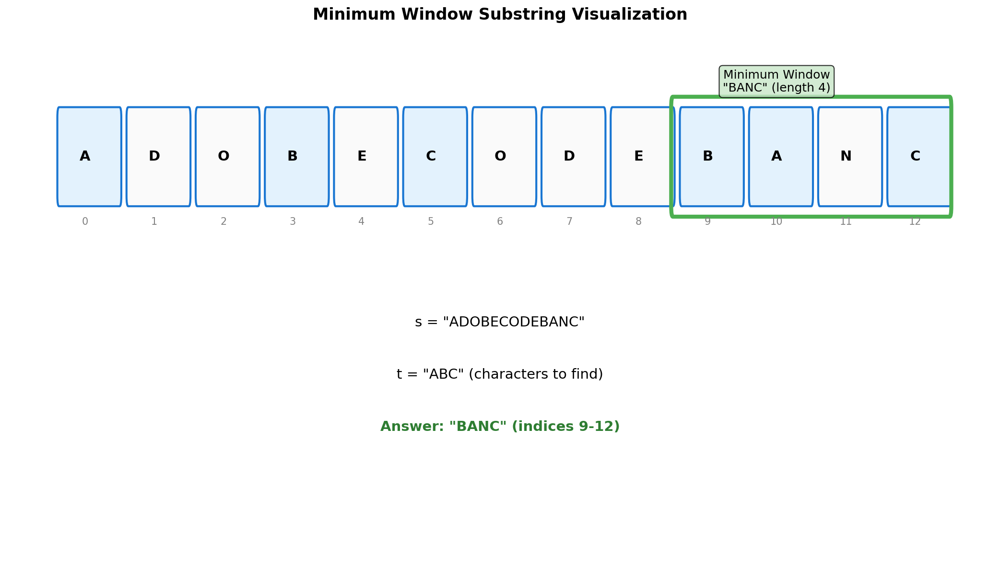
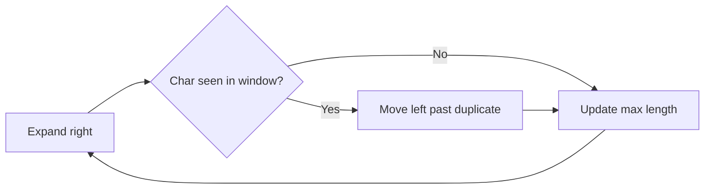

# Minimum Window Substring

> **Advanced sliding window with character frequency tracking**

Minimum Window Substring is one of the most challenging sliding window problems and a favorite in technical interviews at top companies. It tests your ability to maintain complex window state and optimize window contractions.

---

## Problem Statement

Given two strings `s` and `t` of lengths `m` and `n` respectively, return the **minimum window substring** of `s` such that every character in `t` (including duplicates) is included in the window. If there is no such substring, return the empty string `""`.

The testcases are generated such that the answer is **unique**.

This is [LeetCode Problem #76](https://leetcode.com/problems/minimum-window-substring/) - a Hard difficulty problem.

### Examples

| s | t | Output | Explanation |
|---|---|--------|-------------|
| `"ADOBECODEBANC"` | `"ABC"` | `"BANC"` | Contains A, B, C in minimum length |
| `"a"` | `"a"` | `"a"` | Exact match |
| `"a"` | `"aa"` | `""` | Need 2 A's, only have 1 |
| `"ab"` | `"b"` | `"b"` | Single character match |

### Constraints

- `m == s.length`
- `n == t.length`
- `1 <= m, n <= 10^5`
- `s` and `t` consist of uppercase and lowercase English letters

---

## Visualization



---

## Approach: Sliding Window with Frequency Map

### Key Insight

Use two pointers to maintain a sliding window and track:
1. Character frequencies needed (from `t`)
2. Character frequencies in current window
3. Number of characters that have been "satisfied"

### Algorithm

1. Count all characters needed from `t`
2. Expand window (move `right`) until all characters are satisfied
3. Contract window (move `left`) while maintaining validity
4. Track the minimum valid window

### Mermaid Diagram

```mermaid
flowchart TD
    A[Initialize: need = Counter(t), have = 0] --> B[Expand: right++]
    B --> C[Add s[right] to window]
    C --> D{Window valid?<br/>have == required}
    D -->|No| B
    D -->|Yes| E[Update minimum if smaller]
    E --> F[Contract: left++]
    F --> G[Remove s[left] from window]
    G --> H{Still valid?}
    H -->|Yes| E
    H -->|No| I{right < len(s)?}
    I -->|Yes| B
    I -->|No| J[Return minimum window]

    style J fill:#c8e6c9
```

---

## Solution

```python
from collections import Counter

def minWindow(s: str, t: str) -> str:
    """
    Find minimum window substring containing all characters of t.

    Args:
        s: Source string to search in
        t: Target string with required characters

    Returns:
        Minimum window substring, or "" if not found

    Time: O(m + n) where m = len(s), n = len(t)
    Space: O(m + n) for the hash maps
    """
    if not t or not s:
        return ""

    # Count characters needed from t
    need = Counter(t)
    required = len(need)  # Number of unique characters to satisfy

    # Window state
    window = {}
    have = 0  # Number of unique characters satisfied

    # Result tracking
    result = float('inf'), None, None  # (length, left, right)

    left = 0
    for right in range(len(s)):
        # Add character from the right
        char = s[right]
        window[char] = window.get(char, 0) + 1

        # Check if this character's requirement is now satisfied
        if char in need and window[char] == need[char]:
            have += 1

        # Contract window while it's valid
        while have == required:
            # Update result if this window is smaller
            if (right - left + 1) < result[0]:
                result = (right - left + 1, left, right)

            # Remove character from the left
            left_char = s[left]
            window[left_char] -= 1

            # Check if we lost a satisfied character
            if left_char in need and window[left_char] < need[left_char]:
                have -= 1

            left += 1

    return "" if result[0] == float('inf') else s[result[1]:result[2] + 1]
```

::: info Complexity: Time O(m + n) - Space O(m + n)
- **Time:** O(m + n) where m = len(s), n = len(t). Each character in s visited at most twice (by left and right pointers). Counter creation is O(n).
- **Space:** O(m + n) for the need and window hash maps storing character frequencies.
:::

---

## Visual Walkthrough

For `s = "ADOBECODEBANC"`, `t = "ABC"`:

```
need = {A:1, B:1, C:1}, required = 3

Step 1-6: Expand until window is valid
  Window: [ADOBEC], have = 3 (A:1, B:1, C:1)
  Valid! Result = "ADOBEC" (length 6)

Step 7: Contract from left
  Remove 'A': have = 2 (missing A)
  Window: [DOBEC], invalid

Step 8-9: Expand
  Window: [DOBECODEB], have = 2

Step 10: Expand
  Window: [OBECODEBA], add 'A'
  have = 3, Valid! Result = "ADOBEC" still (length 6)

Step 11: Contract
  Remove 'D': still valid
  Remove 'O': still valid
  Remove 'B': have = 2, invalid
  Window: [ECODEBA]

Step 12: Expand to 'N'
  Window: [ECODEBAN]

Step 13: Expand to 'C'
  Window: [CODEBA NC], add 'C'
  have = 3, Valid!
  Contract...
  Best valid: "BANC" (length 4)

Result: "BANC"
```

---

## Optimized Solution: Using Array Instead of HashMap

For ASCII characters, using an array can be faster:

```python
def minWindow_optimized(s: str, t: str) -> str:
    """
    Optimized using array instead of hash map for ASCII.

    Time: O(m + n)
    Space: O(1) - fixed 128 size arrays
    """
    if not t or not s or len(t) > len(s):
        return ""

    # Frequency arrays for ASCII characters
    need = [0] * 128
    window = [0] * 128

    for char in t:
        need[ord(char)] += 1

    # Count unique characters needed
    required = sum(1 for x in need if x > 0)
    have = 0

    result_len = float('inf')
    result_start = 0

    left = 0
    for right in range(len(s)):
        # Add right character
        char_idx = ord(s[right])
        window[char_idx] += 1

        # Check if this character became satisfied
        if need[char_idx] > 0 and window[char_idx] == need[char_idx]:
            have += 1

        # Contract while valid
        while have == required:
            # Update result
            if right - left + 1 < result_len:
                result_len = right - left + 1
                result_start = left

            # Remove left character
            left_idx = ord(s[left])
            window[left_idx] -= 1

            if need[left_idx] > 0 and window[left_idx] < need[left_idx]:
                have -= 1

            left += 1

    return "" if result_len == float('inf') else s[result_start:result_start + result_len]
```

::: info Complexity: Time O(m + n) - Space O(1)
- **Time:** O(m + n) - same as hash map version, but with faster array access (no hashing overhead).
- **Space:** O(1) - fixed 128-element arrays regardless of input size (constant for ASCII charset).
:::

---

## Alternative: Track Matched Characters Directly

```python
def minWindow_matched(s: str, t: str) -> str:
    """
    Alternative approach tracking total matched characters.

    Instead of counting unique satisfied characters,
    count total characters matched.
    """
    if not t or not s:
        return ""

    need = Counter(t)
    total_needed = len(t)  # Total characters to match
    matched = 0

    result = ""
    min_len = float('inf')

    left = 0
    for right in range(len(s)):
        char = s[right]

        # If this character is needed and we haven't exceeded the need
        if need.get(char, 0) > 0:
            matched += 1
        need[char] = need.get(char, 0) - 1

        # Contract while valid
        while matched == total_needed:
            if right - left + 1 < min_len:
                min_len = right - left + 1
                result = s[left:right + 1]

            left_char = s[left]
            need[left_char] += 1

            if need[left_char] > 0:
                matched -= 1

            left += 1

    return result
```

::: info Complexity: Time O(m + n) - Space O(m + n)
- **Time:** O(m + n) - alternative counting approach tracks total characters matched instead of unique character types satisfied.
- **Space:** O(m + n) for the need counter storing character frequencies from t.
:::

---

## Complexity Analysis

| Metric | Value | Explanation |
|--------|-------|-------------|
| Time | O(m + n) | Each character visited at most twice (by left and right) |
| Space | O(m + n) | HashMap stores at most all unique chars |
| Space (Optimized) | O(1) | Fixed-size arrays for ASCII |

---

## Edge Cases

| Case | s | t | Output | Note |
|------|---|---|--------|------|
| No match possible | `"a"` | `"aa"` | `""` | Not enough chars |
| Exact match | `"abc"` | `"abc"` | `"abc"` | Whole string |
| Single char | `"a"` | `"a"` | `"a"` | Trivial match |
| Empty t | `"abc"` | `""` | `""` | Nothing to match |
| t longer than s | `"a"` | `"ab"` | `""` | Impossible |
| Case sensitive | `"aA"` | `"aa"` | `""` | 'A' != 'a' |

---

## Common Mistakes

| Mistake | Problem | Fix |
|---------|---------|-----|
| Not handling duplicates | `t = "aa"` requires 2 A's | Use Counter, not Set |
| Off-by-one in result | Wrong substring indices | Use `s[left:right+1]` |
| Not contracting enough | Missing smaller windows | Contract while valid |
| Comparing full counters | Slow O(k) comparison | Track `have` count |

---

## Interview Tips

1. **Clarify the problem**: Ask about case sensitivity, duplicates in t
2. **Start with brute force**: O(n^2) check all substrings
3. **Explain the optimization**: Sliding window reduces to O(n)
4. **Track satisfaction efficiently**: Use `have` counter instead of comparing maps
5. **Handle edge cases first**: Empty strings, t longer than s

### Follow-up Questions

- **"Can you do it in O(n)?"** - The solution above is O(m + n)
- **"What if t has duplicates?"** - Solution handles this with Counter
- **"What about Unicode?"** - Use dict instead of array

---

## Related Problems

::: details Find All Anagrams in a String (LeetCode 438)
**Problem:** Given strings s and p, return all start indices of p's anagrams in s. An anagram contains the same characters in any order.

**Key Insight:** Use a fixed-size sliding window of length p, comparing character frequencies.

**Approach:** Maintain frequency counts for current window and target. Slide window one character at a time, updating counts and checking for match.

```mermaid
flowchart LR
    A[Window size = len(p)] --> B[Slide right]
    B --> C[Add new char]
    C --> D[Remove old char]
    D --> E{Counts match?}
    E -->|Yes| F[Record index]
    E -->|No| B
```

**Complexity:** O(n) time, O(1) space (26 letters)
:::

::: details Permutation in String (LeetCode 567)
**Problem:** Given s1 and s2, return true if s2 contains any permutation of s1 as a substring.

**Key Insight:** Same as Find All Anagrams, but return boolean instead of indices.

**Approach:** Use fixed-size sliding window equal to len(s1). Compare character frequency counts as window slides through s2.

**Complexity:** O(n) time, O(1) space
:::

::: details Longest Substring Without Repeating Characters (LeetCode 3)
**Problem:** Given a string s, find the length of the longest substring without repeating characters.

**Key Insight:** Use variable-size sliding window that shrinks when duplicates are found.

**Approach:** Expand right pointer, track last seen index of each character. When duplicate found, move left pointer past the previous occurrence.



**Complexity:** O(n) time, O(min(m,n)) space where m is charset size
:::

::: details Substring with Concatenation of All Words (LeetCode 30)
**Problem:** Given string s and array of equal-length words, find all starting indices where a concatenation of all words (in any order) appears.

**Key Insight:** Sliding window with word-level granularity instead of character-level.

**Approach:** For each starting offset (0 to word_length-1), use sliding window of size total_words * word_length. Track word frequencies using hash map.

**Complexity:** O(n * m) time where n is string length and m is word length, O(k) space where k is number of words
:::

---

## Complete Solution with Tests

```python
from collections import Counter

def minWindow(s: str, t: str) -> str:
    """
    Find minimum window substring containing all characters of t.

    Time: O(m + n)
    Space: O(m + n)
    """
    if not t or not s:
        return ""

    need = Counter(t)
    required = len(need)

    window = {}
    have = 0

    result = float('inf'), 0, 0

    left = 0
    for right in range(len(s)):
        char = s[right]
        window[char] = window.get(char, 0) + 1

        if char in need and window[char] == need[char]:
            have += 1

        while have == required:
            if (right - left + 1) < result[0]:
                result = (right - left + 1, left, right)

            left_char = s[left]
            window[left_char] -= 1

            if left_char in need and window[left_char] < need[left_char]:
                have -= 1

            left += 1

    length, start, end = result
    return "" if length == float('inf') else s[start:end + 1]
```

::: info Complexity: Time O(m + n) - Space O(m + n)
- **Time:** O(m + n) where each character is visited at most twice by the sliding window pointers.
- **Space:** O(m + n) for hash maps storing character counts for both window and required characters.
:::

```python
# Test cases
if __name__ == "__main__":
    test_cases = [
        ("ADOBECODEBANC", "ABC", "BANC"),
        ("a", "a", "a"),
        ("a", "aa", ""),
        ("ab", "b", "b"),
        ("abc", "ac", "abc"),
        ("", "a", ""),
        ("a", "", ""),
        ("bba", "ab", "ba"),
    ]

    for s, t, expected in test_cases:
        result = minWindow(s, t)
        status = "PASS" if result == expected else "FAIL"
        print(f'{status}: minWindow("{s}", "{t}") = "{result}" (expected "{expected}")')
```

---

## Summary

| Key Point | Details |
|-----------|---------|
| Pattern | Sliding Window with Frequency Tracking |
| Key Insight | Track "satisfied" characters count for O(1) validity check |
| Time Complexity | O(m + n) |
| Space Complexity | O(m + n) or O(1) with array |

**Takeaway:** Minimum Window Substring is the quintessential advanced sliding window problem. The key optimization is tracking how many character requirements are satisfied rather than comparing entire frequency maps. Master this pattern as it applies to many similar substring problems.

---

## References

- [LeetCode - Minimum Window Substring](https://leetcode.com/problems/minimum-window-substring/)
- [NeetCode - Minimum Window Substring](https://neetcode.io/problems/minimum-window-substring)
- [GeeksforGeeks - Minimum Window Substring](https://www.geeksforgeeks.org/find-the-smallest-window-in-a-string-containing-all-characters-of-another-string/)
