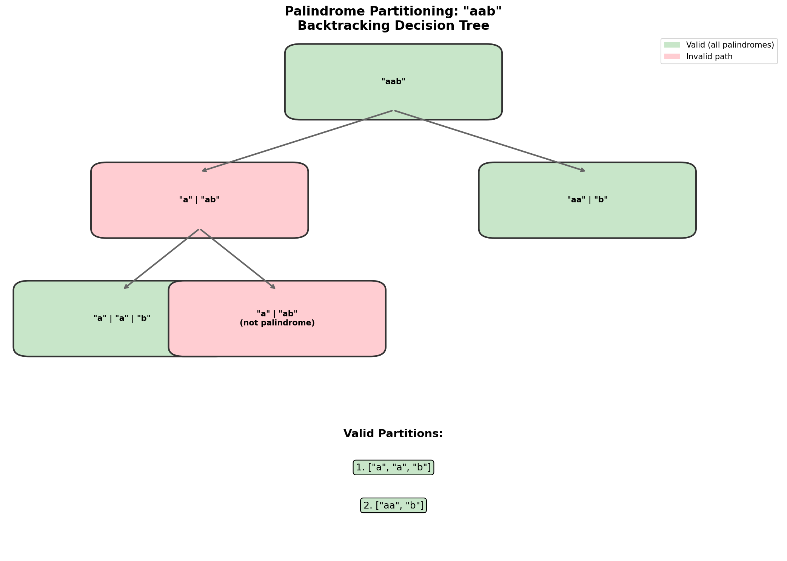

# Palindrome Partitioning

> **Backtracking with dynamic programming optimization**

Palindrome Partitioning is a classic backtracking problem that tests your ability to generate all valid solutions while efficiently checking palindrome conditions. It combines recursion, memoization, and string manipulation.

---

## Problem Statement

Given a string `s`, partition `s` such that every substring of the partition is a **palindrome**. Return all possible palindrome partitioning of `s`.

This is [LeetCode Problem #131](https://leetcode.com/problems/palindrome-partitioning/) - a Medium difficulty problem.

### Examples

| Input | Output |
|-------|--------|
| `"aab"` | `[["a","a","b"],["aa","b"]]` |
| `"a"` | `[["a"]]` |
| `"racecar"` | `[["r","a","c","e","c","a","r"],["r","aceca","r"],["racecar"]]` |

### Constraints

- `1 <= s.length <= 16`
- `s` contains only lowercase English letters

---

## Approach: Backtracking

### Key Insight

We need to explore all ways to partition the string such that each partition is a palindrome. This is a classic backtracking problem where we:

1. At each position, try all possible palindrome prefixes
2. Recursively partition the remaining string
3. If we reach the end, we've found a valid partition

### Decision Tree Visualization



### Mermaid Diagram

```mermaid
flowchart TD
    A[Start: s='aab', path=[]] --> B{Try all palindrome prefixes}
    B --> C["'a' is palindrome"]
    B --> D["'aa' is palindrome"]
    B --> E["'aab' NOT palindrome"]

    C --> F[Recurse: s='ab', path=['a']]
    F --> G["'a' is palindrome"]
    F --> H["'ab' NOT palindrome"]

    G --> I[Recurse: s='b', path=['a','a']]
    I --> J["'b' is palindrome"]
    J --> K["path=['a','a','b'] - VALID!"]

    D --> L[Recurse: s='b', path=['aa']]
    L --> M["'b' is palindrome"]
    M --> N["path=['aa','b'] - VALID!"]

    style K fill:#c8e6c9
    style N fill:#c8e6c9
```

### Algorithm

```
partition(s, start, path, result):
    if start == len(s):
        result.append(path.copy())
        return

    for end in range(start + 1, len(s) + 1):
        substring = s[start:end]
        if is_palindrome(substring):
            path.append(substring)
            partition(s, end, path, result)
            path.pop()  # backtrack
```

---

## Solution: Basic Backtracking

::: code-group

```python [Python]
def partition(s: str) -> list[list[str]]:
    """
    Find all palindrome partitions using backtracking.

    Args:
        s: Input string

    Returns:
        List of all valid palindrome partitions

    Time: O(n * 2^n) - 2^n possible partitions, O(n) to check each
    Space: O(n) for recursion depth + O(n) for current path
    """
    result = []

    def is_palindrome(string: str) -> bool:
        return string == string[::-1]

    def backtrack(start: int, path: list[str]) -> None:
        # Base case: reached end of string
        if start == len(s):
            result.append(path.copy())
            return

        # Try all possible substrings starting at 'start'
        for end in range(start + 1, len(s) + 1):
            substring = s[start:end]

            if is_palindrome(substring):
                # Choose
                path.append(substring)
                # Explore
                backtrack(end, path)
                # Unchoose (backtrack)
                path.pop()

    backtrack(0, [])
    return result
```

```java [Java]
public List<List<String>> partition(String s) {
    List<List<String>> result = new ArrayList<>();
    backtrack(s, 0, new ArrayList<>(), result);
    return result;
}

private void backtrack(String s, int start, List<String> path, List<List<String>> result) {
    if (start == s.length()) {
        result.add(new ArrayList<>(path));
        return;
    }
    for (int end = start + 1; end <= s.length(); end++) {
        String sub = s.substring(start, end);
        if (isPalin(sub)) {
            path.add(sub);
            backtrack(s, end, path, result);
            path.remove(path.size() - 1);
        }
    }
}

private boolean isPalin(String s) {
    int l = 0, r = s.length() - 1;
    while (l < r) {
        if (s.charAt(l++) != s.charAt(r--)) return false;
    }
    return true;
}
```

:::


::: info Complexity: Time O(n * 2^n) - Space O(n)
- **Time:** O(n * 2^n) - there are 2^(n-1) possible partitions (each gap can be cut or not), and each palindrome check is O(n).
- **Space:** O(n) for recursion stack depth plus O(n) for the current path being built.
:::

---

## Optimized Solution: DP + Backtracking

### Optimization: Precompute Palindrome Check

Instead of checking palindrome at each step (O(n)), precompute a DP table where `dp[i][j] = True` if `s[i:j+1]` is a palindrome.

```python
def partition_optimized(s: str) -> list[list[str]]:
    """
    Optimized palindrome partitioning with DP preprocessing.

    Time: O(n^2 + 2^n) - O(n^2) for DP table, O(2^n) for partitions
    Space: O(n^2) for DP table
    """
    n = len(s)
    result = []

    # Precompute palindrome DP table
    # dp[i][j] = True if s[i:j+1] is palindrome
    dp = [[False] * n for _ in range(n)]

    # Single characters are palindromes
    for i in range(n):
        dp[i][i] = True

    # Two characters
    for i in range(n - 1):
        dp[i][i + 1] = (s[i] == s[i + 1])

    # Length 3 and above
    for length in range(3, n + 1):
        for i in range(n - length + 1):
            j = i + length - 1
            dp[i][j] = (s[i] == s[j]) and dp[i + 1][j - 1]

    def backtrack(start: int, path: list[str]) -> None:
        if start == n:
            result.append(path.copy())
            return

        for end in range(start, n):
            if dp[start][end]:  # O(1) palindrome check
                path.append(s[start:end + 1])
                backtrack(end + 1, path)
                path.pop()

    backtrack(0, [])
    return result
```

::: info Complexity: Time O(n^2 + 2^n) - Space O(n^2)
- **Time:** O(n^2) to build the palindrome DP table plus O(2^n) for generating all partitions with O(1) palindrome checks.
- **Space:** O(n^2) for the DP table storing palindrome status for all (i, j) pairs.
:::

---

## Visual Walkthrough

For input `"aab"`:

```
                        partition("aab")
                              |
            +----------------+-----------------+
            |                                  |
     "a" palindrome?                    "aa" palindrome?
          YES                                YES
            |                                  |
    partition("ab")                    partition("b")
            |                                  |
    +-------+-------+                   "b" palindrome?
    |               |                        YES
"a" palin?    "ab" palin?                     |
   YES            NO                      END: ["aa","b"]
    |
partition("b")
    |
"b" palindrome?
   YES
    |
END: ["a","a","b"]

Results: [["a","a","b"], ["aa","b"]]
```

---

## Alternative: Using Memoization

```python
from functools import lru_cache

def partition_memo(s: str) -> list[list[str]]:
    """
    Using memoization for palindrome check.
    """
    @lru_cache(maxsize=None)
    def is_palindrome(i: int, j: int) -> bool:
        if i >= j:
            return True
        if s[i] != s[j]:
            return False
        return is_palindrome(i + 1, j - 1)

    result = []

    def backtrack(start: int, path: tuple) -> None:
        if start == len(s):
            result.append(list(path))
            return

        for end in range(start, len(s)):
            if is_palindrome(start, end):
                backtrack(end + 1, path + (s[start:end + 1],))

    backtrack(0, ())
    return result
```

---

## Related Problem: Palindrome Partitioning II (Minimum Cuts)

LeetCode 132: Find the **minimum** number of cuts needed.

```python
def minCut(s: str) -> int:
    """
    Find minimum cuts for palindrome partitioning.

    This is a DP problem, not backtracking.

    dp[i] = minimum cuts for s[0:i+1]

    Time: O(n^2)
    Space: O(n^2) for palindrome table, O(n) for dp array
    """
    n = len(s)
    if n <= 1:
        return 0

    # Precompute palindrome table
    is_palin = [[False] * n for _ in range(n)]
    for i in range(n - 1, -1, -1):
        for j in range(i, n):
            if s[i] == s[j] and (j - i < 2 or is_palin[i + 1][j - 1]):
                is_palin[i][j] = True

    # dp[i] = min cuts for s[0:i+1]
    dp = list(range(n))  # Worst case: cut after each char

    for i in range(n):
        if is_palin[0][i]:
            dp[i] = 0  # Entire prefix is palindrome
        else:
            for j in range(i):
                if is_palin[j + 1][i]:
                    dp[i] = min(dp[i], dp[j] + 1)

    return dp[n - 1]
```

---

## Complexity Analysis

| Approach | Time | Space | Notes |
|----------|------|-------|-------|
| Basic Backtracking | O(n * 2^n) | O(n) | Check palindrome each time |
| DP + Backtracking | O(n^2 + 2^n) | O(n^2) | Precompute palindromes |
| With Memoization | O(n * 2^n) | O(n^2) | Cache palindrome results |

**Why O(2^n)?** In the worst case (all same characters like "aaaa"), there are 2^(n-1) ways to partition (each gap can be cut or not).

---

## Edge Cases

| Case | Input | Output | Note |
|------|-------|--------|------|
| Single char | `"a"` | `[["a"]]` | One trivial partition |
| All same | `"aaa"` | `[["a","a","a"],["a","aa"],["aa","a"],["aaa"]]` | All substrings are palindromes |
| No partition needed | `"aba"` | `[["a","b","a"],["aba"]]` | Whole string is palindrome |
| Two chars different | `"ab"` | `[["a","b"]]` | Only char-by-char partition |

---

## Interview Tips

1. **Start with the recursive structure**: Explain the backtracking approach first
2. **Mention optimization**: DP preprocessing for O(1) palindrome checks
3. **Know the complexity**: O(2^n) is unavoidable since we need all partitions
4. **Handle the base case**: When start == len(s), add current path to result

### Common Follow-up Questions

- **"What's the time complexity?"** - O(n * 2^n) or O(n^2 + 2^n) with optimization
- **"Can you optimize?"** - Yes, precompute palindrome table
- **"What about minimum cuts?"** - That's a DP problem (Palindrome Partitioning II)

---

## Related Problems

::: details Palindrome Partitioning II (LeetCode 132)
**Problem:** Given a string s, return the minimum cuts needed for a palindrome partitioning of s.

**Key Insight:** Convert from "find all" (backtracking) to "find minimum" (DP). dp[i] = min cuts for s[0:i+1].

**Approach:** Precompute palindrome table. For each position i, if s[0:i+1] is palindrome, 0 cuts needed. Otherwise, try all cut points j where s[j+1:i+1] is palindrome.

**Complexity:** O(n^2) time, O(n^2) space
:::

::: details Palindrome Partitioning III (LeetCode 1278)
**Problem:** Given string s and integer k, change at most k characters to divide s into k non-empty disjoint substrings such that each is a palindrome.

**Key Insight:** DP with two dimensions: position in string and number of partitions remaining.

**Approach:** Precompute cost to make each substring a palindrome. Use DP to find minimum total cost to partition into exactly k palindromes.

**Complexity:** O(n^2 * k) time, O(n^2 + n*k) space
:::

::: details Longest Palindromic Substring (LeetCode 5)
**Problem:** Given a string s, return the longest palindromic substring in s.

**Key Insight:** Expand around center technique or DP table for O(1) palindrome checks.

**Approach:** For each center (single char or between chars), expand outward while characters match. Track the longest palindrome found.

**Complexity:** O(n^2) time, O(1) space with expansion
:::

::: details Palindromic Substrings (LeetCode 647)
**Problem:** Given a string s, return the number of palindromic substrings in it.

**Key Insight:** Same expand-around-center technique, but count instead of finding max.

**Approach:** For each center, expand and count valid palindromes. Sum counts for all centers.

**Complexity:** O(n^2) time, O(1) space
:::

---

## Complete Solution with Tests

```python
def partition(s: str) -> list[list[str]]:
    """
    Find all palindrome partitions of string s.

    Time: O(n * 2^n)
    Space: O(n^2) for DP table
    """
    n = len(s)
    result = []

    # Precompute palindrome DP table
    dp = [[False] * n for _ in range(n)]

    for i in range(n):
        dp[i][i] = True

    for i in range(n - 1):
        dp[i][i + 1] = (s[i] == s[i + 1])

    for length in range(3, n + 1):
        for i in range(n - length + 1):
            j = i + length - 1
            dp[i][j] = (s[i] == s[j]) and dp[i + 1][j - 1]

    def backtrack(start: int, path: list[str]) -> None:
        if start == n:
            result.append(path.copy())
            return

        for end in range(start, n):
            if dp[start][end]:
                path.append(s[start:end + 1])
                backtrack(end + 1, path)
                path.pop()

    backtrack(0, [])
    return result


# Test cases
if __name__ == "__main__":
    test_cases = [
        ("aab", [["a", "a", "b"], ["aa", "b"]]),
        ("a", [["a"]]),
        ("ab", [["a", "b"]]),
        ("aaa", [["a", "a", "a"], ["a", "aa"], ["aa", "a"], ["aaa"]]),
    ]

    for s, expected in test_cases:
        result = partition(s)
        # Sort for comparison (order doesn't matter)
        result_sorted = sorted([sorted(p) for p in result])
        expected_sorted = sorted([sorted(p) for p in expected])
        status = "PASS" if result_sorted == expected_sorted else "FAIL"
        print(f'{status}: partition("{s}")')
        print(f'  Result: {result}')
        print(f'  Expected: {expected}')
```

---

## Summary

| Key Point | Details |
|-----------|---------|
| Pattern | Backtracking with optional DP optimization |
| Time Complexity | O(n * 2^n) unavoidable for generating all partitions |
| Space Complexity | O(n) for recursion, O(n^2) with DP optimization |
| Key Insight | Each position can extend to any valid palindrome substring |

**Takeaway:** Palindrome Partitioning is a great example of combining backtracking with dynamic programming. The backtracking explores all possibilities, while DP precomputation speeds up the palindrome checks.

---

## References

- [LeetCode - Palindrome Partitioning](https://leetcode.com/problems/palindrome-partitioning/)
- [NeetCode - Palindrome Partitioning](https://neetcode.io/problems/palindrome-partitioning)
- [GeeksforGeeks - Palindrome Partitioning](https://www.geeksforgeeks.org/print-palindromic-partitions-string/)
