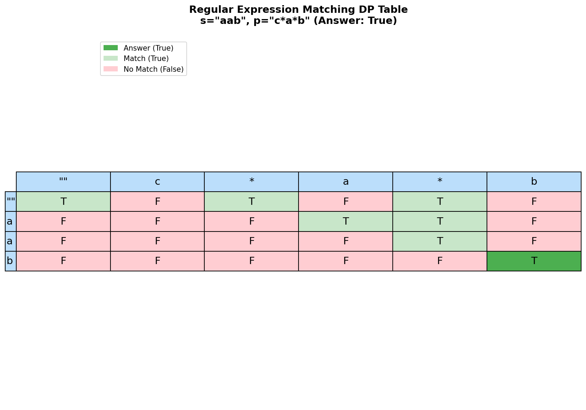

# Regular Expression Matching

> **Complex 2D dynamic programming with pattern matching**

Regular Expression Matching is one of the most challenging string DP problems and a classic hard problem in technical interviews. It requires careful handling of the `*` operator which can match zero or more characters.

---

## Problem Statement

Given an input string `s` and a pattern `p`, implement regular expression matching with support for `'.'` and `'*'` where:

- `'.'` Matches any single character.
- `'*'` Matches zero or more of the preceding element.

The matching should cover the **entire** input string (not partial).

This is [LeetCode Problem #10](https://leetcode.com/problems/regular-expression-matching/) - a Hard difficulty problem.

### Examples

| s | p | Output | Explanation |
|---|---|--------|-------------|
| `"aa"` | `"a"` | `false` | "a" doesn't match entire "aa" |
| `"aa"` | `"a*"` | `true` | `*` means zero or more of 'a' |
| `"ab"` | `".*"` | `true` | `.*` matches any sequence |
| `"aab"` | `"c*a*b"` | `true` | `c*` = "", `a*` = "aa", `b` = "b" |
| `"mississippi"` | `"mis*is*p*."` | `false` | Can't match the whole string |

### Constraints

- `1 <= s.length <= 20`
- `1 <= p.length <= 20`
- `s` contains only lowercase English letters
- `p` contains only lowercase English letters, `'.'`, and `'*'`
- Guaranteed that for each `'*'`, there is a preceding character to match

> **Note:** The empty-string cases shown in the Edge Cases table and the test suite below (e.g. `s = ""`) go beyond the LeetCode constraints above. They are included to illustrate that the algorithm handles `s.length == 0` correctly.

---

## DP Table Visualization



---

## Key Insight: Handling `*`

The `*` operator is what makes this problem challenging. For a pattern like `a*`:

1. **Match zero occurrences**: Skip `a*` entirely (`dp[i][j-2]`)
2. **Match one or more**: If `s[i]` matches `a` (or `.`), try matching more (`dp[i-1][j]`)

### Pattern Matching Rules

| Pattern | Meaning | DP Transition |
|---------|---------|---------------|
| `a` matches `a` | Exact match | `dp[i][j] = dp[i-1][j-1]` |
| `.` matches any | Wildcard | `dp[i][j] = dp[i-1][j-1]` |
| `a*` matches "" | Zero of `a` | `dp[i][j] = dp[i][j-2]` |
| `a*` matches `aaa` | Multiple `a`s | `dp[i][j] = dp[i-1][j]` if `s[i-1]=='a'` |

---

## Solution: 2D Dynamic Programming

::: code-group

```python [Python]
def isMatch(s: str, p: str) -> bool:
    """
    Regular expression matching with '.' and '*' support.

    Args:
        s: Input string
        p: Pattern with '.' (any char) and '*' (zero or more)

    Returns:
        True if pattern matches entire string

    Time: O(m * n) where m = len(s), n = len(p)
    Space: O(m * n) for DP table
    """
    m, n = len(s), len(p)

    # dp[i][j] = True if s[0:i] matches p[0:j]
    dp = [[False] * (n + 1) for _ in range(m + 1)]

    # Base case: empty string matches empty pattern
    dp[0][0] = True

    # Base case: empty string with pattern like a*, a*b*, a*b*c*
    # These patterns can match empty string
    for j in range(2, n + 1):
        if p[j - 1] == '*':
            dp[0][j] = dp[0][j - 2]

    # Fill the DP table
    for i in range(1, m + 1):
        for j in range(1, n + 1):
            if p[j - 1] == '*':
                # Case 1: Zero occurrences of preceding element
                # Just skip the "x*" pattern (look at dp[i][j-2])
                dp[i][j] = dp[i][j - 2]

                # Case 2: One or more occurrences
                # If preceding element matches s[i-1], inherit from dp[i-1][j]
                if p[j - 2] == '.' or p[j - 2] == s[i - 1]:
                    dp[i][j] = dp[i][j] or dp[i - 1][j]

            elif p[j - 1] == '.' or p[j - 1] == s[i - 1]:
                # Direct match (either '.' or exact character)
                dp[i][j] = dp[i - 1][j - 1]

            # else: dp[i][j] remains False

    return dp[m][n]
```

```java [Java]
public boolean isMatch(String s, String p) {
    int m = s.length(), n = p.length();
    boolean[][] dp = new boolean[m + 1][n + 1];
    dp[0][0] = true;

    for (int j = 2; j <= n; j++) {
        if (p.charAt(j - 1) == '*') dp[0][j] = dp[0][j - 2];
    }

    for (int i = 1; i <= m; i++) {
        for (int j = 1; j <= n; j++) {
            char pc = p.charAt(j - 1);
            if (pc == '*') {
                dp[i][j] = dp[i][j - 2]; // zero occurrences
                char prev = p.charAt(j - 2);
                if (prev == '.' || prev == s.charAt(i - 1)) {
                    dp[i][j] = dp[i][j] || dp[i - 1][j];
                }
            } else if (pc == '.' || pc == s.charAt(i - 1)) {
                dp[i][j] = dp[i - 1][j - 1];
            }
        }
    }
    return dp[m][n];
}
```

:::


::: info Complexity: Time O(m * n) · Space O(m * n)
- **Time:** O(m * n) where m = len(s), n = len(p) - we fill each cell of the DP table exactly once
- **Space:** O(m * n) for the 2D DP table storing boolean match states for all subproblem combinations
:::

---

## Visual Walkthrough

For `s = "aab"`, `p = "c*a*b"`:

```
Pattern "c*a*b" interpretation:
- c* = match zero or more 'c' (we use zero)
- a* = match zero or more 'a' (we use two: "aa")
- b  = match exactly 'b'

DP Table:
          ""    c    *    a    *    b
    ""     T    F    T    F    T    F
     a     F    F    F    T    T    F
     a     F    F    F    F    T    F
     b     F    F    F    F    F    T

Building the table:
- dp[0][0] = True (empty matches empty)
- dp[0][2] = dp[0][0] = True (c* matches empty)
- dp[0][4] = dp[0][2] = True (a* also matches empty)
- dp[1][3]: 'a' matches 'a', dp[1][3] = dp[0][2] = True
- dp[1][4]: a* with 'a', dp[1][4] = dp[1][2] = True (zero a's) OR dp[0][4] = True (one a)
- dp[2][4]: a* with 'aa', dp[2][4] = dp[1][4] = True (matching 'aa')
- dp[3][5]: 'b' matches 'b', dp[3][5] = dp[2][4] = True

Answer: dp[3][5] = True
```

---

## Memoization Approach (Top-Down DP)

```python
from functools import lru_cache

def isMatch_memo(s: str, p: str) -> bool:
    """
    Top-down DP with memoization.

    Time: O(m * n)
    Space: O(m * n) for memoization
    """
    @lru_cache(maxsize=None)
    def dp(i: int, j: int) -> bool:
        # Base case: pattern exhausted
        if j == len(p):
            return i == len(s)

        # Check if current characters match
        first_match = i < len(s) and (p[j] == s[i] or p[j] == '.')

        # Handle '*'
        if j + 1 < len(p) and p[j + 1] == '*':
            # Zero occurrences OR one+ occurrences
            return (dp(i, j + 2) or  # Skip "x*"
                    (first_match and dp(i + 1, j)))  # Match and continue

        # No '*', direct match required
        return first_match and dp(i + 1, j + 1)

    return dp(0, 0)
```

::: info Complexity: Time O(m * n) · Space O(m * n)
- **Time:** O(m * n) - each unique state (i, j) is computed once due to memoization
- **Space:** O(m * n) for memoization cache plus O(m + n) recursion stack depth
:::

---

## Recursive Approach (Without Memoization)

For understanding the logic before optimization:

```python
def isMatch_recursive(s: str, p: str) -> bool:
    """
    Recursive solution (exponential time without memo).

    Good for understanding the logic.
    """
    if not p:
        return not s

    # Check first character match
    first_match = bool(s) and (p[0] == s[0] or p[0] == '.')

    # Handle '*'
    if len(p) >= 2 and p[1] == '*':
        # Option 1: Zero occurrences (skip x*)
        # Option 2: One occurrence (if first matches, continue with rest of s)
        return (isMatch_recursive(s, p[2:]) or
                (first_match and isMatch_recursive(s[1:], p)))

    # No '*', require direct match
    return first_match and isMatch_recursive(s[1:], p[1:])
```

::: info Complexity: Time O(2^(m+n)) · Space O(m + n)
- **Time:** O(2^(m+n)) exponential - each '*' creates two recursive branches, leading to exponential blowup without memoization
- **Space:** O(m + n) for the recursion call stack depth in the worst case
:::

---

## Space-Optimized Solution

```python
def isMatch_optimized(s: str, p: str) -> bool:
    """
    Space-optimized using two rows.

    Time: O(m * n)
    Space: O(n)
    """
    m, n = len(s), len(p)

    prev = [False] * (n + 1)
    curr = [False] * (n + 1)

    # Base case
    prev[0] = True
    for j in range(2, n + 1):
        if p[j - 1] == '*':
            prev[j] = prev[j - 2]

    for i in range(1, m + 1):
        curr[0] = False  # Non-empty string can't match empty pattern

        for j in range(1, n + 1):
            if p[j - 1] == '*':
                curr[j] = curr[j - 2]
                if p[j - 2] == '.' or p[j - 2] == s[i - 1]:
                    curr[j] = curr[j] or prev[j]
            elif p[j - 1] == '.' or p[j - 1] == s[i - 1]:
                curr[j] = prev[j - 1]
            else:
                curr[j] = False

        prev, curr = curr, prev

    return prev[n]
```

::: info Complexity: Time O(m * n) · Space O(n)
- **Time:** O(m * n) - same as 2D DP, we still process all subproblems
- **Space:** O(n) - only storing two rows of size n+1 instead of the full m x n table
:::

---

## Complexity Analysis

| Approach | Time | Space |
|----------|------|-------|
| 2D DP | O(m * n) | O(m * n) |
| Memoization | O(m * n) | O(m * n) |
| Space-Optimized | O(m * n) | O(n) |
| Recursive (no memo) | O(2^(m+n)) | O(m + n) |

---

## Edge Cases

| s | p | Output | Note |
|---|---|--------|------|
| `""` | `""` | `true` | Empty matches empty |
| `""` | `"a*"` | `true` | `*` can match zero |
| `""` | `"a*b*"` | `true` | Multiple `*` can all be zero |
| `"a"` | `".*"` | `true` | `.*` matches anything |
| `"a"` | `"a*a"` | `true` | `a*` = "", then match "a" |
| `"ab"` | `".*c"` | `false` | Need 'c' at end |

---

## Common Mistakes

| Mistake | Example | Problem |
|---------|---------|---------|
| Forgetting `*` can be zero | `"ab"` vs `"c*ab"` | `c*` means zero 'c's |
| Wrong index for `*` | Off-by-one | `*` affects `p[j-2]`, not `p[j-1]` |
| Not handling `.*` | `"ab"` vs `".*"` | `.` before `*` matches any char |
| Missing base cases | Empty string with pattern | `a*b*` matches "" |

---

## Interview Tips

1. **Clarify the operators**: Make sure you understand `.` and `*`
2. **Start with recursion**: Explain the logic before optimizing
3. **Draw the DP table**: Visual helps with understanding transitions
4. **Handle `*` carefully**: It's the key to this problem
5. **Test edge cases**: Empty string, patterns like `.*`, `a*b*`

### Key Insights to Mention

- `*` always follows a character (never alone)
- `*` means "zero or more" of the preceding element
- `.*` is the most powerful pattern (matches anything)

---

## Related Problems

::: details Wildcard Matching (LeetCode 44)
**Problem:** Implement wildcard pattern matching with '?' (any single char) and '*' (any sequence including empty).

**Key Insight:** Unlike regex, '*' here is independent - matches any sequence on its own, not tied to preceding character.

**Approach:** 2D DP or greedy with backtracking. For DP: dp[i][j] true if s[0:i] matches p[0:j]. '*' can match empty (dp[i][j-1]) or extend match (dp[i-1][j]).

**Complexity:** O(m * n) time, O(m * n) space (or O(1) with greedy)
:::

::: details Edit Distance (LeetCode 72)
**Problem:** Find minimum operations (insert, delete, replace) to transform word1 into word2.

**Key Insight:** Similar 2D DP structure but different transitions - three operations instead of pattern matching rules.

**Approach:** dp[i][j] = min ops for word1[0:i] to word2[0:j]. Match: inherit diagonal. Mismatch: 1 + min(replace, insert, delete).

**Complexity:** O(m * n) time, O(m * n) space (can optimize to O(n))
:::

::: details Is Subsequence (LeetCode 392)
**Problem:** Given strings s and t, return true if s is a subsequence of t.

**Key Insight:** Simpler version of matching - just need to match characters in order without wildcards.

**Approach:** Two pointers: advance through t, move s pointer when characters match. Return true if s pointer reaches end.

**Complexity:** O(n) time, O(1) space
:::

---

## Complete Solution with Tests

```python
def isMatch(s: str, p: str) -> bool:
    """
    Regular expression matching with '.' and '*'.

    Time: O(m * n)
    Space: O(m * n)
    """
    m, n = len(s), len(p)
    dp = [[False] * (n + 1) for _ in range(m + 1)]

    dp[0][0] = True

    for j in range(2, n + 1):
        if p[j - 1] == '*':
            dp[0][j] = dp[0][j - 2]

    for i in range(1, m + 1):
        for j in range(1, n + 1):
            if p[j - 1] == '*':
                dp[i][j] = dp[i][j - 2]
                if p[j - 2] == '.' or p[j - 2] == s[i - 1]:
                    dp[i][j] = dp[i][j] or dp[i - 1][j]
            elif p[j - 1] == '.' or p[j - 1] == s[i - 1]:
                dp[i][j] = dp[i - 1][j - 1]

    return dp[m][n]


# Test cases
if __name__ == "__main__":
    test_cases = [
        ("aa", "a", False),
        ("aa", "a*", True),
        ("ab", ".*", True),
        ("aab", "c*a*b", True),
        ("mississippi", "mis*is*p*.", False),
        ("", "", True),
        ("", "a*", True),
        ("", "a*b*c*", True),
        ("a", "ab*", True),
        ("aaa", "a*a", True),
        ("aaa", "ab*a*c*a", True),
    ]

    for s, p, expected in test_cases:
        result = isMatch(s, p)
        status = "PASS" if result == expected else "FAIL"
        print(f'{status}: isMatch("{s}", "{p}") = {result} (expected {expected})')
```

---

## Summary

| Key Point | Details |
|-----------|---------|
| Pattern | 2D String DP with special operator handling |
| Key Challenge | `*` can match zero or more of preceding element |
| State | `dp[i][j]` = does `s[0:i]` match `p[0:j]`? |
| Time | O(m * n) |
| Space | O(m * n) or O(n) optimized |

**Takeaway:** Regular Expression Matching is challenging because of the `*` operator. The key insight is that `x*` can either be skipped entirely (zero matches) or can consume characters from `s` (one or more matches). Master this transition logic for the DP solution.

---

## References

- [LeetCode - Regular Expression Matching](https://leetcode.com/problems/regular-expression-matching/)
- [GeeksforGeeks - Regex Matching](https://www.geeksforgeeks.org/wildcard-pattern-matching/)
