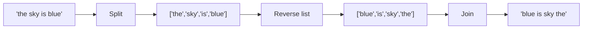

# Reverse String

> **Classic two-pointer in-place string manipulation**

Reversing a string is one of the most fundamental string operations and a common warm-up question in technical interviews. While simple, it tests your understanding of in-place algorithms and the two-pointer technique.

---

## Problem Statement

Write a function that reverses a string. The input string is given as an array of characters `s`.

You must do this by modifying the input array **in-place** with O(1) extra memory.

This is [LeetCode Problem #344](https://leetcode.com/problems/reverse-string/) - an Easy difficulty problem.

### Examples

| Input | Output | Explanation |
|-------|--------|-------------|
| `["h","e","l","l","o"]` | `["o","l","l","e","h"]` | Reverse all characters |
| `["H","a","n","n","a","h"]` | `["h","a","n","n","a","H"]` | Palindrome reverses to itself (almost) |
| `["a"]` | `["a"]` | Single character stays the same |
| `[]` | `[]` | Empty array stays empty |

### Constraints

- `1 <= s.length <= 10^5`
- `s[i]` is a printable ASCII character

---

## Approach: Two Pointers

The classic approach uses two pointers starting at opposite ends of the array:

1. Initialize `left` at index 0 and `right` at index `len(s) - 1`
2. Swap the characters at `left` and `right`
3. Move `left` forward and `right` backward
4. Repeat until `left >= right`

### Why This Works

By swapping characters from both ends and moving toward the center, each character ends up in its mirror position. When the pointers meet (or cross), all characters have been swapped exactly once.

### Mermaid Diagram

```mermaid
flowchart TD
    A[Start: left=0, right=len-1] --> B{left < right?}
    B -->|Yes| C[Swap s[left] and s[right]]
    C --> D[left += 1, right -= 1]
    D --> B
    B -->|No| E[Done - string reversed]

    style A fill:#e1f5fe
    style E fill:#c8e6c9
```

### Visual Walkthrough

For input `["h","e","l","l","o"]`:

```
Initial:  [h] [e] [l] [l] [o]
           ^               ^
         left            right

Step 1:   [o] [e] [l] [l] [h]    Swap h <-> o
               ^       ^
             left    right

Step 2:   [o] [l] [l] [e] [h]    Swap e <-> l
                   ^
              left=right

Done:     [o] [l] [l] [e] [h]    Pointers crossed, stop
```

---

## Solution (Python)

### Basic Two Pointers

```python
def reverseString(s: list[str]) -> None:
    """
    Reverse string in-place using two pointers.

    Args:
        s: List of characters to reverse

    Returns:
        None (modifies s in-place)

    Time: O(n) - visit each character once
    Space: O(1) - only two pointer variables
    """
    left, right = 0, len(s) - 1

    while left < right:
        # Swap characters
        s[left], s[right] = s[right], s[left]

        # Move pointers toward center
        left += 1
        right -= 1
```

### Recursive Approach

```python
def reverseString_recursive(s: list[str]) -> None:
    """
    Reverse string using recursion.

    Note: This uses O(n) space on the call stack, so it doesn't
    meet the O(1) space requirement, but demonstrates recursion.

    Time: O(n)
    Space: O(n) - recursive call stack
    """
    def reverse(left: int, right: int) -> None:
        if left >= right:
            return
        s[left], s[right] = s[right], s[left]
        reverse(left + 1, right - 1)

    reverse(0, len(s) - 1)
```

### One-Liner (Pythonic but creates new list)

```python
def reverseString_pythonic(s: list[str]) -> None:
    """
    Pythonic reverse using slice assignment.

    Note: s[:] = s[::-1] modifies in-place
    s = s[::-1] would create a new list (wrong!)

    Time: O(n)
    Space: O(n) - slice creates temporary copy
    """
    s[:] = s[::-1]
```

---

## Complexity Analysis

| Approach | Time | Space | Notes |
|----------|------|-------|-------|
| Two Pointers | O(n) | O(1) | Optimal solution |
| Recursive | O(n) | O(n) | Call stack space |
| Slice Assignment | O(n) | O(n) | Creates temporary copy |

**Interview Tip:** Always use the two-pointer approach in interviews - it's the expected O(1) space solution.

---

## Variations

### 1. Reverse String II (LeetCode 541)

Given a string `s` and an integer `k`, reverse the first `k` characters for every `2k` characters.

```python
def reverseStr(s: str, k: int) -> str:
    """
    Reverse first k chars of every 2k chunk.

    Example: s="abcdefg", k=2 -> "bacdfeg"
    """
    s = list(s)

    for i in range(0, len(s), 2 * k):
        # Reverse s[i:i+k]
        left, right = i, min(i + k - 1, len(s) - 1)
        while left < right:
            s[left], s[right] = s[right], s[left]
            left += 1
            right -= 1

    return ''.join(s)
```

### 2. Reverse Words in a String III (LeetCode 557)

Reverse each word in a string while keeping word order.

```python
def reverseWords(s: str) -> str:
    """
    Reverse each word in the string.

    Example: "Let's take LeetCode contest" -> "s'teL ekat edoCteeL tsetnoc"
    """
    return ' '.join(word[::-1] for word in s.split())
```

### 3. Reverse Only Letters (LeetCode 917)

Reverse only the letters, keeping other characters in place.

```python
def reverseOnlyLetters(s: str) -> str:
    """
    Reverse only alphabetic characters.

    Example: "a-bC-dEf-ghIj" -> "j-Ih-gfE-dCba"
    """
    s = list(s)
    left, right = 0, len(s) - 1

    while left < right:
        # Skip non-letters
        while left < right and not s[left].isalpha():
            left += 1
        while left < right and not s[right].isalpha():
            right -= 1

        if left < right:
            s[left], s[right] = s[right], s[left]
            left += 1
            right -= 1

    return ''.join(s)
```

---

## Edge Cases

| Case | Input | Output | Note |
|------|-------|--------|------|
| Empty | `[]` | `[]` | Handle gracefully |
| Single char | `["a"]` | `["a"]` | No swap needed |
| Two chars | `["a","b"]` | `["b","a"]` | One swap |
| Palindrome | `["r","a","c","e","c","a","r"]` | `["r","a","c","e","c","a","r"]` | Same after reverse |
| All same | `["a","a","a"]` | `["a","a","a"]` | Same after reverse |

---

## Interview Tips

1. **Clarify in-place requirement**: Ask if you need to modify in-place or can return a new string
2. **Discuss space trade-offs**: Mention that Python slicing creates copies
3. **Handle edge cases first**: Check for empty or single-character strings
4. **Explain the swap**: Show you understand the simultaneous assignment in Python

### Common Follow-up Questions

- "What if the string is immutable?" - Convert to list first
- "Can you do it recursively?" - Yes, but O(n) stack space
- "What about reversing words?" - Different problem, reverse each word

---

## Related Problems

::: details Reverse String II (LeetCode 541)
**Problem:** Given string s and integer k, reverse the first k characters for every 2k characters.

**Key Insight:** Process string in chunks of 2k, applying two-pointer reversal to first k of each chunk.

**Approach:** Iterate with step 2k. For each chunk, reverse characters from i to min(i+k-1, len-1).

**Complexity:** O(n) time, O(1) space (or O(n) if string is immutable)
:::

::: details Reverse Words in a String (LeetCode 151)
**Problem:** Given a string s, reverse the order of words. Words are separated by spaces.

**Key Insight:** Can reverse entire string, then reverse each word. Or split, reverse list, join.

**Approach:** Split by spaces, filter empty strings, reverse the list, join with single space.



**Complexity:** O(n) time, O(n) space
:::

::: details Reverse Words in a String III (LeetCode 557)
**Problem:** Reverse each word in a sentence while preserving word order and whitespace.

**Key Insight:** Split by spaces, reverse each individual word, join back.

**Approach:** For each word, apply two-pointer swap. Can do in-place by tracking word boundaries.

**Complexity:** O(n) time, O(1) extra space with in-place reversal
:::

::: details Reverse Only Letters (LeetCode 917)
**Problem:** Reverse only the letters in a string, keeping other characters in their original positions.

**Key Insight:** Two pointers that skip non-letter characters.

**Approach:** Left and right pointers. Skip non-alpha characters. Swap letters when both pointers point to letters.

**Complexity:** O(n) time, O(n) space (for mutable copy)
:::

::: details Valid Palindrome (LeetCode 125)
**Problem:** Given a string, determine if it's a palindrome considering only alphanumeric characters and ignoring case.

**Key Insight:** Same two-pointer technique but with character filtering.

**Approach:** Two pointers from ends. Skip non-alphanumeric, compare lowercase. Return false on mismatch.

**Complexity:** O(n) time, O(1) space
:::

---

## Summary

| Key Point | Details |
|-----------|---------|
| Pattern | Two Pointers (opposite ends) |
| Time | O(n) |
| Space | O(1) in-place |
| Key Insight | Swap from ends, move toward center |

**Takeaway:** The two-pointer technique for reversing is a fundamental pattern that appears in many string problems. Master this simple swap-and-move approach as it forms the basis for more complex algorithms.

---

## References

- [LeetCode - Reverse String](https://leetcode.com/problems/reverse-string/)
- [GeeksforGeeks - Reverse a String](https://www.geeksforgeeks.org/reverse-a-string/)
- [NeetCode - Reverse String](https://neetcode.io/problems/reverse-a-string)
