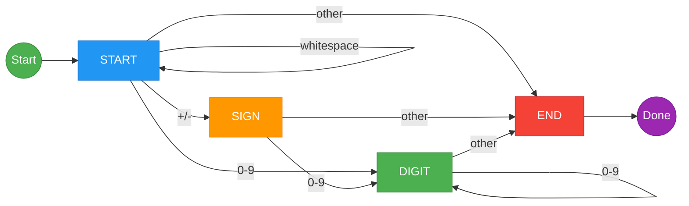

# String to Integer (atoi)

> **State machine parsing with edge case handling**

The String to Integer problem (commonly known as `atoi`) is a classic parsing problem that tests your ability to handle edge cases, understand state transitions, and implement robust input validation.

---

## Problem Statement

Implement the `myAtoi(string s)` function, which converts a string to a 32-bit signed integer (similar to C/C++'s `atoi` function).

The algorithm for `myAtoi(string s)` is as follows:

1. **Whitespace**: Read in and ignore any leading whitespace
2. **Sign**: Check if the next character is `'-'` or `'+'`. Read this character if it exists. This determines if the final result is negative or positive. Assume positive if neither is present.
3. **Digits**: Read in the next characters until a non-digit character is reached or the end of the input. The rest of the string is ignored.
4. **Conversion**: Convert these digits into an integer. If no digits were read, the result is 0.
5. **Clamping**: If the integer is out of the 32-bit signed integer range `[-2^31, 2^31 - 1]`, clamp the integer to remain in the range.

This is [LeetCode Problem #8](https://leetcode.com/problems/string-to-integer-atoi/) - a Medium difficulty problem.

### Examples

| Input | Output | Explanation |
|-------|--------|-------------|
| `"42"` | `42` | Simple positive number |
| `"   -42"` | `-42` | Leading whitespace, negative |
| `"4193 with words"` | `4193` | Stops at non-digit |
| `"words and 987"` | `0` | First non-whitespace isn't digit/sign |
| `"-91283472332"` | `-2147483648` | Clamped to INT_MIN |
| `"21474836460"` | `2147483647` | Clamped to INT_MAX |
| `"+-12"` | `0` | Invalid after sign |
| `""` | `0` | Empty string |

### Constraints

- `0 <= s.length <= 200`
- `s` consists of English letters, digits, `' '`, `'+'`, `'-'`, and `'.'`

---

## Approach 1: State Machine (Recommended)

The cleanest way to solve this is with a finite state machine that handles each state transition explicitly.

### State Diagram



### States

| State | Description | Valid Transitions |
|-------|-------------|-------------------|
| START | Initial state, skip whitespace | whitespace->START, sign->SIGN, digit->DIGIT, other->END |
| SIGN | Read a sign character | digit->DIGIT, other->END |
| DIGIT | Reading digits | digit->DIGIT, other->END |
| END | Stop parsing | Terminal |

### Solution: State Machine

```python
def myAtoi(s: str) -> int:
    """
    Convert string to integer using state machine.

    Args:
        s: Input string

    Returns:
        32-bit signed integer

    Time: O(n)
    Space: O(1)
    """
    INT_MAX = 2**31 - 1  # 2147483647
    INT_MIN = -2**31     # -2147483648

    # States
    START, SIGN, DIGIT, END = 0, 1, 2, 3

    state = START
    sign = 1
    result = 0
    i = 0

    while i < len(s) and state != END:
        char = s[i]

        if state == START:
            if char == ' ':
                pass  # Stay in START
            elif char == '+':
                state = SIGN
            elif char == '-':
                sign = -1
                state = SIGN
            elif char.isdigit():
                result = int(char)
                state = DIGIT
            else:
                state = END

        elif state == SIGN:
            if char.isdigit():
                result = int(char)
                state = DIGIT
            else:
                state = END

        elif state == DIGIT:
            if char.isdigit():
                result = result * 10 + int(char)
                # Early overflow check
                if sign == 1 and result > INT_MAX:
                    return INT_MAX
                if sign == -1 and -result < INT_MIN:
                    return INT_MIN
            else:
                state = END

        i += 1

    # Apply sign and clamp
    result *= sign
    return max(INT_MIN, min(INT_MAX, result))
```

::: info Complexity: Time O(n) · Space O(1)
- **Time:** O(n) - single pass through the string, processing each character once with O(1) state transitions
- **Space:** O(1) - only storing state, sign, result, and index variables regardless of input size
:::

---

## Approach 2: Sequential Processing

A more straightforward approach that processes step by step:

```python
def myAtoi_sequential(s: str) -> int:
    """
    Convert string to integer using sequential processing.

    Time: O(n)
    Space: O(1)
    """
    INT_MAX = 2**31 - 1
    INT_MIN = -2**31

    # Step 1: Skip leading whitespace
    i = 0
    while i < len(s) and s[i] == ' ':
        i += 1

    # Check if we've exhausted the string
    if i >= len(s):
        return 0

    # Step 2: Handle sign
    sign = 1
    if s[i] == '-':
        sign = -1
        i += 1
    elif s[i] == '+':
        i += 1

    # Step 3: Read digits
    result = 0
    while i < len(s) and s[i].isdigit():
        digit = int(s[i])

        # Step 5: Check for overflow BEFORE adding
        # If result > INT_MAX // 10, multiplying by 10 will overflow
        # If result == INT_MAX // 10 and digit > 7, adding will overflow
        if result > INT_MAX // 10 or (result == INT_MAX // 10 and digit > 7):
            return INT_MAX if sign == 1 else INT_MIN

        result = result * 10 + digit
        i += 1

    # Step 4 & 5: Apply sign (clamping handled above)
    return sign * result
```

::: info Complexity: Time O(n) · Space O(1)
- **Time:** O(n) - sequential processing through whitespace, sign, then digits in one pass
- **Space:** O(1) - only constant extra variables for index, sign, and result accumulator
:::

---

## Approach 3: Using Regular Expression

```python
import re

def myAtoi_regex(s: str) -> int:
    """
    Use regex to extract number.

    Note: This may not be accepted in interviews as it bypasses
    the parsing logic they want to test.

    Time: O(n)
    Space: O(n) for regex match
    """
    INT_MAX = 2**31 - 1
    INT_MIN = -2**31

    # Match optional whitespace, optional sign, digits
    match = re.match(r'^\s*([+-]?\d+)', s)

    if not match:
        return 0

    result = int(match.group(1))

    # Clamp to 32-bit range
    return max(INT_MIN, min(INT_MAX, result))
```

::: info Complexity: Time O(n) · Space O(n)
- **Time:** O(n) - regex matching processes the string in linear time
- **Space:** O(n) - regex match object stores the matched substring which can be up to length n
:::

---

## Visual Walkthrough

For input `"   -42 with words"`:

```
Step 1: Skip whitespace
        "   -42 with words"
         ^^^
         Skip these spaces

Step 2: Handle sign
        "-42 with words"
         ^
         Found '-', sign = -1

Step 3: Read digits
        "42 with words"
         ^^
         Read '4': result = 4
         Read '2': result = 42
         Found ' ': stop

Step 4: Apply sign
        result = -1 * 42 = -42

Step 5: Check bounds
        -2147483648 <= -42 <= 2147483647 (OK)

Return -42
```

---

## Edge Cases

| Case | Input | Output | Reason |
|------|-------|--------|--------|
| Empty | `""` | `0` | No characters |
| Only spaces | `"   "` | `0` | No digits |
| Only sign | `"+"` | `0` | Sign but no digits |
| Leading zeros | `"00042"` | `42` | Valid number |
| Overflow positive | `"2147483648"` | `2147483647` | Clamped to MAX |
| Overflow negative | `"-2147483649"` | `-2147483648` | Clamped to MIN |
| Multiple signs | `"+-12"` | `0` | Invalid after first sign |
| Decimal point | `"3.14159"` | `3` | Stop at '.' |
| Mixed | `"  +0 123"` | `0` | Stop at space after 0 |

---

## Overflow Handling Deep Dive

The trickiest part is handling overflow **before** it happens:

```python
# Given: INT_MAX = 2147483647

# If result > 214748364, then result * 10 > 2147483640
# Adding any digit will overflow

# If result == 214748364, then result * 10 = 2147483640
# Adding digit > 7 will overflow (since 2147483647 ends in 7)

if result > INT_MAX // 10:
    return INT_MAX if sign > 0 else INT_MIN

if result == INT_MAX // 10 and digit > 7:
    return INT_MAX if sign > 0 else INT_MIN
```

---

## Interview Tips

1. **Clarify the requirements**: Ask about whitespace, sign handling, overflow
2. **Use a state machine**: It's the cleanest approach for parsing
3. **Handle overflow early**: Check before multiplying/adding, not after
4. **Test edge cases**: Empty, spaces only, overflow, multiple signs

### Common Mistakes

| Mistake | Example | Problem |
|---------|---------|---------|
| Forgetting overflow check | Large numbers | Integer overflow |
| Wrong overflow boundary | Using 8 instead of 7 | Off-by-one |
| Not stopping at first invalid | `"4193 123"` returns 4193123 | Should be 4193 |
| Handling multiple signs | `"--42"` returns 42 | Should be 0 |

---

## Related Problems

::: details Reverse Integer (LeetCode 7)
**Problem:** Given a signed 32-bit integer x, return x with its digits reversed. Return 0 if reversing causes overflow.

**Key Insight:** Same overflow checking technique - check BEFORE the operation that would overflow.

**Approach:** Extract digits with modulo, build reversed number. Check if result > INT_MAX/10 or result == INT_MAX/10 and next digit > 7 before each addition.

**Complexity:** O(log x) time, O(1) space
:::

::: details Valid Number (LeetCode 65)
**Problem:** Given a string s, return whether s is a valid number (integer, decimal, or scientific notation).

**Key Insight:** More complex state machine with states for sign, digits, decimal point, and exponent.

**Approach:** Use deterministic finite automaton (DFA) with states: START, SIGN, INTEGER, DOT, DECIMAL, EXP, EXP_SIGN, EXP_NUMBER. Track valid end states.

**Complexity:** O(n) time, O(1) space
:::

::: details Integer to Roman (LeetCode 12)
**Problem:** Convert an integer (1-3999) to its Roman numeral representation.

**Key Insight:** Use greedy approach with value-symbol pairs in descending order.

**Approach:** Define pairs including subtractive cases (IV, IX, XL, etc.). Iterate from largest to smallest, appending symbols while subtracting values.

**Complexity:** O(1) time (bounded input), O(1) space
:::

---

## Complete Solution with Tests

```python
def myAtoi(s: str) -> int:
    """
    Convert string to 32-bit signed integer.

    Time: O(n)
    Space: O(1)
    """
    INT_MAX = 2147483647
    INT_MIN = -2147483648

    i = 0
    n = len(s)

    # Skip whitespace
    while i < n and s[i] == ' ':
        i += 1

    if i >= n:
        return 0

    # Handle sign
    sign = 1
    if s[i] == '-':
        sign = -1
        i += 1
    elif s[i] == '+':
        i += 1

    # Read digits
    result = 0
    while i < n and s[i].isdigit():
        digit = int(s[i])

        # Overflow check
        if result > INT_MAX // 10 or (result == INT_MAX // 10 and digit > 7):
            return INT_MAX if sign == 1 else INT_MIN

        result = result * 10 + digit
        i += 1

    return sign * result


# Test cases
if __name__ == "__main__":
    test_cases = [
        ("42", 42),
        ("   -42", -42),
        ("4193 with words", 4193),
        ("words and 987", 0),
        ("-91283472332", -2147483648),
        ("21474836460", 2147483647),
        ("+-12", 0),
        ("", 0),
        ("   ", 0),
        ("+1", 1),
        ("  +0 123", 0),
        ("-2147483647", -2147483647),
        ("-2147483648", -2147483648),
    ]

    for input_str, expected in test_cases:
        result = myAtoi(input_str)
        status = "PASS" if result == expected else "FAIL"
        print(f'{status}: myAtoi("{input_str}") = {result} (expected {expected})')
```

---

## Summary

| Key Point | Details |
|-----------|---------|
| Pattern | State Machine or Sequential Parsing |
| Key Challenge | Overflow detection before it happens |
| Time Complexity | O(n) |
| Space Complexity | O(1) |

**Takeaway:** The atoi problem is about careful parsing and edge case handling. Use a state machine approach for clean code, and always check for overflow **before** performing the operation that would cause it.

---

## References

- [LeetCode - String to Integer (atoi)](https://leetcode.com/problems/string-to-integer-atoi/)
- [GeeksforGeeks - Write your own atoi](https://www.geeksforgeeks.org/write-your-own-atoi/)
