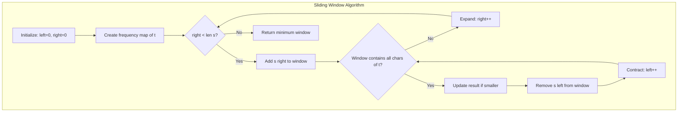
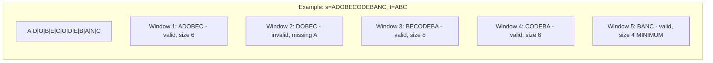
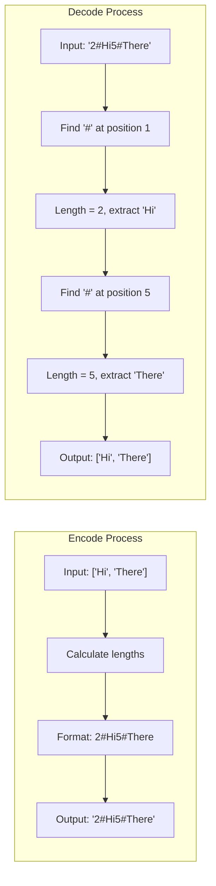

# Minimum Window Substring & String Serialization

> **Advanced sliding window and encoding techniques**

---

## Minimum Window Substring

### Problem Statement
Given strings `s` and `t`, return the minimum window substring of `s` that contains all characters of `t` (including duplicates). If no such substring exists, return an empty string `""`.

**LeetCode #76 (Hard)**

### Example
```
Input: s = "ADOBECODEBANC", t = "ABC"
Output: "BANC"
Explanation: The minimum window substring "BANC" includes 'A', 'B', and 'C' from string t.
```

```
Input: s = "a", t = "a"
Output: "a"
```

```
Input: s = "a", t = "aa"
Output: ""
Explanation: Both 'a's from t must be included, but s only has one 'a'.
```

### Approach
The algorithm uses a **sliding window technique** with character count tracking:

1. **Character Frequency Map**: Track the frequency of characters needed from `t`
2. **Expand Window**: Move the right pointer to include more characters until all required characters are in the window
3. **Contract Window**: Once a valid window is found, move the left pointer to minimize the window size while maintaining validity
4. **Track Minimum**: Keep track of the smallest valid window found

**Key Questions for Sliding Window Problems:**
- When should you expand the window (move right)?
- What data should you update when adding a character?
- When should you contract the window (move left)?
- What data should you update when removing a character?

### Mermaid Diagram





### Solution

::: code-group

```python [Python]
from collections import Counter

def minWindow(s: str, t: str) -> str:
    if not t or not s:
        return ""

    # Count characters needed from t
    need = Counter(t)
    required = len(need)  # Number of unique characters to match

    # Window state
    window = {}
    formed = 0  # Number of unique chars with required frequency

    # Result tracking: (window_length, left_index, right_index)
    result = float('inf'), None, None

    left = 0
    for right in range(len(s)):
        # Expand window - add character from the right
        char = s[right]
        window[char] = window.get(char, 0) + 1

        # Check if current char's frequency matches required frequency
        if char in need and window[char] == need[char]:
            formed += 1

        # Contract window - try to minimize while valid
        while formed == required:
            # Update result if current window is smaller
            if right - left + 1 < result[0]:
                result = (right - left + 1, left, right)

            # Remove character from the left
            left_char = s[left]
            window[left_char] -= 1
            if left_char in need and window[left_char] < need[left_char]:
                formed -= 1
            left += 1

    return "" if result[0] == float('inf') else s[result[1]:result[2]+1]
```

```java [Java]
public String minWindow(String s, String t) {
    if (s.isEmpty() || t.isEmpty()) return "";
    Map<Character, Integer> need = new HashMap<>();
    for (char c : t.toCharArray()) need.merge(c, 1, Integer::sum);
    int required = need.size();
    Map<Character, Integer> window = new HashMap<>();
    int formed = 0, resLen = Integer.MAX_VALUE, resLeft = 0, resRight = 0;
    int left = 0;
    for (int right = 0; right < s.length(); right++) {
        char c = s.charAt(right);
        window.merge(c, 1, Integer::sum);
        if (need.containsKey(c) && window.get(c).equals(need.get(c))) formed++;
        while (formed == required) {
            if (right - left + 1 < resLen) {
                resLen = right - left + 1;
                resLeft = left; resRight = right;
            }
            char lc = s.charAt(left);
            window.merge(lc, -1, Integer::sum);
            if (need.containsKey(lc) && window.get(lc) < need.get(lc)) formed--;
            left++;
        }
    }
    return resLen == Integer.MAX_VALUE ? "" : s.substring(resLeft, resRight + 1);
}
```

:::


::: info Complexity: Time O(|s| + |t|) - Space O(|s| + |t|)
- **Time:** Each character in s is visited at most twice (once when expanding, once when contracting). Building the need counter is O(|t|).
- **Space:** O(|s| + |t|) for the window and need hash maps storing character frequencies.
:::

### Optimized Solution with Filtered Characters

```python
from collections import Counter

def minWindowOptimized(s: str, t: str) -> str:
    if not t or not s:
        return ""

    need = Counter(t)
    required = len(need)

    # Filter s to only include relevant characters with their indices
    filtered_s = [(i, char) for i, char in enumerate(s) if char in need]

    window = {}
    formed = 0
    result = float('inf'), None, None

    left = 0
    for right in range(len(filtered_s)):
        char = filtered_s[right][1]
        window[char] = window.get(char, 0) + 1

        if window[char] == need[char]:
            formed += 1

        while formed == required:
            # Get actual indices from filtered list
            start = filtered_s[left][0]
            end = filtered_s[right][0]

            if end - start + 1 < result[0]:
                result = (end - start + 1, start, end)

            left_char = filtered_s[left][1]
            window[left_char] -= 1
            if window[left_char] < need[left_char]:
                formed -= 1
            left += 1

    return "" if result[0] == float('inf') else s[result[1]:result[2]+1]
```

::: info Complexity: Time O(|s| + |t|) - Space O(|s| + |t|)
- **Time:** O(|s| + |t|) but faster in practice when |filtered_s| << |s|, as we only iterate over characters that appear in t.
- **Space:** O(|s| + |t|) for the filtered list storing (index, char) tuples and the hash maps.
:::

### Complexity
- **Time**: O(|s| + |t|) - Each character is visited at most twice (once by right pointer, once by left)
- **Space**: O(|s| + |t|) - For the character frequency maps
- **Optimized Version**: O(|s| + |t|) time, but faster when |filtered_s| << |s|

---

## Serialize and Deserialize Strings

### Problem Statement
Design an algorithm to encode a list of strings to a single string, and decode it back to the original list of strings.

**LeetCode #271 (Medium)**

**Constraints:**
- `1 <= strs.length <= 200`
- `0 <= strs[i].length <= 200`
- `strs[i]` contains any possible characters out of 256 valid ASCII characters
- Your encode and decode algorithms should be **stateless**

### Approach
**Length-Prefixed Encoding**: The key insight is that we cannot use simple delimiters (like commas) because the strings themselves might contain any character including the delimiter.

**Solution**: Prefix each string with its length and a delimiter character. During decoding, read the length first, then extract exactly that many characters.

**Format**: `length + '#' + string`

For example: `["Hello", "World"]` becomes `"5#Hello5#World"`

### Solution

::: code-group

```python [Python]
class Codec:
    def encode(self, strs: list[str]) -> str:
        """
        Encodes a list of strings to a single string.
        Format: length + '#' + string for each element
        """
        result = []
        for s in strs:
            result.append(f"{len(s)}#{s}")
        return ''.join(result)

    def decode(self, s: str) -> list[str]:
        """
        Decodes a single string to a list of strings.
        """
        result = []
        i = 0

        while i < len(s):
            # Find the length delimiter '#'
            j = i
            while s[j] != '#':
                j += 1

            # Extract length and string
            length = int(s[i:j])
            result.append(s[j+1:j+1+length])
            i = j + 1 + length

        return result
```

```java [Java]
public String encode(List<String> strs) {
    StringBuilder sb = new StringBuilder();
    for (String s : strs) sb.append(s.length()).append('#').append(s);
    return sb.toString();
}

public List<String> decode(String s) {
    List<String> result = new ArrayList<>();
    int i = 0;
    while (i < s.length()) {
        int j = s.indexOf('#', i);
        int len = Integer.parseInt(s.substring(i, j));
        result.add(s.substring(j + 1, j + 1 + len));
        i = j + 1 + len;
    }
    return result;
}
```

:::


::: info Complexity: Time O(n) - Space O(n)
- **Time:** O(n) for both encode and decode, where n is the total number of characters across all strings. Encode builds the output in one pass; decode parses length prefixes and extracts substrings.
- **Space:** O(n) for the encoded/decoded output string. No additional space beyond the result.
:::

```python
# Usage Example
codec = Codec()
original = ["Hello", "World", "with#special", "chars123"]
encoded = codec.encode(original)
print(f"Encoded: {encoded}")
# Output: "5#Hello5#World12#with#special8#chars123"

decoded = codec.decode(encoded)
print(f"Decoded: {decoded}")
# Output: ["Hello", "World", "with#special", "chars123"]
```

### Why Length-Prefix Works

The length-prefix approach handles **any character** including:
- The delimiter character itself (`#`)
- Digits that might be confused with length
- Special characters, newlines, null bytes
- Empty strings

**Example with tricky input:**
```python
strs = ["", "#", "12#34", "normal"]
# Encoded: "0#1##5#12#346#normal"
# Parsing:
#   "0#"      -> length 0, empty string ""
#   "1##"     -> length 1, string "#"
#   "5#12#34" -> length 5, string "12#34"
#   "6#normal"-> length 6, string "normal"
```

### Alternative: Fixed-Width Length Prefix

```python
class CodecFixedWidth:
    """
    Uses a fixed 4-character width for length (supports strings up to 9999 chars)
    """
    def encode(self, strs: list[str]) -> str:
        result = []
        for s in strs:
            # Pad length to 4 digits
            result.append(f"{len(s):04d}{s}")
        return ''.join(result)

    def decode(self, s: str) -> list[str]:
        result = []
        i = 0

        while i < len(s):
            # Read 4 characters for length
            length = int(s[i:i+4])
            result.append(s[i+4:i+4+length])
            i = i + 4 + length

        return result
```

::: info Complexity: Time O(n) - Space O(n)
- **Time:** O(n) for both operations where n is total characters. Fixed-width parsing makes decode simpler.
- **Space:** O(n) for the result. Supports strings up to 9999 characters each.
:::

```python
# Example: ["hello", "world"] -> "0005hello0005world"
```

### Alternative: Escape Character Approach

```python
class CodecEscape:
    """
    Uses escape sequences for special characters.
    Delimiter: '|'
    Escape: '\'
    """
    def encode(self, strs: list[str]) -> str:
        encoded_parts = []
        for s in strs:
            # Escape backslashes first, then pipes
            escaped = s.replace('\\', '\\\\').replace('|', '\\|')
            encoded_parts.append(escaped)
        return '|'.join(encoded_parts)

    def decode(self, s: str) -> list[str]:
        result = []
        current = []
        i = 0

        while i < len(s):
            if s[i] == '\\' and i + 1 < len(s):
                # Handle escape sequence
                current.append(s[i+1])
                i += 2
            elif s[i] == '|':
                # Delimiter found
                result.append(''.join(current))
                current = []
                i += 1
            else:
                current.append(s[i])
                i += 1

        result.append(''.join(current))
        return result
```

::: info Complexity: Time O(n) - Space O(n)
- **Time:** O(n) for encode (escaping) and decode (parsing escape sequences). Each character processed once.
- **Space:** O(n) for result. Encoded size may be up to 2n in worst case (if many special chars need escaping).
:::

**Trade-offs:**
| Approach | Pros | Cons |
|----------|------|------|
| Length-Prefix with `#` | Simple parsing, handles all chars | Length field varies |
| Fixed-Width Length | Predictable format | Limited string length |
| Escape Character | Human-readable | Complex parsing, larger encoded size |

### Mermaid Diagram: Encoding Process



### Complexity
- **Time**: O(n) for both encode and decode, where n is total characters across all strings
- **Space**: O(n) for the output

---

## Interview Applications

### Why These Problems Matter

1. **Minimum Window Substring**:
   - Tests understanding of **sliding window optimization**
   - Common in text processing, search engines, and data streaming
   - Google Search: Finding relevant snippets containing query terms
   - Gmail: Searching for emails containing specific keywords
   - YouTube: Transcript search functionality

2. **Encode/Decode Strings**:
   - Essential for **distributed systems** and **network protocols**
   - Protocol Buffers (Protobuf) - Google's data serialization format
   - gRPC communication between microservices
   - BigTable and Spanner data storage
   - Pub/Sub message encoding

### Related Interview Questions

| Problem | Pattern | Difficulty |
|---------|---------|------------|
| Longest Substring Without Repeating Characters (LC 3) | Sliding Window | Medium |
| Find All Anagrams in a String (LC 438) | Sliding Window | Medium |
| Permutation in String (LC 567) | Sliding Window | Medium |
| Serialize and Deserialize Binary Tree (LC 297) | Serialization | Hard |
| Decode String (LC 394) | Stack + String | Medium |
| Encode and Decode TinyURL (LC 535) | Design | Medium |

### Sliding Window Template

```python
def sliding_window_template(s: str) -> int:
    """
    Generic sliding window template for string problems
    """
    window = {}  # Track window state
    left = 0
    result = 0  # Or float('inf') for minimum

    for right in range(len(s)):
        # 1. Expand: Add s[right] to window
        char = s[right]
        window[char] = window.get(char, 0) + 1

        # 2. Contract: Shrink window while condition is violated
        while window_needs_shrinking():
            left_char = s[left]
            window[left_char] -= 1
            if window[left_char] == 0:
                del window[left_char]
            left += 1

        # 3. Update result
        result = max(result, right - left + 1)

    return result
```

::: info Complexity: Time O(n) - Space O(k)
- **Time:** O(n) where n is string length. Each character is added and removed from window at most once.
- **Space:** O(k) where k is the size of the character set (alphabet size or unique chars in string).
:::

### Tips for Interviews

1. **Clarify the problem**: Ask about edge cases (empty strings, duplicates, special characters)
2. **Start with brute force**: Explain O(n^2) or O(n^3) approach first
3. **Optimize incrementally**: Show how sliding window reduces complexity
4. **Handle edge cases**: Empty input, single character, no valid window
5. **Test your solution**: Walk through examples step by step

---

## References

- [LeetCode 76: Minimum Window Substring](https://leetcode.com/problems/minimum-window-substring/)
- [LeetCode 271: Encode and Decode Strings](https://leetcode.com/problems/encode-and-decode-strings/)
- [Algo.Monster: Minimum Window Substring Explanation](https://algo.monster/liteproblems/76)
- [Algo.Monster: Encode and Decode Strings](https://algo.monster/liteproblems/271)
- [Sliding Window Algorithm Template](https://labuladong.online/en/algo/essential-technique/sliding-window-framework/)
- [NeetCode: String Encode and Decode](https://neetcode.io/problems/string-encode-and-decode)
- [Design Gurus: Minimum Window Substring](https://www.designgurus.io/answers/detail/76-minimum-window-substring-wind35674)
