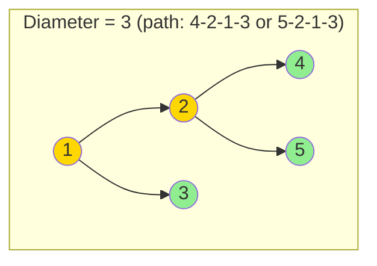

# Balanced Tree, Diameter & Validate BST

> **Tree structure analysis and validation**

These three classic tree problems are foundational for technical interviews at companies like Google. They all share a common pattern: using recursive depth-first traversal to compute properties while simultaneously validating constraints.

---

## Balanced Binary Tree

### Problem Statement

Determine if a binary tree is height-balanced. A height-balanced binary tree is defined as a binary tree in which the depth of the two subtrees of every node never differs by more than 1.

**LeetCode Problem:** [110. Balanced Binary Tree](https://leetcode.com/problems/balanced-binary-tree/)

### Key Insight

A naive approach would compute the height at each node separately, leading to O(n^2) time complexity. The optimal solution uses a bottom-up approach that computes height while simultaneously checking balance, using -1 as a sentinel value to indicate imbalance.

### Solution (Python)

```python
def isBalanced(root) -> bool:
    def height(node):
        if not node:
            return 0

        left_h = height(node.left)
        if left_h == -1:
            return -1  # Left subtree is unbalanced

        right_h = height(node.right)
        if right_h == -1:
            return -1  # Right subtree is unbalanced

        if abs(left_h - right_h) > 1:
            return -1  # Current node is unbalanced

        return max(left_h, right_h) + 1

    return height(root) != -1
```

::: info Complexity: Time O(n) · Space O(h)
- **Time:** O(n) because we visit each node exactly once, computing height bottom-up
- **Space:** O(h) for the recursion stack, where h is the tree height (O(log n) balanced, O(n) skewed)
:::

### Alternative: Explicit Boolean Tracking

```python
def isBalanced(root) -> bool:
    is_balanced = True

    def height(node):
        nonlocal is_balanced
        if not node or not is_balanced:
            return 0

        left_h = height(node.left)
        right_h = height(node.right)

        if abs(left_h - right_h) > 1:
            is_balanced = False

        return max(left_h, right_h) + 1

    height(root)
    return is_balanced
```

::: info Complexity: Time O(n) · Space O(h)
- **Time:** O(n) because each node is visited once; early termination via `is_balanced` flag prevents unnecessary work
- **Space:** O(h) for the recursion stack depth, where h is the tree height
:::

### Complexity

- **Time:** O(n) - each node is visited exactly once
- **Space:** O(h) for recursion stack, where h is the height of the tree

### Edge Cases

- Empty tree (null root): Returns `True` (an empty tree is balanced)
- Single node: Returns `True`
- Skewed tree (all left or all right): Returns `False` if depth > 1

---

## Diameter of a Tree

### Problem Statement

Find the length of the longest path between any two nodes in a binary tree. The path length is measured by the number of edges between nodes. This path may or may not pass through the root.

**LeetCode Problem:** [543. Diameter of Binary Tree](https://leetcode.com/problems/diameter-of-binary-tree/)

### Mermaid Diagram



```
        1           <-- root
       / \
      2   3         Diameter path: 4 -> 2 -> 1 -> 3
     / \            Or: 5 -> 2 -> 1 -> 3
    4   5           Both have length 3 (3 edges)
```

### Key Insight

For any node, the longest path passing through it equals the sum of the heights of its left and right subtrees. The diameter is the maximum such sum across all nodes in the tree.

**Important:** The longest path may not pass through the root! Consider a tree shaped like a 'Y' where the longest path might be entirely within one subtree.

### Solution (Python)

```python
def diameterOfBinaryTree(root) -> int:
    diameter = 0

    def height(node):
        nonlocal diameter
        if not node:
            return 0

        left_h = height(node.left)
        right_h = height(node.right)

        # Update diameter (path through this node = left_h + right_h edges)
        diameter = max(diameter, left_h + right_h)

        return max(left_h, right_h) + 1

    height(root)
    return diameter
```

::: info Complexity: Time O(n) · Space O(h)
- **Time:** O(n) because we visit each node once, computing height while updating diameter
- **Space:** O(h) for recursion stack; the global variable adds O(1) extra space
:::

### Alternative: Return Tuple (height, diameter)

```python
def diameterOfBinaryTree(root) -> int:
    def dfs(node):
        """Returns (height, max_diameter_in_subtree)"""
        if not node:
            return (0, 0)

        left_h, left_d = dfs(node.left)
        right_h, right_d = dfs(node.right)

        # Diameter through this node
        through_node = left_h + right_h

        # Maximum diameter seen so far
        max_diameter = max(left_d, right_d, through_node)

        return (max(left_h, right_h) + 1, max_diameter)

    return dfs(root)[1]
```

::: info Complexity: Time O(n) · Space O(h)
- **Time:** O(n) because each node is visited once; tuple return avoids global variable
- **Space:** O(h) for recursion stack, plus O(1) for tuple overhead at each level
:::

### Complexity

- **Time:** O(n) - visit each node once
- **Space:** O(h) - recursion stack depth

### Edge Cases

- Single node: Diameter = 0 (no edges)
- Linear tree (linked list): Diameter = n - 1

---

## Validate Binary Search Tree

### Problem Statement

Given the root of a binary tree, determine if it is a valid binary search tree (BST).

A valid BST is defined as:
- The left subtree of a node contains only nodes with keys **strictly less than** the node's key
- The right subtree of a node contains only nodes with keys **strictly greater than** the node's key
- Both the left and right subtrees must also be binary search trees

**LeetCode Problem:** [98. Validate Binary Search Tree](https://leetcode.com/problems/validate-binary-search-tree/)

### Approaches

#### 1. Range Validation (Optimal)

Pass down valid range constraints as you traverse. Each node must fall within its valid range.

```python
def isValidBST(root) -> bool:
    def validate(node, min_val, max_val):
        if not node:
            return True

        # Node value must be strictly within range
        if node.val <= min_val or node.val >= max_val:
            return False

        # Left child: update max bound to current node's value
        # Right child: update min bound to current node's value
        return (validate(node.left, min_val, node.val) and
                validate(node.right, node.val, max_val))

    return validate(root, float('-inf'), float('inf'))
```

::: info Complexity: Time O(n) · Space O(h)
- **Time:** O(n) because we visit each node once, passing down range constraints
- **Space:** O(h) for recursion stack; range bounds use O(1) space per call
:::

#### 2. Inorder Traversal (Must be strictly increasing)

An inorder traversal of a valid BST produces values in strictly ascending order.

```python
def isValidBST_inorder(root) -> bool:
    prev = float('-inf')

    def inorder(node):
        nonlocal prev
        if not node:
            return True

        # Check left subtree
        if not inorder(node.left):
            return False

        # Check current node against previous value
        if node.val <= prev:
            return False
        prev = node.val

        # Check right subtree
        return inorder(node.right)

    return inorder(root)
```

::: info Complexity: Time O(n) · Space O(h)
- **Time:** O(n) because inorder traversal visits each node once
- **Space:** O(h) for recursion stack; `prev` variable uses O(1) extra space
:::

#### 3. Iterative Inorder with Stack

```python
def isValidBST_iterative(root) -> bool:
    stack = []
    prev = float('-inf')
    current = root

    while stack or current:
        # Go to leftmost node
        while current:
            stack.append(current)
            current = current.left

        current = stack.pop()

        # Check BST property
        if current.val <= prev:
            return False
        prev = current.val

        # Move to right subtree
        current = current.right

    return True
```

::: info Complexity: Time O(n) · Space O(h)
- **Time:** O(n) because we process each node once via explicit stack
- **Space:** O(h) for the stack storing nodes along the current path
:::

### Complexity

- **Time:** O(n) - visit each node once
- **Space:** O(h) - recursion/stack depth

### Common Mistakes

1. **Using `<=` instead of `<` for comparisons**: Equal values are not allowed in a standard BST. The problem specifies "strictly less than" and "strictly greater than."

2. **Only checking immediate children**: This is the most common mistake!
   ```python
   # WRONG APPROACH - Only checks immediate children
   def isValidBST_WRONG(root):
       if not root:
           return True
       if root.left and root.left.val >= root.val:
           return False
       if root.right and root.right.val <= root.val:
           return False
       return isValidBST_WRONG(root.left) and isValidBST_WRONG(root.right)
   ```
   This fails for cases like:
   ```
        5
       / \
      1   6
         / \
        3   7    <-- 3 is less than 5, but in right subtree!
   ```

3. **Integer overflow**: In some languages, be careful with min/max bounds. In Python, `float('-inf')` and `float('inf')` handle this gracefully.

### Visual Example of Range Propagation

```
                 10 (range: -inf, +inf)
                /  \
               /    \
              5      15 (range: 10, +inf)
  (range: -inf, 10)  /  \
                   12   20
        (range: 10, 15) (range: 15, +inf)
```

---

## Google Interview Applications

These problems frequently appear in Google interviews because they test fundamental tree concepts:

### Why Google Asks These Problems

1. **Balanced Tree**: Tests understanding of tree height optimization and early termination strategies
2. **Diameter**: Tests ability to track global state during recursion and handle non-obvious edge cases (path not through root)
3. **Validate BST**: Tests understanding of BST properties and common pitfalls

### Related Follow-up Questions

| Base Problem | Common Follow-ups |
|-------------|-------------------|
| Balanced Tree | Convert sorted array to balanced BST, Balance an existing BST |
| Diameter | Diameter of N-ary tree, Longest path with same values |
| Validate BST | Find kth smallest element, Inorder successor in BST |

### Pattern Recognition

All three problems share a common pattern:
1. **DFS traversal** computing properties bottom-up
2. **Returning multiple pieces of information** from recursion (height + balance, height + diameter, validity + range)
3. **Early termination** when conditions are violated

### Interview Tips

1. **Start with clarifying questions**: "Are duplicate values allowed?" (for BST)
2. **Discuss brute force first**: Explain the O(n^2) approach before optimizing
3. **Trace through an example**: Draw a tree and walk through your algorithm
4. **Handle edge cases explicitly**: Empty tree, single node, skewed tree
5. **Analyze complexity**: Always state time and space complexity

---

## Summary Table

| Problem | Key Technique | Time | Space | Sentinel Value |
|---------|--------------|------|-------|----------------|
| Balanced Tree | Height + balance check | O(n) | O(h) | -1 for imbalance |
| Diameter | Height + max path tracking | O(n) | O(h) | Global variable |
| Validate BST | Range propagation or inorder | O(n) | O(h) | +/- infinity bounds |

---

## References

- [Balanced Binary Tree - LeetCode](https://leetcode.com/problems/balanced-binary-tree/)
- [110. Balanced Binary Tree - In-Depth Explanation](https://algo.monster/liteproblems/110)
- [Solve LeetCode's Balanced Tree: A Full Guide](https://blog.seancoughlin.me/mastering-leetcodes-height-balanced-binary-tree-a-comprehensive-guide)
- [Diameter of Binary Tree - LeetCode](https://leetcode.com/problems/diameter-of-binary-tree/)
- [543. Diameter of Binary Tree - In-Depth Explanation](https://algo.monster/liteproblems/543)
- [Solve LeetCode's Tree Diameter: A Deep Dive](https://blog.seancoughlin.me/mastering-binary-tree-diameters-a-leetcode-guide-for-engineers)
- [Validate Binary Search Tree - LeetCode](https://leetcode.com/problems/validate-binary-search-tree/)
- [98. Validate Binary Search Tree - In-Depth Explanation](https://algo.monster/liteproblems/98)
- [Mastering LeetCode: Binary Search Tree Validation](https://blog.seancoughlin.me/mastering-leetcode-binary-search-tree-validation)
- [Diameter of a Binary Tree - GeeksforGeeks](https://www.geeksforgeeks.org/dsa/diameter-of-a-binary-tree/)
