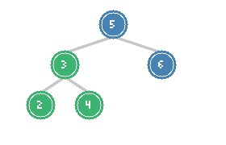

# BST Operations: Kth Smallest & BST Iterator

> **Leveraging BST ordering property for efficient operations**

These problems focus on exploiting the Binary Search Tree property where an inorder traversal yields elements in sorted order. Understanding this property is crucial for BST-related interview questions at Google.

---

## Kth Smallest Element in a BST

### Problem Statement

Given the root of a binary search tree, and an integer k, return the kth smallest value (1-indexed) of all the values of the nodes in the tree.

**LeetCode Problem:** [230. Kth Smallest Element in a BST](https://leetcode.com/problems/kth-smallest-element-in-a-bst/)

### Visualization



*Inorder traversal: 2, 3, 4, 5, 6. For k=3, the answer is 4 (highlighted in green)*

### Key Insight

The inorder traversal of a BST visits nodes in ascending order. Therefore, the kth smallest element is the kth node visited during an inorder traversal.

**Why this works:** In a BST:
- All nodes in the left subtree are smaller than the root
- All nodes in the right subtree are larger than the root
- Inorder (Left, Root, Right) naturally gives sorted order

### Solution: Iterative Inorder

```python
def kthSmallest(root, k) -> int:
    stack = []
    current = root

    while current or stack:
        # Go to the leftmost node
        while current:
            stack.append(current)
            current = current.left

        # Process the node
        current = stack.pop()
        k -= 1

        if k == 0:
            return current.val

        # Move to right subtree
        current = current.right

    return -1  # k is larger than tree size
```

::: info Complexity: Time O(h + k) · Space O(h)
- **Time:** O(h + k) because we traverse down to leftmost node (h) then visit k nodes in order
- **Space:** O(h) for the explicit stack storing nodes along the path
:::

### Solution: Recursive with Counter

```python
def kthSmallest_recursive(root, k) -> int:
    result = [None]
    count = [k]

    def inorder(node):
        if not node or result[0] is not None:
            return

        inorder(node.left)

        count[0] -= 1
        if count[0] == 0:
            result[0] = node.val
            return

        inorder(node.right)

    inorder(root)
    return result[0]
```

::: info Complexity: Time O(h + k) · Space O(h)
- **Time:** O(h + k) because inorder visits left subtree then k nodes before returning
- **Space:** O(h) for recursion stack; early termination via result check saves time
:::

### Follow-up: Frequent Queries

If the BST is modified often and kthSmallest is called frequently, augment each node with a count of nodes in its left subtree:

```python
class TreeNodeAugmented:
    def __init__(self, val=0):
        self.val = val
        self.left = None
        self.right = None
        self.left_count = 0  # Number of nodes in left subtree

def kthSmallest_augmented(root, k) -> int:
    current = root

    while current:
        left_count = current.left_count

        if k == left_count + 1:
            return current.val
        elif k <= left_count:
            current = current.left
        else:
            k -= (left_count + 1)
            current = current.right

    return -1
```

::: info Complexity: Time O(h) · Space O(1)
- **Time:** O(h) because augmented left_count allows direct navigation without visiting k nodes
- **Space:** O(1) because we only use a single pointer and arithmetic comparisons
:::

### Complexity

- **Standard:** Time O(h + k), Space O(h)
- **Augmented:** Time O(h), Space O(1) for queries, O(n) preprocessing

---

## BST Iterator

### Problem Statement

Implement the BSTIterator class that represents an iterator over the inorder traversal of a binary search tree (BST):
- `BSTIterator(TreeNode root)` - Initializes the iterator with the root
- `int next()` - Returns the next smallest number
- `boolean hasNext()` - Returns true if there exists a number in the traversal

The `next()` and `hasNext()` operations should run in average O(1) time and use O(h) memory.

**LeetCode Problem:** [173. Binary Search Tree Iterator](https://leetcode.com/problems/binary-search-tree-iterator/)

### Key Insight

We simulate an iterative inorder traversal using a stack. The stack stores the path to the current position, allowing us to:
1. Start from the leftmost node
2. After processing a node, move to its right subtree's leftmost node
3. When right subtree is exhausted, backtrack using the stack

### Solution (Python)

```python
class BSTIterator:
    def __init__(self, root):
        self.stack = []
        self._push_left(root)

    def _push_left(self, node):
        """Push all left children onto stack."""
        while node:
            self.stack.append(node)
            node = node.left

    def next(self) -> int:
        """Return the next smallest element."""
        node = self.stack.pop()
        result = node.val

        # If node has right child, push its leftmost path
        if node.right:
            self._push_left(node.right)

        return result

    def hasNext(self) -> bool:
        """Return True if there are more elements."""
        return len(self.stack) > 0
```

::: info Complexity: Time O(1) amortized per next() · Space O(h)
- **Time:** O(h) worst case for next() when traversing right subtree, but O(1) amortized over all calls
- **Space:** O(h) for stack storing at most h nodes (path from root to current position)
:::

### Alternative: Flatten on Initialization

```python
class BSTIterator_Flatten:
    def __init__(self, root):
        self.nodes = []
        self.index = 0
        self._inorder(root)

    def _inorder(self, node):
        if not node:
            return
        self._inorder(node.left)
        self.nodes.append(node.val)
        self._inorder(node.right)

    def next(self) -> int:
        result = self.nodes[self.index]
        self.index += 1
        return result

    def hasNext(self) -> bool:
        return self.index < len(self.nodes)
```

::: info Complexity: Time O(1) per next() · Space O(n)
- **Time:** O(n) initialization to flatten tree, then O(1) per next()/hasNext() operation
- **Space:** O(n) for storing all node values in a list
:::

**Trade-off:** Flatten uses O(n) space but O(1) time per operation. Stack-based uses O(h) space but O(h) worst-case per operation (amortized O(1)).

### Complexity Analysis

| Approach | Space | next() Time | hasNext() Time |
|----------|-------|-------------|----------------|
| Stack-based | O(h) | O(h) worst, O(1) amortized | O(1) |
| Flatten | O(n) | O(1) | O(1) |

---

## Related BST Problems

### Search in a BST

**LeetCode Problem:** [700. Search in a Binary Search Tree](https://leetcode.com/problems/search-in-a-binary-search-tree/)

```python
def searchBST(root, val):
    while root:
        if val == root.val:
            return root
        elif val < root.val:
            root = root.left
        else:
            root = root.right
    return None
```

::: info Complexity: Time O(h) · Space O(1)
- **Time:** O(h) because we follow one path from root using BST property
- **Space:** O(1) because we use only pointer manipulation
:::

### Insert into a BST

**LeetCode Problem:** [701. Insert into a Binary Search Tree](https://leetcode.com/problems/insert-into-a-binary-search-tree/)

```python
def insertIntoBST(root, val):
    if not root:
        return TreeNode(val)

    if val < root.val:
        root.left = insertIntoBST(root.left, val)
    else:
        root.right = insertIntoBST(root.right, val)

    return root
```

::: info Complexity: Time O(h) · Space O(h)
- **Time:** O(h) because we traverse one path to find insertion point
- **Space:** O(h) for recursion stack depth
:::

### Delete from a BST

**LeetCode Problem:** [450. Delete Node in a BST](https://leetcode.com/problems/delete-node-in-a-bst/)

```python
def deleteNode(root, key):
    if not root:
        return None

    if key < root.val:
        root.left = deleteNode(root.left, key)
    elif key > root.val:
        root.right = deleteNode(root.right, key)
    else:
        # Node to delete found
        # Case 1 & 2: No child or one child
        if not root.left:
            return root.right
        if not root.right:
            return root.left

        # Case 3: Two children - find inorder successor
        successor = root.right
        while successor.left:
            successor = successor.left

        root.val = successor.val
        root.right = deleteNode(root.right, successor.val)

    return root
```

::: info Complexity: Time O(h) · Space O(h)
- **Time:** O(h) to find node, plus O(h) to find successor and delete recursively
- **Space:** O(h) for recursion stack; could be O(1) with iterative approach
:::

### Inorder Successor in BST

**LeetCode Problem:** [285. Inorder Successor in BST](https://leetcode.com/problems/inorder-successor-in-bst/)

```python
def inorderSuccessor(root, p):
    successor = None

    while root:
        if p.val < root.val:
            successor = root  # Potential successor
            root = root.left
        else:
            root = root.right

    return successor
```

::: info Complexity: Time O(h) · Space O(1)
- **Time:** O(h) because we follow one path tracking potential successors
- **Space:** O(1) because we only track the successor candidate pointer
:::

---

## Inorder Traversal Pattern

### Template for BST Problems

```python
def bst_inorder_template(root):
    """Many BST problems can be solved with inorder traversal."""
    stack = []
    current = root
    # Initialize any tracking variables

    while current or stack:
        # Go to leftmost
        while current:
            stack.append(current)
            current = current.left

        # Process current node
        current = stack.pop()

        # Do something with current.val
        # (check condition, count, compare, etc.)

        # Move to right subtree
        current = current.right

    return result
```

### Common Applications

| Problem | What to Track |
|---------|--------------|
| Kth Smallest | Counter, decrement until 0 |
| Validate BST | Previous value for strict ordering |
| Convert to Sorted List | Build list during traversal |
| Find Mode | Count frequencies, track max |
| Range Sum | Sum values within range |

---

## BST Properties Summary

### Time Complexities

| Operation | Average | Worst (Skewed) |
|-----------|---------|----------------|
| Search | O(log n) | O(n) |
| Insert | O(log n) | O(n) |
| Delete | O(log n) | O(n) |
| Kth Smallest | O(log n + k) | O(n) |
| Min/Max | O(log n) | O(n) |

### Why BST Can Degrade

A BST becomes skewed (like a linked list) when:
- Elements are inserted in sorted order
- No balancing mechanism is used

**Solution:** Self-balancing BSTs like AVL or Red-Black trees maintain O(log n) height.

---

## Google Interview Applications

### Common Variations

1. **Kth Largest**: Same as kth smallest, but reverse inorder (Right, Root, Left)
2. **Range Queries**: Find all elements in range [lo, hi]
3. **Closest Value**: Find value closest to target
4. **Two Sum in BST**: Find two nodes that sum to target

### Kth Largest Element

```python
def kthLargest(root, k) -> int:
    stack = []
    current = root

    while current or stack:
        # Go to rightmost
        while current:
            stack.append(current)
            current = current.right

        current = stack.pop()
        k -= 1

        if k == 0:
            return current.val

        current = current.left

    return -1
```

::: info Complexity: Time O(h + (n-k)) · Space O(h)
- **Time:** O(h) to reach rightmost, then visit n-k nodes in reverse order
- **Space:** O(h) for stack storing path to current position
:::

### Two Sum in BST

```python
def findTarget(root, k) -> bool:
    seen = set()

    def dfs(node):
        if not node:
            return False

        if k - node.val in seen:
            return True

        seen.add(node.val)

        return dfs(node.left) or dfs(node.right)

    return dfs(root)
```

::: info Complexity: Time O(n) · Space O(n)
- **Time:** O(n) because we visit each node once checking complement in hash set
- **Space:** O(n) for hash set storing all visited values
:::

### Follow-up Questions

| Problem | Follow-up |
|---------|-----------|
| Kth Smallest | How to optimize for frequent queries? (Augment nodes) |
| BST Iterator | Can you implement previous() as well? |
| Range Query | What if ranges are very large but tree is small? |

### Interview Tips

1. **Mention inorder property**: Always state that BST inorder gives sorted order
2. **Discuss balance**: Acknowledge that performance depends on tree balance
3. **Consider augmentation**: For repeated queries, augmented data structures help
4. **Handle edge cases**: Empty tree, k larger than tree size, single node

---

## Summary Table

| Problem | Difficulty | Pattern | Time | Space |
|---------|-----------|---------|------|-------|
| Kth Smallest | Medium | Inorder + Counter | O(h+k) | O(h) |
| BST Iterator | Medium | Controlled Inorder | O(1) amortized | O(h) |
| Search BST | Easy | BST Navigation | O(h) | O(1) |
| Insert BST | Medium | BST Navigation | O(h) | O(h) |
| Delete BST | Medium | Find + Reconnect | O(h) | O(h) |

---

## References

- [Kth Smallest Element in BST - LeetCode](https://leetcode.com/problems/kth-smallest-element-in-a-bst/)
- [Binary Search Tree Iterator - LeetCode](https://leetcode.com/problems/binary-search-tree-iterator/)
- [Delete Node in BST - LeetCode](https://leetcode.com/problems/delete-node-in-a-bst/)
- [230. Kth Smallest Element - In-Depth Explanation](https://algo.monster/liteproblems/230)
- [173. BST Iterator - In-Depth Explanation](https://algo.monster/liteproblems/173)
- [450. Delete Node in BST - In-Depth Explanation](https://algo.monster/liteproblems/450)
