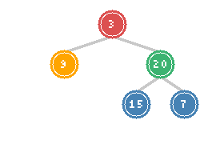
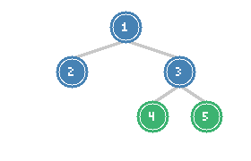

# Construct Binary Tree & Serialize/Deserialize

> **Building and encoding tree structures**

These problems test your understanding of tree traversal relationships and your ability to uniquely represent tree structures. They're frequently asked in interviews because they combine algorithmic thinking with data structure design.

---

## Construct Binary Tree from Preorder and Inorder Traversal

### Problem Statement

Given two integer arrays `preorder` and `inorder` where preorder is the preorder traversal of a binary tree and inorder is the inorder traversal of the same tree, construct and return the binary tree.

**LeetCode Problem:** [105. Construct Binary Tree from Preorder and Inorder Traversal](https://leetcode.com/problems/construct-binary-tree-from-preorder-and-inorder-traversal/)

### Visualization



*Tree constructed from preorder=[3,9,20,15,7] and inorder=[9,3,15,20,7]*

### Key Insight

Understanding traversal patterns:
- **Preorder (Root, Left, Right)**: First element is always the root
- **Inorder (Left, Root, Right)**: Root divides left and right subtrees

Algorithm:
1. Take first element from preorder - this is the root
2. Find this element in inorder - elements to the left form left subtree, elements to the right form right subtree
3. Recursively build left and right subtrees

### Solution (Python)

```python
def buildTree(preorder, inorder):
    if not preorder or not inorder:
        return None

    # First element of preorder is the root
    root_val = preorder[0]
    root = TreeNode(root_val)

    # Find root in inorder to split left/right subtrees
    mid = inorder.index(root_val)

    # Left subtree: preorder[1:mid+1], inorder[:mid]
    # Right subtree: preorder[mid+1:], inorder[mid+1:]
    root.left = buildTree(preorder[1:mid+1], inorder[:mid])
    root.right = buildTree(preorder[mid+1:], inorder[mid+1:])

    return root
```

::: info Complexity: Time O(n^2) · Space O(n)
- **Time:** O(n^2) because index() is O(n) and array slicing creates copies at each level
- **Space:** O(n) for the sliced arrays plus O(h) recursion stack
:::

### Optimized Solution with HashMap

```python
def buildTree_optimized(preorder, inorder):
    # Build index map for O(1) lookup in inorder
    inorder_map = {val: idx for idx, val in enumerate(inorder)}
    preorder_idx = [0]  # Use list to maintain state across recursion

    def build(left, right):
        if left > right:
            return None

        # Get root value and increment preorder index
        root_val = preorder[preorder_idx[0]]
        preorder_idx[0] += 1

        root = TreeNode(root_val)

        # Find split point
        mid = inorder_map[root_val]

        # Build subtrees (left first, then right - matches preorder)
        root.left = build(left, mid - 1)
        root.right = build(mid + 1, right)

        return root

    return build(0, len(inorder) - 1)
```

::: info Complexity: Time O(n) · Space O(n)
- **Time:** O(n) because hashmap gives O(1) root lookup and we avoid slicing
- **Space:** O(n) for hashmap plus O(h) recursion stack
:::

### Complexity

- **Naive:** Time O(n^2) due to slicing and index lookup
- **Optimized:** Time O(n), Space O(n) for hashmap

---

## Construct Binary Tree from Inorder and Postorder Traversal

### Problem Statement

Given two integer arrays `inorder` and `postorder` where inorder is the inorder traversal and postorder is the postorder traversal of the same tree, construct and return the binary tree.

**LeetCode Problem:** [106. Construct Binary Tree from Inorder and Postorder Traversal](https://leetcode.com/problems/construct-binary-tree-from-inorder-and-postorder-traversal/)

### Key Insight

Similar to preorder + inorder, but:
- **Postorder (Left, Right, Root)**: Last element is always the root
- We traverse postorder from the end (right to left)
- Build right subtree before left (reverse of preorder approach)

### Solution (Python)

```python
def buildTree_postorder(inorder, postorder):
    if not inorder or not postorder:
        return None

    # Last element of postorder is the root
    root_val = postorder[-1]
    root = TreeNode(root_val)

    # Find root in inorder
    mid = inorder.index(root_val)

    # Build subtrees
    root.left = buildTree_postorder(inorder[:mid], postorder[:mid])
    root.right = buildTree_postorder(inorder[mid+1:], postorder[mid:-1])

    return root
```

::: info Complexity: Time O(n^2) · Space O(n)
- **Time:** O(n^2) because index() and slicing at each recursive call
- **Space:** O(n) for sliced arrays; could be optimized with index tracking
:::

### Optimized Solution

```python
def buildTree_postorder_optimized(inorder, postorder):
    inorder_map = {val: idx for idx, val in enumerate(inorder)}
    postorder_idx = [len(postorder) - 1]

    def build(left, right):
        if left > right:
            return None

        root_val = postorder[postorder_idx[0]]
        postorder_idx[0] -= 1

        root = TreeNode(root_val)
        mid = inorder_map[root_val]

        # Build right subtree first (matches postorder traversal direction)
        root.right = build(mid + 1, right)
        root.left = build(left, mid - 1)

        return root

    return build(0, len(inorder) - 1)
```

::: info Complexity: Time O(n) · Space O(n)
- **Time:** O(n) because hashmap provides O(1) lookup; we process each node once
- **Space:** O(n) for hashmap plus O(h) recursion; note we build right before left
:::

---

## Serialize and Deserialize Binary Tree

### Problem Statement

Design an algorithm to serialize and deserialize a binary tree. Serialization is the process of converting a data structure into a sequence of bits so that it can be stored or transmitted. Deserialization reconstructs the tree from the serialized format.

**LeetCode Problem:** [297. Serialize and Deserialize Binary Tree](https://leetcode.com/problems/serialize-and-deserialize-binary-tree/)

### Visualization



*Tree serialized as "1,2,3,null,null,4,5" or "1,2,null,null,3,4,null,null,5,null,null"*

### Key Insight

Two common approaches:
1. **BFS (Level Order)**: Serialize level by level with null markers
2. **DFS (Preorder)**: Serialize with null markers for missing children

Both require null markers to distinguish tree shapes (e.g., left child only vs right child only).

### Solution: Preorder DFS

```python
class Codec:
    def serialize(self, root) -> str:
        """Encodes a tree to a single string."""
        result = []

        def dfs(node):
            if not node:
                result.append("null")
                return

            result.append(str(node.val))
            dfs(node.left)
            dfs(node.right)

        dfs(root)
        return ",".join(result)

    def deserialize(self, data: str):
        """Decodes your encoded data to tree."""
        if not data:
            return None

        values = iter(data.split(","))

        def build():
            val = next(values)

            if val == "null":
                return None

            node = TreeNode(int(val))
            node.left = build()
            node.right = build()

            return node

        return build()
```

::: info Complexity: Time O(n) · Space O(n)
- **Time:** O(n) for serialize (visit each node) and O(n) for deserialize (process each value)
- **Space:** O(n) for the serialized string; recursion stack is O(h) for tree height
:::

### Solution: BFS (Level Order)

```python
from collections import deque

class Codec_BFS:
    def serialize(self, root) -> str:
        if not root:
            return ""

        result = []
        queue = deque([root])

        while queue:
            node = queue.popleft()

            if node:
                result.append(str(node.val))
                queue.append(node.left)
                queue.append(node.right)
            else:
                result.append("null")

        # Remove trailing nulls for efficiency
        while result and result[-1] == "null":
            result.pop()

        return ",".join(result)

    def deserialize(self, data: str):
        if not data:
            return None

        values = data.split(",")
        root = TreeNode(int(values[0]))
        queue = deque([root])
        i = 1

        while queue and i < len(values):
            node = queue.popleft()

            # Left child
            if i < len(values) and values[i] != "null":
                node.left = TreeNode(int(values[i]))
                queue.append(node.left)
            i += 1

            # Right child
            if i < len(values) and values[i] != "null":
                node.right = TreeNode(int(values[i]))
                queue.append(node.right)
            i += 1

        return root
```

::: info Complexity: Time O(n) · Space O(n)
- **Time:** O(n) for both operations; BFS processes each node exactly once
- **Space:** O(n) for serialized string and O(w) for queue where w is max width
:::

### Complexity

- **Time:** O(n) for both serialize and deserialize
- **Space:** O(n) for storing the serialized string

---

## Serialize and Deserialize BST

### Problem Statement

Design an algorithm to serialize and deserialize a BST. The encoded string should be as compact as possible.

**LeetCode Problem:** [449. Serialize and Deserialize BST](https://leetcode.com/problems/serialize-and-deserialize-bst/)

### Key Insight

For BST, we don't need null markers because the BST property allows reconstruction from preorder alone. We use bounds to determine where to place each value.

### Solution (Python)

```python
class Codec_BST:
    def serialize(self, root) -> str:
        """Preorder traversal - no null markers needed for BST."""
        if not root:
            return ""

        result = []

        def preorder(node):
            if node:
                result.append(str(node.val))
                preorder(node.left)
                preorder(node.right)

        preorder(root)
        return ",".join(result)

    def deserialize(self, data: str):
        if not data:
            return None

        values = list(map(int, data.split(",")))
        idx = [0]

        def build(min_val, max_val):
            if idx[0] >= len(values):
                return None

            val = values[idx[0]]

            # Value outside valid range for this position
            if val < min_val or val > max_val:
                return None

            idx[0] += 1
            node = TreeNode(val)

            # Left subtree has values less than current
            node.left = build(min_val, val)
            # Right subtree has values greater than current
            node.right = build(val, max_val)

            return node

        return build(float('-inf'), float('inf'))
```

::: info Complexity: Time O(n) · Space O(n)
- **Time:** O(n) for serialize (preorder) and O(n) for deserialize (bounds-based reconstruction)
- **Space:** O(n) for string; no null markers needed due to BST property, making it more compact
:::

---

## Why Two Traversals Are Needed

### Uniqueness of Tree Structure

| Combination | Unique? | Reason |
|-------------|---------|--------|
| Preorder + Inorder | Yes | Preorder gives root, inorder gives split |
| Postorder + Inorder | Yes | Postorder gives root (last), inorder gives split |
| Preorder + Postorder | No* | Cannot determine split without inorder |
| Inorder alone | No | Cannot determine root |
| Preorder alone | No | Cannot distinguish left/right children |

*Exception: With null markers, a single traversal suffices.

### Why Preorder + Postorder Doesn't Work

Consider:
```
Tree A:      Tree B:
    1            1
   /              \
  2                2
```

Both have:
- Preorder: [1, 2]
- Postorder: [2, 1]

Without inorder, we can't tell if 2 is a left or right child.

---

## Construct BST from Preorder Traversal

### Problem Statement

Given an array of integers preorder, which represents the preorder traversal of a BST, construct the tree.

**LeetCode Problem:** [1008. Construct BST from Preorder Traversal](https://leetcode.com/problems/construct-binary-search-tree-from-preorder-traversal/)

### Solution (Python)

```python
def bstFromPreorder(preorder):
    idx = [0]

    def build(min_val, max_val):
        if idx[0] >= len(preorder):
            return None

        val = preorder[idx[0]]

        if val < min_val or val > max_val:
            return None

        idx[0] += 1
        node = TreeNode(val)
        node.left = build(min_val, val)
        node.right = build(val, max_val)

        return node

    return build(float('-inf'), float('inf'))
```

::: info Complexity: Time O(n) · Space O(h)
- **Time:** O(n) because each element is processed once with O(1) bound comparisons
- **Space:** O(h) for recursion stack; more efficient than general tree construction
:::

---

## Pattern Recognition

### Construction Patterns

| Given | Key Insight | Approach |
|-------|-------------|----------|
| Preorder + Inorder | Preorder[0] is root | Divide at root in inorder |
| Postorder + Inorder | Postorder[-1] is root | Build right before left |
| BST + Preorder | Use BST bounds | No inorder needed |
| BST + Postorder | Use BST bounds (reversed) | Build right then left |

### Serialization Patterns

| Format | Markers | When to Use |
|--------|---------|-------------|
| Preorder DFS | Need null markers | Simple implementation |
| BFS Level Order | Need null markers | Intuitive, matches array representation |
| BST Preorder | No markers | More compact for BST |

---

## Interview Applications

### Common Variations

1. **Construct with other traversals**: Level order + inorder
2. **Verify reconstruction**: Given traversals, check if valid tree exists
3. **N-ary tree serialization**: Extend to trees with multiple children
4. **Compressed serialization**: Minimize string length

### Follow-up Questions

| Problem | Follow-up |
|---------|-----------|
| Construct from traversals | What if values can be duplicates? |
| Serialize/Deserialize | How to handle very large trees (streaming)? |
| BST serialization | How to make it even more compact (bit-level)? |

### Interview Tips

1. **Explain traversal properties**: State what each traversal tells you
2. **Handle edge cases**: Empty tree, single node, null values
3. **Discuss alternatives**: Mention BFS vs DFS tradeoffs
4. **Analyze space**: Consider the serialization format efficiency

---

## Summary Table

| Problem | Difficulty | Key Technique | Time | Space |
|---------|-----------|---------------|------|-------|
| Construct (Pre + In) | Medium | Divide at root | O(n) | O(n) |
| Construct (Post + In) | Medium | Reverse approach | O(n) | O(n) |
| Serialize (DFS) | Hard | Preorder + nulls | O(n) | O(n) |
| Serialize (BFS) | Hard | Level order + nulls | O(n) | O(n) |
| Serialize BST | Medium | Preorder, no nulls | O(n) | O(n) |
| BST from Preorder | Medium | Bounds-based build | O(n) | O(h) |

---

## References

- [Construct Binary Tree from Preorder and Inorder - LeetCode](https://leetcode.com/problems/construct-binary-tree-from-preorder-and-inorder-traversal/)
- [Construct Binary Tree from Inorder and Postorder - LeetCode](https://leetcode.com/problems/construct-binary-tree-from-inorder-and-postorder-traversal/)
- [Serialize and Deserialize Binary Tree - LeetCode](https://leetcode.com/problems/serialize-and-deserialize-binary-tree/)
- [Serialize and Deserialize BST - LeetCode](https://leetcode.com/problems/serialize-and-deserialize-bst/)
- [105. Construct from Preorder and Inorder - In-Depth Explanation](https://algo.monster/liteproblems/105)
- [297. Serialize and Deserialize - In-Depth Explanation](https://algo.monster/liteproblems/297)
