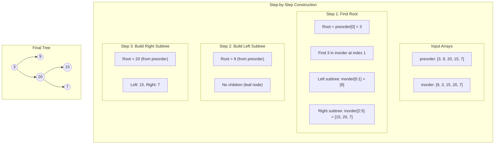
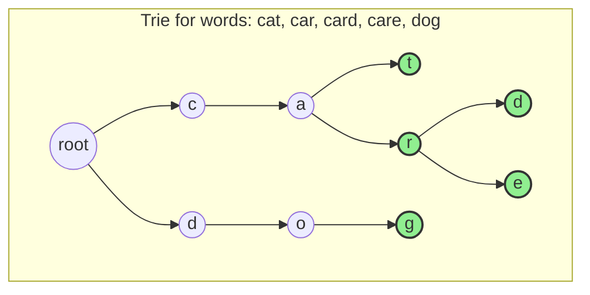

# Construct Binary Tree & Implement Trie

> **Building trees from traversals and prefix trees**

---

## Construct Binary Tree from Preorder and Inorder

### Problem Statement

Given two integer arrays `preorder` and `inorder` where:
- `preorder` is the preorder traversal of a binary tree
- `inorder` is the inorder traversal of the same tree

Construct and return the binary tree.

**Example:**
```
Input: preorder = [3,9,20,15,7], inorder = [9,3,15,20,7]
Output: [3,9,20,null,null,15,7]
```

### Key Insight

- **Preorder traversal**: `[root, left subtree, right subtree]`
- **Inorder traversal**: `[left subtree, root, right subtree]`
- The first element of preorder is always the root
- Finding the root in inorder splits the array into left and right subtrees
- Use a hashmap to achieve O(1) lookup for root position in inorder array

### Mermaid Diagram



### Solution (Python)

```python
from typing import Optional

class TreeNode:
    def __init__(self, val=0, left=None, right=None):
        self.val = val
        self.left = left
        self.right = right

def buildTree(preorder: list[int], inorder: list[int]) -> Optional[TreeNode]:
    if not preorder or not inorder:
        return None

    # Build index map for O(1) lookup of root position in inorder
    inorder_map = {val: idx for idx, val in enumerate(inorder)}

    def build(pre_start: int, pre_end: int, in_start: int, in_end: int) -> Optional[TreeNode]:
        # Base case: no elements to construct
        if pre_start > pre_end:
            return None

        # First element in preorder range is the root
        root_val = preorder[pre_start]
        root = TreeNode(root_val)

        # Find root position in inorder to determine subtree sizes
        root_idx = inorder_map[root_val]
        left_size = root_idx - in_start

        # Recursively build left subtree
        # Preorder: elements after root, up to left_size elements
        # Inorder: elements before root_idx
        root.left = build(
            pre_start + 1,
            pre_start + left_size,
            in_start,
            root_idx - 1
        )

        # Recursively build right subtree
        # Preorder: elements after left subtree
        # Inorder: elements after root_idx
        root.right = build(
            pre_start + left_size + 1,
            pre_end,
            root_idx + 1,
            in_end
        )

        return root

    return build(0, len(preorder) - 1, 0, len(inorder) - 1)
```

::: info Complexity: Time O(n) · Space O(n)
- **Time:** O(n) because we process each node once; hashmap provides O(1) root lookup in inorder
- **Space:** O(n) for the hashmap storing inorder indices, plus O(h) recursion stack
:::

### Alternative: Construct from Postorder and Inorder

```python
def buildTreePostIn(inorder: list[int], postorder: list[int]) -> Optional[TreeNode]:
    if not inorder or not postorder:
        return None

    inorder_map = {val: idx for idx, val in enumerate(inorder)}

    def build(in_start: int, in_end: int, post_start: int, post_end: int) -> Optional[TreeNode]:
        if in_start > in_end:
            return None

        # Last element in postorder range is the root
        root_val = postorder[post_end]
        root = TreeNode(root_val)

        root_idx = inorder_map[root_val]
        left_size = root_idx - in_start

        root.left = build(
            in_start, root_idx - 1,
            post_start, post_start + left_size - 1
        )
        root.right = build(
            root_idx + 1, in_end,
            post_start + left_size, post_end - 1
        )

        return root

    return build(0, len(inorder) - 1, 0, len(postorder) - 1)
```

::: info Complexity: Time O(n) · Space O(n)
- **Time:** O(n) because we process each node once; same hashmap optimization as preorder version
- **Space:** O(n) for the hashmap, plus O(h) recursion stack for tree construction
:::

### Complexity

| Approach | Time | Space |
|----------|------|-------|
| With HashMap | O(n) | O(n) |
| Without HashMap (using index search) | O(n^2) | O(n) |

Where n = number of nodes in the tree

**Space breakdown:**
- O(n) for the hashmap
- O(h) for recursion stack, where h = tree height (O(n) worst case for skewed tree)

---

## Implement Trie (Prefix Tree)

### Overview

A **Trie** (pronounced "try"), also called a prefix tree, is a tree-like data structure used for efficient storage and retrieval of strings. Each path from root to a node represents a prefix of stored words.

**Common Use Cases:**
- **Autocomplete systems** - Suggesting completions as users type
- **Spell checkers** - Finding similar words or validating spelling
- **IP routing** - Longest prefix matching in network routers
- **Word games** - Validating words in Scrabble, Boggle, etc.
- **Search engines** - Indexing and searching text

### Mermaid Diagram



**Legend:** Green nodes indicate `is_end = True` (valid word endings)

### Implementation (Python)

```python
class TrieNode:
    """Node in the Trie structure."""
    def __init__(self):
        self.children: dict[str, 'TrieNode'] = {}
        self.is_end: bool = False


class Trie:
    """
    Prefix tree implementation supporting insert, search, and prefix operations.
    """

    def __init__(self):
        self.root = TrieNode()

    def insert(self, word: str) -> None:
        """
        Insert a word into the trie.
        Time: O(m), Space: O(m) where m = len(word)
        """
        node = self.root
        for char in word:
            if char not in node.children:
                node.children[char] = TrieNode()
            node = node.children[char]
        node.is_end = True

    def search(self, word: str) -> bool:
        """
        Return True if word is in the trie (exact match).
        Time: O(m), Space: O(1)
        """
        node = self._find_node(word)
        return node is not None and node.is_end

    def startsWith(self, prefix: str) -> bool:
        """
        Return True if any word in the trie starts with the given prefix.
        Time: O(m), Space: O(1)
        """
        return self._find_node(prefix) is not None

    def _find_node(self, prefix: str) -> TrieNode | None:
        """
        Helper method to traverse the trie following the prefix.
        Returns the node at the end of prefix, or None if prefix not found.
        """
        node = self.root
        for char in prefix:
            if char not in node.children:
                return None
            node = node.children[char]
        return node


# Usage Example
trie = Trie()
trie.insert("apple")
print(trie.search("apple"))    # True
print(trie.search("app"))      # False
print(trie.startsWith("app"))  # True
trie.insert("app")
print(trie.search("app"))      # True
```

::: info Complexity: Time O(m) per operation · Space O(m) for insert
- **Time:** O(m) per operation where m is word/prefix length; we traverse one character per node
- **Space:** O(m) for insert (creates at most m new nodes); O(1) for search/startsWith (no new storage)
:::

### Complexity

| Operation | Time | Space |
|-----------|------|-------|
| Insert | O(m) | O(m) |
| Search | O(m) | O(1) |
| StartsWith | O(m) | O(1) |

Where m = length of the word/prefix

**Total Space Complexity:** O(ALPHABET_SIZE * m * n) in worst case, where n = number of words

### Alternative: Array-based Children (Fixed Alphabet)

```python
class TrieNodeArray:
    """
    More memory-efficient for lowercase English letters only.
    Uses array instead of dictionary.
    """
    def __init__(self):
        self.children: list[TrieNodeArray | None] = [None] * 26
        self.is_end: bool = False


class TrieArray:
    def __init__(self):
        self.root = TrieNodeArray()

    def _char_to_index(self, char: str) -> int:
        return ord(char) - ord('a')

    def insert(self, word: str) -> None:
        node = self.root
        for char in word:
            idx = self._char_to_index(char)
            if node.children[idx] is None:
                node.children[idx] = TrieNodeArray()
            node = node.children[idx]
        node.is_end = True

    def search(self, word: str) -> bool:
        node = self._find_node(word)
        return node is not None and node.is_end

    def startsWith(self, prefix: str) -> bool:
        return self._find_node(prefix) is not None

    def _find_node(self, prefix: str) -> TrieNodeArray | None:
        node = self.root
        for char in prefix:
            idx = self._char_to_index(char)
            if node.children[idx] is None:
                return None
            node = node.children[idx]
        return node
```

::: info Complexity: Time O(m) per operation · Space O(26 * m * n) total
- **Time:** O(m) per operation; array indexing is O(1) compared to hash lookup
- **Space:** O(26 * m * n) worst case for total Trie with n words of avg length m; more memory per node but faster access
:::

### Advanced: Autocomplete

```python
def autocomplete(self, prefix: str, max_results: int = 10) -> list[str]:
    """
    Return all words in the trie that start with the given prefix.

    Time: O(m + k) where m = prefix length, k = total chars in all matching words
    Space: O(h) for recursion stack, where h = max word length
    """
    node = self._find_node(prefix)
    if not node:
        return []

    results = []

    def dfs(current_node: TrieNode, path: str) -> None:
        if len(results) >= max_results:
            return

        if current_node.is_end:
            results.append(prefix + path)

        for char, child in current_node.children.items():
            dfs(child, path + char)

    dfs(node, "")
    return results
```

::: info Complexity: Time O(m + k) · Space O(h)
- **Time:** O(m) to find prefix node, plus O(k) where k is total characters in all matching words
- **Space:** O(h) for recursion stack where h is max word length; results list is output space
:::

### Advanced: Delete Operation

```python
def delete(self, word: str) -> bool:
    """
    Delete a word from the trie.
    Returns True if word was found and deleted.
    """
    def _delete_helper(node: TrieNode, word: str, depth: int) -> bool:
        if depth == len(word):
            if not node.is_end:
                return False  # Word not found
            node.is_end = False
            return len(node.children) == 0  # Can delete if no children

        char = word[depth]
        if char not in node.children:
            return False  # Word not found

        should_delete_child = _delete_helper(
            node.children[char], word, depth + 1
        )

        if should_delete_child:
            del node.children[char]
            return len(node.children) == 0 and not node.is_end

        return False

    _delete_helper(self.root, word, 0)
    return True
```

::: info Complexity: Time O(m) · Space O(m)
- **Time:** O(m) where m is word length; we traverse the word once and potentially clean up nodes
- **Space:** O(m) for recursion stack depth equal to word length
:::

### Advanced: Count Words with Prefix

```python
def countWordsWithPrefix(self, prefix: str) -> int:
    """
    Count how many words in the trie start with the given prefix.
    Requires maintaining a count in each node during insertion.
    """
    node = self._find_node(prefix)
    if not node:
        return 0

    count = 0

    def dfs(current_node: TrieNode) -> None:
        nonlocal count
        if current_node.is_end:
            count += 1
        for child in current_node.children.values():
            dfs(child)

    dfs(node)
    return count
```

::: info Complexity: Time O(m + k) · Space O(h)
- **Time:** O(m) to find prefix node, plus O(k) to traverse all nodes under it where k is number of nodes
- **Space:** O(h) for recursion stack where h is max depth of subtree being traversed
:::

---

## Interview Applications

### Common Interview Problems

1. **Word Search II (LeetCode 212)** - Find all words from a dictionary in a 2D board using Trie + DFS backtracking

2. **Design Add and Search Words Data Structure (LeetCode 211)** - Trie with wildcard '.' matching support

3. **Replace Words (LeetCode 648)** - Find shortest prefix in dictionary for each word

4. **Implement Magic Dictionary (LeetCode 676)** - Search with exactly one character different

5. **Construct Binary Tree from Preorder and Inorder (LeetCode 105)** - Classic tree construction problem

6. **Construct Binary Tree from Inorder and Postorder (LeetCode 106)** - Similar approach, different traversal order

### Interview Tips

**For Tree Construction:**
- Always use a hashmap to store inorder indices for O(1) lookup
- Understand how to calculate subtree sizes and index ranges
- Practice both preorder+inorder and postorder+inorder variants
- Be ready to trace through an example step by step

**For Trie Problems:**
- Understand when to use Trie vs HashSet (Trie excels at prefix operations)
- Know how to combine Trie with DFS/BFS for search problems
- Consider space optimization with array-based children for fixed alphabets
- Practice implementing delete and count operations

### Related LeetCode Problems

| Problem | Difficulty | Topic |
|---------|------------|-------|
| 105. Construct Binary Tree from Preorder and Inorder | Medium | Tree Construction |
| 106. Construct Binary Tree from Inorder and Postorder | Medium | Tree Construction |
| 889. Construct Binary Tree from Preorder and Postorder | Medium | Tree Construction |
| 208. Implement Trie (Prefix Tree) | Medium | Trie |
| 211. Design Add and Search Words Data Structure | Medium | Trie + DFS |
| 212. Word Search II | Hard | Trie + Backtracking |
| 648. Replace Words | Medium | Trie |
| 677. Map Sum Pairs | Medium | Trie |
| 1804. Implement Trie II (Prefix Tree) | Medium | Trie |

---

## Sources

- [LeetCode 105 - Construct Binary Tree from Preorder and Inorder Traversal](https://leetcode.com/problems/construct-binary-tree-from-preorder-and-inorder-traversal/)
- [algo.monster - Problem 105 In-Depth Explanation](https://algo.monster/liteproblems/105)
- [NeetCode - Binary Tree from Preorder and Inorder](https://neetcode.io/problems/binary-tree-from-preorder-and-inorder-traversal/question?list=neetcode150)
- [GeeksforGeeks - Binary Tree from Inorder and Preorder](https://www.geeksforgeeks.org/dsa/construct-tree-from-given-inorder-and-preorder-traversal/)
- [LeetCode 208 - Implement Trie (Prefix Tree)](https://leetcode.com/problems/implement-trie-prefix-tree/)
- [algo.monster - Problem 208 In-Depth Explanation](https://algo.monster/liteproblems/208)
- [algomap.io - Implement Trie Solution](https://algomap.io/problems/implement-trie-prefix-tree)
- [LeetCode 1804 - Implement Trie II](https://leetcode.com/problems/implement-trie-ii-prefix-tree/)
