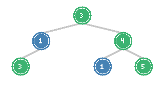
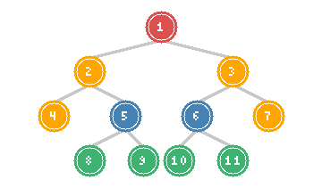

# Count Good Nodes & Boundary of Binary Tree

> **Path-based constraints and boundary traversal**

These problems require tracking information from root to current node (good nodes) or carefully ordering traversal to capture specific node sets (boundary). They test understanding of DFS with state propagation and creative traversal techniques.

---

## Count Good Nodes in Binary Tree

### Problem Statement

Given a binary tree root, a node X in the tree is named **good** if in the path from root to X there are no nodes with a value greater than X.

Return the number of good nodes in the binary tree.

**LeetCode Problem:** [1448. Count Good Nodes in Binary Tree](https://leetcode.com/problems/count-good-nodes-in-binary-tree/)

### Visualization



*Good nodes are highlighted in green: 3, 4, 3, 5. Node 1 is not good because 3 > 1 on its path.*

### Key Insight

A node is "good" if it's the maximum value seen on the path from root to that node. We can solve this by:
1. Track the maximum value seen so far during DFS traversal
2. At each node, check if current value >= max seen
3. Update max for children if current node is larger

### Solution (Python)

```python
def goodNodes(root) -> int:
    def dfs(node, max_so_far):
        if not node:
            return 0

        # Current node is good if its value >= max on path
        count = 1 if node.val >= max_so_far else 0

        # Update max for children
        new_max = max(max_so_far, node.val)

        # Add good nodes from subtrees
        count += dfs(node.left, new_max)
        count += dfs(node.right, new_max)

        return count

    return dfs(root, root.val) if root else 0
```

::: info Complexity: Time O(n) · Space O(h)
- **Time:** O(n) because we visit each node exactly once, comparing with max value on path
- **Space:** O(h) for recursion stack where h is tree height
:::

### Alternative: Without Return Value

```python
def goodNodes_global(root) -> int:
    count = 0

    def dfs(node, max_so_far):
        nonlocal count

        if not node:
            return

        if node.val >= max_so_far:
            count += 1

        new_max = max(max_so_far, node.val)
        dfs(node.left, new_max)
        dfs(node.right, new_max)

    if root:
        dfs(root, root.val)

    return count
```

::: info Complexity: Time O(n) · Space O(h)
- **Time:** O(n) because we visit each node once updating count via nonlocal variable
- **Space:** O(h) for recursion stack; nonlocal count uses O(1) extra space
:::

### Iterative BFS Solution

```python
from collections import deque

def goodNodes_bfs(root) -> int:
    if not root:
        return 0

    count = 0
    queue = deque([(root, root.val)])  # (node, max_so_far)

    while queue:
        node, max_so_far = queue.popleft()

        if node.val >= max_so_far:
            count += 1

        new_max = max(max_so_far, node.val)

        if node.left:
            queue.append((node.left, new_max))
        if node.right:
            queue.append((node.right, new_max))

    return count
```

::: info Complexity: Time O(n) · Space O(w)
- **Time:** O(n) because each node is processed once with O(1) max comparison
- **Space:** O(w) for queue where w is maximum tree width; stores (node, max) tuples
:::

### Complexity

- **Time:** O(n) - visit each node once
- **Space:** O(h) for DFS recursion stack, O(w) for BFS queue

---

## Boundary of Binary Tree

### Problem Statement

The **boundary** of a binary tree is the concatenation of the root, the left boundary, the leaves, and the right boundary **in order**.

- **Left boundary**: Path from root to leftmost node (excluding leaves)
- **Leaves**: All leaf nodes from left to right
- **Right boundary**: Path from root to rightmost node (excluding leaves), in **reverse** order

**LeetCode Problem:** [545. Boundary of Binary Tree](https://leetcode.com/problems/boundary-of-binary-tree/)

### Visualization



*Boundary: 1 (root, red) -> 2, 4 (left boundary, orange) -> 8, 9, 10, 11 (leaves, green) -> 7, 3 (right boundary reversed, orange)*

**Output:** `[1, 2, 4, 8, 9, 10, 11, 7, 3]`

### Key Insight

Split the problem into three parts:
1. **Left boundary** (top to bottom): Follow left child if exists, else right child
2. **Leaves** (left to right): Standard DFS collecting all leaves
3. **Right boundary** (bottom to top): Same as left boundary but reversed

**Important:** Avoid counting nodes multiple times (root, leftmost leaf, rightmost leaf).

### Solution (Python)

```python
def boundaryOfBinaryTree(root):
    if not root:
        return []

    # Single node case
    if not root.left and not root.right:
        return [root.val]

    result = [root.val]

    def add_left_boundary(node):
        """Add left boundary nodes (excluding leaves)."""
        while node:
            if node.left or node.right:  # Not a leaf
                result.append(node.val)

            if node.left:
                node = node.left
            else:
                node = node.right

    def add_leaves(node):
        """Add all leaves from left to right."""
        if not node:
            return

        if not node.left and not node.right:
            result.append(node.val)
            return

        add_leaves(node.left)
        add_leaves(node.right)

    def add_right_boundary(node):
        """Add right boundary nodes in reverse (excluding leaves)."""
        stack = []

        while node:
            if node.left or node.right:  # Not a leaf
                stack.append(node.val)

            if node.right:
                node = node.right
            else:
                node = node.left

        # Add in reverse order
        while stack:
            result.append(stack.pop())

    # Process left subtree boundary
    add_left_boundary(root.left)

    # Process leaves (both subtrees)
    add_leaves(root.left)
    add_leaves(root.right)

    # Process right subtree boundary
    add_right_boundary(root.right)

    return result
```

::: info Complexity: Time O(n) · Space O(n)
- **Time:** O(n) because we visit each node at most once across all three traversals
- **Space:** O(n) for result list plus O(h) stack for right boundary reversal
:::

### Alternative: Single Pass with Flags

```python
def boundaryOfBinaryTree_flags(root):
    if not root:
        return []

    result = []

    def dfs(node, is_left_boundary, is_right_boundary):
        if not node:
            return

        # Add to result if: left boundary, or leaf, or right boundary
        is_leaf = not node.left and not node.right

        # Left boundary nodes are added before children
        if is_left_boundary or is_leaf:
            result.append(node.val)

        # Process children
        if node.left and node.right:
            dfs(node.left, is_left_boundary, False)
            dfs(node.right, False, is_right_boundary)
        elif node.left:
            dfs(node.left, is_left_boundary, is_right_boundary)
        elif node.right:
            dfs(node.right, is_left_boundary, is_right_boundary)

        # Right boundary nodes are added after children (reverse order)
        if is_right_boundary and not is_leaf and not is_left_boundary:
            result.append(node.val)

    # Handle root
    result.append(root.val)

    # Process left and right subtrees
    dfs(root.left, True, False)
    dfs(root.right, False, True)

    return result
```

::: info Complexity: Time O(n) · Space O(n)
- **Time:** O(n) because single DFS visits each node once with flag-based decisions
- **Space:** O(n) for result plus O(h) for recursion stack
:::

### Complexity

- **Time:** O(n) - visit each node once
- **Space:** O(n) for result, O(h) for recursion stack

---

## Similar Problems

### Vertical Order Traversal

**LeetCode Problem:** [987. Vertical Order Traversal of a Binary Tree](https://leetcode.com/problems/vertical-order-traversal-of-a-binary-tree/)

```python
from collections import defaultdict
import heapq

def verticalTraversal(root):
    # Store (row, val) for each column
    columns = defaultdict(list)

    def dfs(node, row, col):
        if not node:
            return

        columns[col].append((row, node.val))
        dfs(node.left, row + 1, col - 1)
        dfs(node.right, row + 1, col + 1)

    dfs(root, 0, 0)

    result = []
    for col in sorted(columns.keys()):
        # Sort by row, then by value
        column_vals = [val for row, val in sorted(columns[col])]
        result.append(column_vals)

    return result
```

::: info Complexity: Time O(n log n) · Space O(n)
- **Time:** O(n log n) because we visit n nodes then sort columns and values within
- **Space:** O(n) for storing all nodes with their positions
:::

### Find Bottom Left Tree Value

**LeetCode Problem:** [513. Find Bottom Left Tree Value](https://leetcode.com/problems/find-bottom-left-tree-value/)

```python
from collections import deque

def findBottomLeftValue(root) -> int:
    queue = deque([root])
    leftmost = root.val

    while queue:
        leftmost = queue[0].val  # First node at current level

        for _ in range(len(queue)):
            node = queue.popleft()
            if node.left:
                queue.append(node.left)
            if node.right:
                queue.append(node.right)

    return leftmost
```

::: info Complexity: Time O(n) · Space O(w)
- **Time:** O(n) because BFS processes all nodes level by level
- **Space:** O(w) for queue storing nodes at current level
:::

---

## Pattern Recognition

### Problems Requiring Path State

| Problem | State to Track |
|---------|---------------|
| Good Nodes | Maximum value from root |
| Path Sum | Running sum from root |
| Ancestor Distance | Distance from specific ancestor |
| Depth/Height | Current depth from root |

### Boundary/Special Traversal Problems

| Problem | Key Technique |
|---------|--------------|
| Boundary | Three-part collection: left, leaves, right (reversed) |
| Vertical Order | Track column index, sort results |
| Bottom View | Track column, keep last node per column by level |
| Top View | Track column, keep first node per column by level |

---

## DFS with State Template

```python
def dfs_with_state(root):
    result = []

    def dfs(node, state):
        if not node:
            return

        # Process current node based on state
        if condition(node, state):
            result.append(node.val)

        # Update state for children
        new_state = update_state(state, node)

        # Recurse
        dfs(node.left, new_state)
        dfs(node.right, new_state)

    dfs(root, initial_state)
    return result
```

---

## Interview Applications

### Common Variations

1. **Good Nodes with condition**: Nodes where path sum meets criteria
2. **Boundary with depth limit**: Only nodes within k levels
3. **Count paths with property**: Paths where all nodes satisfy condition
4. **Maximum good node path**: Longest path of consecutive good nodes

### Follow-up Questions

| Problem | Follow-up |
|---------|-----------|
| Good Nodes | What if "good" means minimum instead of maximum? |
| Boundary | What if we need inner boundary at depth k? |
| Vertical Order | How to handle very wide trees efficiently? |

### Interview Tips

1. **Good Nodes**: Clearly state what "good" means and how state propagates
2. **Boundary**: Carefully handle edge cases (single node, no left/right subtree)
3. **State propagation**: Explain what information flows down the tree
4. **Avoid duplicates**: Be careful not to count boundary nodes multiple times

---

## Summary Table

| Problem | Difficulty | Pattern | Time | Space |
|---------|-----------|---------|------|-------|
| Good Nodes | Medium | DFS with max tracking | O(n) | O(h) |
| Boundary | Medium | Three-part DFS | O(n) | O(n) |
| Vertical Order | Hard | DFS with position tracking | O(n log n) | O(n) |
| Bottom Left Value | Medium | BFS level-order | O(n) | O(w) |

---

## References

- [Count Good Nodes in Binary Tree - LeetCode](https://leetcode.com/problems/count-good-nodes-in-binary-tree/)
- [Boundary of Binary Tree - LeetCode](https://leetcode.com/problems/boundary-of-binary-tree/)
- [1448. Good Nodes - In-Depth Explanation](https://algo.monster/liteproblems/1448)
- [545. Boundary of Binary Tree - In-Depth Explanation](https://algo.monster/liteproblems/545)
- [Vertical Order Traversal - LeetCode](https://leetcode.com/problems/vertical-order-traversal-of-a-binary-tree/)
- [Find Bottom Left Tree Value - LeetCode](https://leetcode.com/problems/find-bottom-left-tree-value/)
