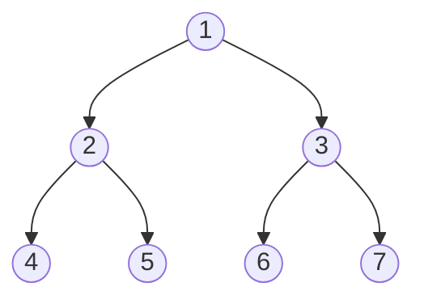

# Trees

> **Hierarchical data structures for efficient operations**

---

## Overview

A **tree** is a hierarchical, non-linear data structure consisting of nodes connected by edges. Trees are used to represent hierarchical relationships and enable efficient searching, insertion, and deletion operations. They form the foundation for many advanced data structures and algorithms commonly tested in technical interviews.

### What is a Tree?

A tree consists of:
- **Root**: The topmost node with no parent
- **Nodes**: Elements containing data and references to child nodes
- **Edges**: Connections between parent and child nodes
- **Leaves**: Nodes with no children

A **Binary Tree** is a tree where each node has at most two children (left and right). A **Binary Search Tree (BST)** is a binary tree with the ordering property: left subtree values < node value < right subtree values.

### When to Use Trees

| Use Case | Why Trees Work Well |
|----------|---------------------|
| **Hierarchical data** | File systems, organization charts, HTML DOM |
| **Fast search/insert/delete** | BST provides O(log n) average case |
| **Sorted data traversal** | Inorder traversal of BST gives sorted order |
| **Priority operations** | Heaps (special trees) for min/max extraction |
| **Prefix matching** | Tries for autocomplete, spell checkers |
| **Expression evaluation** | Parse trees for mathematical expressions |

### When to Consider Alternatives

| Scenario | Better Alternative |
|----------|-------------------|
| Simple linear sequence | Array or Linked List |
| Key-value lookups only | Hash Table (O(1) average) |
| Need bidirectional traversal | Doubly Linked List |
| Graph with cycles | General Graph |

---

## Document Structure

| Problem | Difficulty | Technique | Link |
|---------|------------|-----------|------|
| Maximum Depth of Binary Tree | Easy | DFS Recursion | [Link](./balanced-diameter-validate) |
| Balanced Binary Tree | Easy | DFS + Height | [Link](./balanced-diameter-validate) |
| Same Tree | Easy | DFS Comparison | [Link](./same-subtree-invert) |
| Symmetric Tree | Easy | DFS/BFS Mirror | [Link](./same-subtree-invert) |
| Invert Binary Tree | Easy | DFS/BFS | [Link](./same-subtree-invert) |
| Subtree of Another Tree | Easy | DFS + Same Tree | [Link](./same-subtree-invert) |
| Diameter of Binary Tree | Easy | DFS + Global Max | [Link](./balanced-diameter-validate) |
| Validate BST | Medium | Inorder/Range Check | [Link](./balanced-diameter-validate) |
| Lowest Common Ancestor (BST) | Medium | BST Property | [Link](./lca-path-sum) |
| Lowest Common Ancestor (Binary Tree) | Medium | DFS Recursion | [Link](./lca-path-sum) |
| Path Sum I, II, III | Easy-Medium | DFS Backtracking | [Link](./lca-path-sum) |
| Binary Tree Level Order Traversal | Medium | BFS Queue | [Link](./level-order-zigzag) |
| Zigzag Level Order Traversal | Medium | BFS + Direction | [Link](./level-order-zigzag) |
| Binary Tree Right Side View | Medium | BFS/DFS | [Link](./level-order-zigzag) |
| Kth Smallest Element in BST | Medium | Inorder Traversal | [Link](./bst-operations) |
| BST Iterator | Medium | Inorder Stack | [Link](./bst-operations) |
| Construct Binary Tree from Traversals | Medium | Recursion + Index | [Link](./construct-serialize) |
| Serialize/Deserialize Binary Tree | Hard | DFS/BFS + Format | [Link](./construct-serialize) |
| Binary Tree Maximum Path Sum | Hard | DFS + Global Max | [Link](./max-path-sum) |
| Count Good Nodes in Binary Tree | Medium | DFS + Max Tracking | [Link](./good-nodes-boundary) |
| Boundary of Binary Tree | Medium | DFS Left-Leaves-Right | [Link](./good-nodes-boundary) |

---

## Tree Terminology

### Basic Terms

| Term | Definition |
|------|------------|
| **Root** | The topmost node (no parent) |
| **Node** | An element containing data and child references |
| **Leaf** | A node with no children (terminal node) |
| **Edge** | Connection between parent and child |
| **Parent** | Node directly above another node |
| **Child** | Node directly below another node |
| **Sibling** | Nodes sharing the same parent |
| **Ancestor** | Any node on the path from root to a node |
| **Descendant** | Any node reachable from a given node |

### Height vs Depth

```
        1        <- Depth 0, Height 2
       / \
      2   3      <- Depth 1, Height 1
     / \
    4   5        <- Depth 2, Height 0 (leaves)
```

| Measure | Definition | Calculation |
|---------|------------|-------------|
| **Depth** | Distance from root to node | Count edges from root down |
| **Height** | Distance from node to deepest leaf | Count edges to furthest leaf |
| **Tree Height** | Height of root node | Maximum depth of any leaf |

### Binary Tree Types

| Type | Definition | Properties |
|------|------------|------------|
| **Full Binary Tree** | Every node has 0 or 2 children | No single-child nodes |
| **Complete Binary Tree** | All levels filled except possibly last; last level filled left-to-right | Used in heaps |
| **Perfect Binary Tree** | All internal nodes have 2 children, all leaves at same level | 2^h - 1 nodes at height h |
| **Balanced Binary Tree** | Height of left and right subtrees differ by at most 1 | O(log n) operations |
| **Degenerate/Skewed** | Each parent has only one child | Essentially a linked list |

```
Full:          Complete:       Perfect:        Skewed:
    1              1              1              1
   / \           / | \          / \              \
  2   3         2  3  4        2   3              2
 / \           /               / \ / \             \
4   5         5               4  5 6  7             3
```

### BST Property

**For every node in a Binary Search Tree:**
- All values in the **left subtree** are **less than** the node's value
- All values in the **right subtree** are **greater than** the node's value

```
       8
      / \
     3   10
    / \    \
   1   6    14
      / \   /
     4   7 13

Inorder traversal gives sorted order: 1, 3, 4, 6, 7, 8, 10, 13, 14
```

---

## Tree Traversals

### Mermaid Diagram



### Traversal Orders

| Traversal | Order | Result | Use Case |
|-----------|-------|--------|----------|
| **Preorder** | Root-Left-Right | 1,2,4,5,3,6,7 | Copy tree, serialize, prefix expression |
| **Inorder** | Left-Root-Right | 4,2,5,1,6,3,7 | BST sorted order, infix expression |
| **Postorder** | Left-Right-Root | 4,5,2,6,7,3,1 | Delete tree, evaluate postfix, calc size |
| **Level-order** | BFS by level | 1,2,3,4,5,6,7 | Level-by-level processing, shortest path |

### DFS vs BFS Summary

| Aspect | DFS (Depth-First) | BFS (Breadth-First) |
|--------|-------------------|---------------------|
| **Data Structure** | Stack / Recursion | Queue |
| **Memory** | O(h) - height of tree | O(w) - max width |
| **Order** | Goes deep before wide | Goes level by level |
| **Use Case** | Path finding, backtracking | Shortest path, level order |
| **Implementation** | Often recursive | Iterative with queue |

---

## Tree Traversal Templates

### DFS Recursive

```python
def preorder(root):
    """Root -> Left -> Right"""
    if not root:
        return []
    return [root.val] + preorder(root.left) + preorder(root.right)

def inorder(root):
    """Left -> Root -> Right (gives sorted order for BST)"""
    if not root:
        return []
    return inorder(root.left) + [root.val] + inorder(root.right)

def postorder(root):
    """Left -> Right -> Root"""
    if not root:
        return []
    return postorder(root.left) + postorder(root.right) + [root.val]
```

### DFS Iterative (Using Stack)

```python
def preorder_iterative(root):
    """Preorder using explicit stack"""
    if not root:
        return []

    result = []
    stack = [root]

    while stack:
        node = stack.pop()
        result.append(node.val)
        # Push right first so left is processed first
        if node.right:
            stack.append(node.right)
        if node.left:
            stack.append(node.left)

    return result

def inorder_iterative(root):
    """Inorder using explicit stack"""
    result = []
    stack = []
    curr = root

    while curr or stack:
        # Go to leftmost node
        while curr:
            stack.append(curr)
            curr = curr.left

        curr = stack.pop()
        result.append(curr.val)
        curr = curr.right

    return result

def postorder_iterative(root):
    """Postorder: modified preorder then reverse"""
    if not root:
        return []

    result = []
    stack = [root]

    while stack:
        node = stack.pop()
        result.append(node.val)
        # Push left first (opposite of preorder)
        if node.left:
            stack.append(node.left)
        if node.right:
            stack.append(node.right)

    return result[::-1]  # Reverse to get postorder
```

### BFS Level Order

```python
from collections import deque

def level_order(root):
    """BFS level-by-level traversal"""
    if not root:
        return []

    result = []
    queue = deque([root])

    while queue:
        level = []
        for _ in range(len(queue)):
            node = queue.popleft()
            level.append(node.val)
            if node.left:
                queue.append(node.left)
            if node.right:
                queue.append(node.right)
        result.append(level)

    return result
```

---

## Common Tree Patterns

### Pattern 1: Calculate Tree Property (Height, Balanced, Diameter)

```python
def max_depth(root):
    """Maximum depth of binary tree"""
    if not root:
        return 0
    return 1 + max(max_depth(root.left), max_depth(root.right))

def is_balanced(root):
    """Check if tree is height-balanced"""
    def check(node):
        if not node:
            return 0

        left = check(node.left)
        right = check(node.right)

        if left == -1 or right == -1 or abs(left - right) > 1:
            return -1

        return 1 + max(left, right)

    return check(root) != -1

def diameter(root):
    """Diameter: longest path between any two nodes"""
    max_diameter = [0]

    def height(node):
        if not node:
            return 0

        left = height(node.left)
        right = height(node.right)

        # Update diameter (path through this node)
        max_diameter[0] = max(max_diameter[0], left + right)

        return 1 + max(left, right)

    height(root)
    return max_diameter[0]
```

### Pattern 2: BST Validation and Operations

```python
def is_valid_bst(root, min_val=float('-inf'), max_val=float('inf')):
    """Validate BST using range checking"""
    if not root:
        return True

    if root.val <= min_val or root.val >= max_val:
        return False

    return (is_valid_bst(root.left, min_val, root.val) and
            is_valid_bst(root.right, root.val, max_val))

def kth_smallest(root, k):
    """Find kth smallest element in BST using inorder"""
    stack = []
    curr = root

    while curr or stack:
        while curr:
            stack.append(curr)
            curr = curr.left

        curr = stack.pop()
        k -= 1
        if k == 0:
            return curr.val
        curr = curr.right

    return -1
```

### Pattern 3: Lowest Common Ancestor (LCA)

```python
def lca_bst(root, p, q):
    """LCA in BST - use BST property"""
    while root:
        if p.val < root.val and q.val < root.val:
            root = root.left
        elif p.val > root.val and q.val > root.val:
            root = root.right
        else:
            return root
    return None

def lca_binary_tree(root, p, q):
    """LCA in general binary tree"""
    if not root or root == p or root == q:
        return root

    left = lca_binary_tree(root.left, p, q)
    right = lca_binary_tree(root.right, p, q)

    if left and right:
        return root  # p and q are in different subtrees

    return left or right
```

### Pattern 4: Path Sum Problems

```python
def has_path_sum(root, target_sum):
    """Check if root-to-leaf path equals target sum"""
    if not root:
        return False

    if not root.left and not root.right:
        return root.val == target_sum

    remaining = target_sum - root.val
    return (has_path_sum(root.left, remaining) or
            has_path_sum(root.right, remaining))

def path_sum_ii(root, target_sum):
    """Find all root-to-leaf paths with target sum"""
    result = []

    def dfs(node, path, remaining):
        if not node:
            return

        path.append(node.val)

        if not node.left and not node.right and remaining == node.val:
            result.append(path[:])  # Copy path

        dfs(node.left, path, remaining - node.val)
        dfs(node.right, path, remaining - node.val)

        path.pop()  # Backtrack

    dfs(root, [], target_sum)
    return result
```

### Pattern 5: Tree Construction

```python
def build_tree(preorder, inorder):
    """Build tree from preorder and inorder traversals"""
    if not preorder or not inorder:
        return None

    root = TreeNode(preorder[0])
    mid = inorder.index(preorder[0])

    root.left = build_tree(preorder[1:mid+1], inorder[:mid])
    root.right = build_tree(preorder[mid+1:], inorder[mid+1:])

    return root
```

---

## Complexity Analysis

### Time Complexity

| Operation | BST (Average) | BST (Worst) | Balanced BST |
|-----------|--------------|-------------|--------------|
| Search | O(log n) | O(n) | O(log n) |
| Insert | O(log n) | O(n) | O(log n) |
| Delete | O(log n) | O(n) | O(log n) |
| Traversal | O(n) | O(n) | O(n) |

### Space Complexity

| Traversal | Recursive | Iterative |
|-----------|-----------|-----------|
| DFS | O(h) call stack | O(h) explicit stack |
| BFS | N/A | O(w) queue width |

- **h** = height of tree (log n for balanced, n for skewed)
- **w** = maximum width of tree (up to n/2 for complete tree)

---

## Google Interview Focus

Based on recent Google SDE interview patterns, these tree topics are most frequently tested:

### High Priority Topics

1. **Tree Traversals** - Master all four traversals (preorder, inorder, postorder, level-order) both recursively and iteratively
2. **BST Operations** - Validate BST, search, insert, delete, find kth smallest/largest
3. **Lowest Common Ancestor** - Both BST and general binary tree variants
4. **Tree Properties** - Height, depth, diameter, balanced check
5. **Path Problems** - Path sum, maximum path sum, all paths with target

### Common Google Tree Questions

| Question Type | Example Problem | Key Insight |
|--------------|-----------------|-------------|
| Traversal | Zigzag Level Order | BFS with direction alternation |
| Validation | Validate BST | Range checking or inorder sequence |
| LCA | Lowest Common Ancestor | BST property vs general recursion |
| Path Sum | Binary Tree Maximum Path Sum | DFS with global max tracking |
| Construction | Build Tree from Traversals | Preorder gives root, inorder gives split |
| Serialization | Serialize/Deserialize Tree | Preorder with null markers |

### What Interviewers Look For

1. **Clarifying Questions**
   - Is it a BST or general binary tree?
   - Can there be duplicate values?
   - What should be returned (boolean, node, value)?
   - What about empty trees or single nodes?

2. **Problem-Solving Approach**
   - Identify traversal type needed (DFS vs BFS)
   - Consider recursive vs iterative solution
   - Think about what information to pass down/up
   - Handle base cases carefully

3. **Code Quality**
   - Clean recursive structure
   - Proper null checks
   - Meaningful variable names
   - Handle edge cases (empty tree, single node, skewed tree)

4. **Complexity Analysis**
   - Time: Usually O(n) for traversal-based solutions
   - Space: Consider recursion stack depth O(h)

### Common Mistakes to Avoid

1. **Forgetting base cases** - Always check for null root first
2. **Not handling single-child nodes** - Important for path problems
3. **Confusing BST vs Binary Tree** - BST has ordering property
4. **Stack overflow on large trees** - Consider iterative for skewed trees
5. **Not preserving BST property** - After modifications, tree may become invalid

---

## Practice Progression

### Week 1: Foundations

| Day | Focus | Problems |
|-----|-------|----------|
| 1 | Traversals | Binary Tree Inorder, Preorder, Postorder Traversal |
| 2 | Tree Properties | Maximum Depth, Balanced Tree, Diameter |
| 3 | Basic BST | Search in BST, Validate BST, Invert Tree |

### Week 2: Intermediate

| Day | Focus | Problems |
|-----|-------|----------|
| 4 | Level Order | Level Order Traversal, Zigzag, Right Side View |
| 5 | LCA & Ancestors | LCA of BST, LCA of Binary Tree, Kth Smallest |
| 6 | Path Problems | Path Sum I, II, III |

### Week 3: Advanced

| Day | Focus | Problems |
|-----|-------|----------|
| 7 | Construction | Build Tree from Preorder/Inorder, Serialize Tree |
| 8 | Advanced Paths | Maximum Path Sum, Longest Univalue Path |
| 9 | Mixed Practice | Random selection from all patterns |

---

## Quick Reference Card

### Time Complexity Cheat Sheet

```
Traversals:     O(n)     - Visit each node once
BST Search:     O(log n) - Balanced, O(n) worst case
BST Insert:     O(log n) - Balanced, O(n) worst case
Height/Depth:   O(n)     - Must visit all nodes
LCA:            O(n)     - Binary Tree, O(log n) BST
```

### Pattern Recognition Triggers

| If you see... | Think about... |
|--------------|----------------|
| "Binary Search Tree" | Use BST property (left < root < right) |
| "Level by level" | BFS with queue |
| "Root to leaf path" | DFS with backtracking |
| "Lowest common ancestor" | BST property or recursive search |
| "Maximum/Minimum path" | DFS with global variable |
| "Serialize/Deserialize" | Preorder with null markers |
| "Validate tree" | Range checking or inorder sequence |
| "Kth smallest/largest" | Inorder traversal with counter |

---

## Resources

### Recommended Practice

- [LeetCode Tree Problems](https://leetcode.com/tag/tree/)
- [NeetCode Tree Playlist](https://neetcode.io/roadmap)
- [Grind 75 - Tree Section](https://www.techinterviewhandbook.org/grind75)

### Further Reading

- [GeeksforGeeks - Top 50 Tree Coding Problems](https://www.geeksforgeeks.org/dsa/top-50-tree-coding-problems-for-interviews/)
- [Tech Interview Handbook - Tree Cheatsheet](https://www.techinterviewhandbook.org/algorithms/tree/)
- [TakeUforward - Tree Interview Questions](https://takeuforward.org/tree-series/top-tree-interview-questions-structured-path-with-video-solutions)
- [Interviewing.io - Trees Interview Tips](https://interviewing.io/trees-interview-questions)
- [GeeksforGeeks - Top 50 BST Problems](https://www.geeksforgeeks.org/dsa/top-50-binary-search-tree-coding-problems-for-interviews/)

---

*Last updated: January 2026*

*Trees are where interview difficulty ramps up. Unlike arrays or linked lists, trees require you to think recursively, interpret hierarchical relationships, and reason about traversal order. Master the traversal templates and common patterns - they form the foundation for solving the majority of tree problems in technical interviews.*
