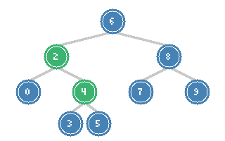
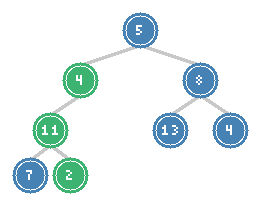

# Lowest Common Ancestor & Path Sum Problems

> **Finding relationships and paths in binary trees**

These problems focus on finding ancestors, computing paths, and understanding node relationships in trees. They are fundamental for graph-like reasoning on tree structures and frequently appear in technical interviews.

---

## Lowest Common Ancestor of a BST

### Problem Statement

Given a binary search tree (BST), find the lowest common ancestor (LCA) of two given nodes in the BST. The lowest common ancestor is defined as the lowest node in the tree that has both p and q as descendants (a node can be a descendant of itself).

**LeetCode Problem:** [235. Lowest Common Ancestor of a Binary Search Tree](https://leetcode.com/problems/lowest-common-ancestor-of-a-binary-search-tree/)

### Visualization



*In this BST, LCA of nodes 2 and 4 is node 2 (highlighted in green)*

### Key Insight

In a BST, we can leverage the ordering property:
- If both p and q are smaller than the current node, LCA is in the left subtree
- If both p and q are larger than the current node, LCA is in the right subtree
- Otherwise, the current node is the LCA (one node is on each side, or current node equals p or q)

This allows us to find the LCA in O(h) time without visiting every node.

### Solution

::: code-group
```python [Python]
def lowestCommonAncestor_BST(root, p, q):
    current = root

    while current:
        # Both nodes are in the left subtree
        if p.val < current.val and q.val < current.val:
            current = current.left
        # Both nodes are in the right subtree
        elif p.val > current.val and q.val > current.val:
            current = current.right
        # Found the split point (or one of p/q is current)
        else:
            return current

    return None
```
```java [Java]
public TreeNode lowestCommonAncestorBST(TreeNode root, TreeNode p, TreeNode q) {
    TreeNode current = root;

    while (current != null) {
        if (p.val < current.val && q.val < current.val) {
            current = current.left;
        } else if (p.val > current.val && q.val > current.val) {
            current = current.right;
        } else {
            return current;
        }
    }

    return null;
}
```
:::

::: info Complexity: Time O(h) · Space O(1)
- **Time:** O(h) because we follow a single path from root using BST property to find split point
- **Space:** O(1) because we use only a single pointer variable (iterative approach)
:::

### Recursive Solution

```python
def lowestCommonAncestor_BST_recursive(root, p, q):
    if p.val < root.val and q.val < root.val:
        return lowestCommonAncestor_BST_recursive(root.left, p, q)
    elif p.val > root.val and q.val > root.val:
        return lowestCommonAncestor_BST_recursive(root.right, p, q)
    else:
        return root
```

::: info Complexity: Time O(h) · Space O(h)
- **Time:** O(h) because we traverse one path from root to the split point
- **Space:** O(h) for recursion stack depth in the worst case (skewed tree)
:::

### Complexity

- **Time:** O(h) - follow one path from root
- **Space:** O(1) iterative, O(h) recursive

---

## Lowest Common Ancestor of a Binary Tree

### Problem Statement

Given a binary tree, find the lowest common ancestor (LCA) of two given nodes in the tree. This is a general binary tree, not a BST, so we cannot use the ordering property.

**LeetCode Problem:** [236. Lowest Common Ancestor of a Binary Tree](https://leetcode.com/problems/lowest-common-ancestor-of-a-binary-tree/)

### Key Insight

Without BST ordering, we must search both subtrees. The algorithm:
1. If the current node is null, or equals p, or equals q, return it
2. Recursively search left and right subtrees
3. If both searches return non-null, current node is the LCA
4. If only one returns non-null, that result propagates up

### Solution

::: code-group
```python [Python]
def lowestCommonAncestor(root, p, q):
    # Base case: null or found p or q
    if not root or root == p or root == q:
        return root

    # Search in both subtrees
    left = lowestCommonAncestor(root.left, p, q)
    right = lowestCommonAncestor(root.right, p, q)

    # If both subtrees return non-null, current node is LCA
    if left and right:
        return root

    # Otherwise, return the non-null result (or null if both null)
    return left if left else right
```
```java [Java]
public TreeNode lowestCommonAncestor(TreeNode root, TreeNode p, TreeNode q) {
    if (root == null || root == p || root == q) return root;

    TreeNode left = lowestCommonAncestor(root.left, p, q);
    TreeNode right = lowestCommonAncestor(root.right, p, q);

    if (left != null && right != null) return root;
    return left != null ? left : right;
}
```
:::

::: info Complexity: Time O(n) · Space O(h)
- **Time:** O(n) because without BST property, we may need to search entire tree
- **Space:** O(h) for recursion stack; each recursive call adds one frame until we find both nodes
:::

### Iterative Solution with Parent Pointers

```python
def lowestCommonAncestor_iterative(root, p, q):
    # Build parent pointer map using BFS
    parent = {root: None}
    stack = [root]

    while p not in parent or q not in parent:
        node = stack.pop()
        if node.left:
            parent[node.left] = node
            stack.append(node.left)
        if node.right:
            parent[node.right] = node
            stack.append(node.right)

    # Find ancestors of p
    ancestors = set()
    while p:
        ancestors.add(p)
        p = parent[p]

    # Find first common ancestor
    while q not in ancestors:
        q = parent[q]

    return q
```

::: info Complexity: Time O(n) · Space O(n)
- **Time:** O(n) because we build parent map via traversal, then trace ancestors
- **Space:** O(n) for parent hashmap storing all node-to-parent mappings
:::

### Complexity

- **Time:** O(n) - may need to visit all nodes
- **Space:** O(h) for recursion, O(n) for iterative with parent map

---

## Path Sum I (Has Path Sum)

### Problem Statement

Given the root of a binary tree and an integer `targetSum`, return `true` if the tree has a root-to-leaf path such that adding up all the values along the path equals `targetSum`.

**LeetCode Problem:** [112. Path Sum](https://leetcode.com/problems/path-sum/)

### Visualization



*Path 5 -> 4 -> 11 -> 2 sums to 22 (highlighted in green)*

### Key Insight

A root-to-leaf path with target sum exists if:
1. Current node is a leaf and its value equals the remaining sum
2. OR a valid path exists in the left subtree with remaining sum minus current value
3. OR a valid path exists in the right subtree with remaining sum minus current value

### Solution

::: code-group
```python [Python]
def hasPathSum(root, targetSum) -> bool:
    if not root:
        return False

    remaining = targetSum - root.val

    # Check if it's a leaf node
    if not root.left and not root.right:
        return remaining == 0

    # Recursively check left and right subtrees
    return (hasPathSum(root.left, remaining) or
            hasPathSum(root.right, remaining))
```
```java [Java]
public boolean hasPathSum(TreeNode root, int targetSum) {
    if (root == null) return false;

    int remaining = targetSum - root.val;

    if (root.left == null && root.right == null) return remaining == 0;

    return hasPathSum(root.left, remaining) || hasPathSum(root.right, remaining);
}
```
:::

::: info Complexity: Time O(n) · Space O(h)
- **Time:** O(n) because in worst case we visit all nodes before finding a valid path
- **Space:** O(h) for recursion stack; early return avoids processing remaining nodes when path found
:::

### Iterative DFS Solution

```python
def hasPathSum_iterative(root, targetSum) -> bool:
    if not root:
        return False

    stack = [(root, targetSum)]

    while stack:
        node, remaining = stack.pop()
        remaining -= node.val

        # Leaf node check
        if not node.left and not node.right and remaining == 0:
            return True

        if node.right:
            stack.append((node.right, remaining))
        if node.left:
            stack.append((node.left, remaining))

    return False
```

::: info Complexity: Time O(n) · Space O(h)
- **Time:** O(n) because we may need to visit all nodes to check all paths
- **Space:** O(h) for stack storing (node, remaining) tuples along current path
:::

### Complexity

- **Time:** O(n) - may need to check all nodes
- **Space:** O(h) - recursion/stack depth

---

## Path Sum II (All Paths)

### Problem Statement

Given the root of a binary tree and an integer `targetSum`, return all root-to-leaf paths where the sum of the node values in the path equals `targetSum`. Return each path as a list of node values.

**LeetCode Problem:** [113. Path Sum II](https://leetcode.com/problems/path-sum-ii/)

### Key Insight

This extends Path Sum I by collecting all valid paths instead of just checking existence. We use backtracking: maintain a current path, add the current node, recurse, then remove the node (backtrack).

### Solution

::: code-group
```python [Python]
def pathSum(root, targetSum):
    result = []

    def dfs(node, remaining, path):
        if not node:
            return

        path.append(node.val)

        # Leaf node with correct sum
        if not node.left and not node.right and remaining == node.val:
            result.append(path[:])  # Copy the path
        else:
            dfs(node.left, remaining - node.val, path)
            dfs(node.right, remaining - node.val, path)

        path.pop()  # Backtrack

    dfs(root, targetSum, [])
    return result
```
```java [Java]
public List<List<Integer>> pathSum(TreeNode root, int targetSum) {
    List<List<Integer>> result = new ArrayList<>();
    dfs(root, targetSum, new ArrayList<>(), result);
    return result;
}

private void dfs(TreeNode node, int remaining, List<Integer> path,
                  List<List<Integer>> result) {
    if (node == null) return;

    path.add(node.val);

    if (node.left == null && node.right == null && remaining == node.val) {
        result.add(new ArrayList<>(path));
    } else {
        dfs(node.left, remaining - node.val, path, result);
        dfs(node.right, remaining - node.val, path, result);
    }

    path.remove(path.size() - 1); // backtrack
}
```
:::

::: info Complexity: Time O(n^2) · Space O(n)
- **Time:** O(n^2) worst case because we visit n nodes and copy paths of up to length n
- **Space:** O(n) for recursion stack plus current path; result space is output-dependent
:::

### Alternative: Return Paths from Recursion

```python
def pathSum_functional(root, targetSum):
    if not root:
        return []

    remaining = targetSum - root.val

    # Leaf node
    if not root.left and not root.right:
        return [[root.val]] if remaining == 0 else []

    # Collect paths from both subtrees
    left_paths = pathSum_functional(root.left, remaining)
    right_paths = pathSum_functional(root.right, remaining)

    # Prepend current node to all paths
    return [[root.val] + path for path in left_paths + right_paths]
```

::: info Complexity: Time O(n^2) · Space O(n^2)
- **Time:** O(n^2) because we prepend to paths which costs O(path length) per node
- **Space:** O(n^2) worst case for storing all paths; each path up to length n
:::

### Complexity

- **Time:** O(n^2) worst case (copying paths of length n)
- **Space:** O(n) for recursion and path storage

---

## Path Sum III (Any Starting Point)

### Problem Statement

Given the root of a binary tree and an integer `targetSum`, return the number of paths where the sum of the values along the path equals `targetSum`. The path does not need to start or end at the root or a leaf, but it must go downwards (traveling only from parent nodes to child nodes).

**LeetCode Problem:** [437. Path Sum III](https://leetcode.com/problems/path-sum-iii/)

### Key Insight

This is more challenging because paths can start anywhere. We use a prefix sum approach:
- Track the running sum from root to current node
- Use a hashmap to count how many times each prefix sum has occurred
- If `current_sum - targetSum` exists in the map, we found valid path(s)

### Solution

::: code-group
```python [Python]
def pathSum_III(root, targetSum) -> int:
    def dfs(node, current_sum, prefix_sums):
        if not node:
            return 0

        # Update running sum
        current_sum += node.val

        # Count paths ending at this node
        count = prefix_sums.get(current_sum - targetSum, 0)

        # Add current sum to prefix sums
        prefix_sums[current_sum] = prefix_sums.get(current_sum, 0) + 1

        # Recurse to children
        count += dfs(node.left, current_sum, prefix_sums)
        count += dfs(node.right, current_sum, prefix_sums)

        # Backtrack: remove current sum from prefix sums
        prefix_sums[current_sum] -= 1

        return count

    # Initialize with 0 sum having count 1 (for paths starting at root)
    return dfs(root, 0, {0: 1})
```
```java [Java]
public int pathSumIII(TreeNode root, int targetSum) {
    Map<Long, Integer> prefixSums = new HashMap<>();
    prefixSums.put(0L, 1);
    return dfs(root, 0L, targetSum, prefixSums);
}

private int dfs(TreeNode node, long currentSum, int targetSum,
                 Map<Long, Integer> prefixSums) {
    if (node == null) return 0;

    currentSum += node.val;

    int count = prefixSums.getOrDefault(currentSum - targetSum, 0);

    prefixSums.merge(currentSum, 1, Integer::sum);

    count += dfs(node.left, currentSum, targetSum, prefixSums);
    count += dfs(node.right, currentSum, targetSum, prefixSums);

    prefixSums.merge(currentSum, -1, Integer::sum); // backtrack

    return count;
}
```
:::

::: info Complexity: Time O(n) · Space O(h)
- **Time:** O(n) because we visit each node once; prefix sum lookup/update is O(1)
- **Space:** O(h) for recursion stack plus hashmap storing at most h prefix sums (one per ancestor)
:::

### Naive O(n^2) Solution

```python
def pathSum_III_naive(root, targetSum) -> int:
    def count_paths_from(node, remaining):
        """Count paths starting from this node with given sum."""
        if not node:
            return 0

        count = 1 if node.val == remaining else 0
        count += count_paths_from(node.left, remaining - node.val)
        count += count_paths_from(node.right, remaining - node.val)
        return count

    if not root:
        return 0

    # Count paths from this node + all paths from subtrees
    return (count_paths_from(root, targetSum) +
            pathSum_III_naive(root.left, targetSum) +
            pathSum_III_naive(root.right, targetSum))
```

::: info Complexity: Time O(n^2) · Space O(h)
- **Time:** O(n^2) because for each of n nodes, we call count_paths_from which visits O(n) nodes
- **Space:** O(h) for recursion stack; nested calls share the same stack depth
:::

### Complexity

- **Prefix Sum Approach:** Time O(n), Space O(h) for recursion + O(h) for hashmap
- **Naive Approach:** Time O(n^2), Space O(h)

---

## Pattern Recognition

### LCA Patterns

| Tree Type | Strategy | Time |
|-----------|----------|------|
| BST | Use ordering property to navigate | O(h) |
| Binary Tree | Search both subtrees, combine results | O(n) |
| N-ary Tree | Same as binary tree, check all children | O(n) |

### Path Sum Patterns

| Variant | Path Constraint | Technique |
|---------|-----------------|-----------|
| Path Sum I | Root to leaf | DFS with remaining sum |
| Path Sum II | Root to leaf, all paths | DFS with backtracking |
| Path Sum III | Any downward path | Prefix sum with hashmap |

---

## Interview Applications

### Common Variations

1. **LCA with k nodes**: Find LCA of k nodes instead of 2
2. **Distance between nodes**: Find path length using LCA
3. **Path with maximum sum**: Find root-to-leaf path with maximum sum
4. **Count paths**: Count all root-to-leaf paths

### Follow-up Questions

| Problem | Follow-up |
|---------|-----------|
| LCA BST | What if we need to find LCA of k nodes? |
| LCA Binary Tree | What if nodes might not exist in the tree? |
| Path Sum | What if we need paths between any two nodes (not just downward)? |
| Path Sum III | What if we want paths with sum in a range [lo, hi]? |

### Interview Tips

1. **Clarify tree type**: BST vs general binary tree changes the approach
2. **Ask about existence**: Are p and q guaranteed to exist in the tree?
3. **Consider edge cases**: What if p equals q? What if the tree is empty?
4. **Discuss tradeoffs**: Recursive vs iterative, space optimization with prefix sums

---

## Summary Table

| Problem | Difficulty | Pattern | Time | Space |
|---------|-----------|---------|------|-------|
| LCA of BST | Medium | BST Navigation | O(h) | O(1)/O(h) |
| LCA of Binary Tree | Medium | DFS Search | O(n) | O(h) |
| Path Sum I | Easy | DFS with sum | O(n) | O(h) |
| Path Sum II | Medium | DFS Backtracking | O(n^2) | O(n) |
| Path Sum III | Medium | Prefix Sum | O(n) | O(h) |

---

## References

- [Lowest Common Ancestor of BST - LeetCode](https://leetcode.com/problems/lowest-common-ancestor-of-a-binary-search-tree/)
- [Lowest Common Ancestor of Binary Tree - LeetCode](https://leetcode.com/problems/lowest-common-ancestor-of-a-binary-tree/)
- [Path Sum - LeetCode](https://leetcode.com/problems/path-sum/)
- [Path Sum II - LeetCode](https://leetcode.com/problems/path-sum-ii/)
- [Path Sum III - LeetCode](https://leetcode.com/problems/path-sum-iii/)
- [235. LCA of BST - In-Depth Explanation](https://algo.monster/liteproblems/235)
- [236. LCA of Binary Tree - In-Depth Explanation](https://algo.monster/liteproblems/236)
- [112. Path Sum - In-Depth Explanation](https://algo.monster/liteproblems/112)
- [437. Path Sum III - In-Depth Explanation](https://algo.monster/liteproblems/437)
