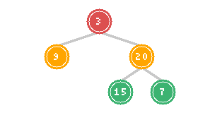
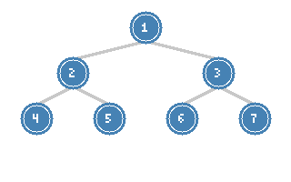
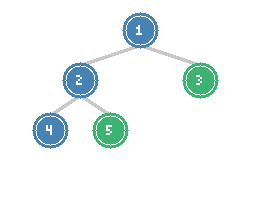

# Level Order, Zigzag & Right Side View

> **BFS-based tree traversal patterns**

These problems focus on level-by-level processing of binary trees using Breadth-First Search (BFS). They're fundamental for understanding tree width, levels, and different perspectives of tree visualization.

---

## Binary Tree Level Order Traversal

### Problem Statement

Given the root of a binary tree, return the level order traversal of its nodes' values. (i.e., from left to right, level by level).

**LeetCode Problem:** [102. Binary Tree Level Order Traversal](https://leetcode.com/problems/binary-tree-level-order-traversal/)

### Visualization



*Tree traversed level by level: Level 0 (red), Level 1 (orange), Level 2 (green)*

**Output:** `[[3], [9, 20], [15, 7]]`

### Key Insight

Level order traversal is a classic BFS application:
1. Use a queue to process nodes level by level
2. For each level, process all nodes currently in the queue
3. Add children of processed nodes for the next level
4. The key trick: capture queue size at the start of each level

### Solution

::: code-group
```python [Python]
from collections import deque

def levelOrder(root):
    if not root:
        return []

    result = []
    queue = deque([root])

    while queue:
        level_size = len(queue)
        level = []

        for _ in range(level_size):
            node = queue.popleft()
            level.append(node.val)

            if node.left:
                queue.append(node.left)
            if node.right:
                queue.append(node.right)

        result.append(level)

    return result
```
```java [Java]
public List<List<Integer>> levelOrder(TreeNode root) {
    List<List<Integer>> result = new ArrayList<>();
    if (root == null) return result;

    Deque<TreeNode> queue = new ArrayDeque<>();
    queue.offer(root);

    while (!queue.isEmpty()) {
        int levelSize = queue.size();
        List<Integer> level = new ArrayList<>();

        for (int i = 0; i < levelSize; i++) {
            TreeNode node = queue.poll();
            level.add(node.val);

            if (node.left != null) queue.offer(node.left);
            if (node.right != null) queue.offer(node.right);
        }

        result.add(level);
    }

    return result;
}
```
:::

::: info Complexity: Time O(n) · Space O(w)
- **Time:** O(n) because each node is processed exactly once via the queue
- **Space:** O(w) where w is maximum tree width; queue stores at most one complete level
:::

### DFS Alternative

```python
def levelOrder_dfs(root):
    result = []

    def dfs(node, depth):
        if not node:
            return

        # Extend result if needed
        if depth >= len(result):
            result.append([])

        result[depth].append(node.val)

        dfs(node.left, depth + 1)
        dfs(node.right, depth + 1)

    dfs(root, 0)
    return result
```

::: info Complexity: Time O(n) · Space O(h)
- **Time:** O(n) because each node is visited once during the DFS traversal
- **Space:** O(h) for recursion stack, plus O(n) for result storage (not counted as auxiliary)
:::

### Complexity

- **Time:** O(n) - visit each node once
- **Space:** O(w) where w is the maximum width of the tree (up to n/2 for complete tree)

---

## Binary Tree Zigzag Level Order Traversal

### Problem Statement

Given the root of a binary tree, return the zigzag level order traversal of its nodes' values. (i.e., from left to right for the first level, then right to left for the next level, and alternate between).

**LeetCode Problem:** [103. Binary Tree Zigzag Level Order Traversal](https://leetcode.com/problems/binary-tree-zigzag-level-order-traversal/)

### Visualization



*Zigzag pattern: Level 0 left-to-right, Level 1 right-to-left, Level 2 left-to-right*

**Output:** `[[1], [3, 2], [4, 5, 6, 7]]`

### Key Insight

Same as level order, but with alternating direction:
- Even levels: left to right (normal order)
- Odd levels: right to left (reversed)

Two approaches:
1. Reverse alternate levels after collecting
2. Use a deque and alternate append direction

### Solution

::: code-group
```python [Python]
from collections import deque

def zigzagLevelOrder(root):
    if not root:
        return []

    result = []
    queue = deque([root])
    left_to_right = True

    while queue:
        level_size = len(queue)
        level = deque()  # Use deque for efficient front/back insertion

        for _ in range(level_size):
            node = queue.popleft()

            # Add to level based on direction
            if left_to_right:
                level.append(node.val)
            else:
                level.appendleft(node.val)

            if node.left:
                queue.append(node.left)
            if node.right:
                queue.append(node.right)

        result.append(list(level))
        left_to_right = not left_to_right

    return result
```
```java [Java]
public List<List<Integer>> zigzagLevelOrder(TreeNode root) {
    List<List<Integer>> result = new ArrayList<>();
    if (root == null) return result;

    Deque<TreeNode> queue = new ArrayDeque<>();
    queue.offer(root);
    boolean leftToRight = true;

    while (!queue.isEmpty()) {
        int levelSize = queue.size();
        Deque<Integer> level = new ArrayDeque<>();

        for (int i = 0; i < levelSize; i++) {
            TreeNode node = queue.poll();

            if (leftToRight) level.addLast(node.val);
            else             level.addFirst(node.val);

            if (node.left != null) queue.offer(node.left);
            if (node.right != null) queue.offer(node.right);
        }

        result.add(new ArrayList<>(level));
        leftToRight = !leftToRight;
    }

    return result;
}
```
:::

::: info Complexity: Time O(n) · Space O(w)
- **Time:** O(n) because each node is processed once; deque operations are O(1)
- **Space:** O(w) for the queue plus O(w) for the level deque at each level
:::

### Alternative: Reverse After Collection

```python
def zigzagLevelOrder_reverse(root):
    if not root:
        return []

    result = []
    queue = deque([root])
    level_num = 0

    while queue:
        level = []

        for _ in range(len(queue)):
            node = queue.popleft()
            level.append(node.val)

            if node.left:
                queue.append(node.left)
            if node.right:
                queue.append(node.right)

        # Reverse odd levels
        if level_num % 2 == 1:
            level.reverse()

        result.append(level)
        level_num += 1

    return result
```

::: info Complexity: Time O(n) · Space O(w)
- **Time:** O(n) because we visit each node once; reversing a level costs O(level size) but sums to O(n)
- **Space:** O(w) for the queue; reverse operation is in-place
:::

### DFS Solution

```python
def zigzagLevelOrder_dfs(root):
    result = []

    def dfs(node, depth):
        if not node:
            return

        if depth >= len(result):
            result.append(deque())

        # Insert based on level parity
        if depth % 2 == 0:
            result[depth].append(node.val)
        else:
            result[depth].appendleft(node.val)

        dfs(node.left, depth + 1)
        dfs(node.right, depth + 1)

    dfs(root, 0)
    return [list(level) for level in result]
```

::: info Complexity: Time O(n) · Space O(h)
- **Time:** O(n) because each node is visited once; deque insertions are O(1)
- **Space:** O(h) for recursion stack; result deques store at most n elements total
:::

### Complexity

- **Time:** O(n) - visit each node once
- **Space:** O(w) for queue, O(n) for result

---

## Binary Tree Right Side View

### Problem Statement

Given the root of a binary tree, imagine yourself standing on the right side of it, return the values of the nodes you can see ordered from top to bottom.

**LeetCode Problem:** [199. Binary Tree Right Side View](https://leetcode.com/problems/binary-tree-right-side-view/)

### Visualization



*View from right side: nodes 1, 3, 5 are visible (highlighted in green)*

**Output:** `[1, 3, 5]`

### Key Insight

The right side view consists of the rightmost node at each level. We can solve this with:
1. **BFS:** Take the last node at each level
2. **DFS:** Visit right subtree first, track the first node seen at each depth

### Solution: BFS Approach

::: code-group
```python [Python]
from collections import deque

def rightSideView(root):
    if not root:
        return []

    result = []
    queue = deque([root])

    while queue:
        level_size = len(queue)

        for i in range(level_size):
            node = queue.popleft()

            # Last node in level is the right side view
            if i == level_size - 1:
                result.append(node.val)

            if node.left:
                queue.append(node.left)
            if node.right:
                queue.append(node.right)

    return result
```
```java [Java]
public List<Integer> rightSideView(TreeNode root) {
    List<Integer> result = new ArrayList<>();
    if (root == null) return result;

    Deque<TreeNode> queue = new ArrayDeque<>();
    queue.offer(root);

    while (!queue.isEmpty()) {
        int levelSize = queue.size();

        for (int i = 0; i < levelSize; i++) {
            TreeNode node = queue.poll();

            if (i == levelSize - 1) result.add(node.val);

            if (node.left != null) queue.offer(node.left);
            if (node.right != null) queue.offer(node.right);
        }
    }

    return result;
}
```
:::

::: info Complexity: Time O(n) · Space O(w)
- **Time:** O(n) because each node is processed once across all levels
- **Space:** O(w) for the queue; result stores at most h elements (one per level)
:::

### Solution: DFS Approach (Right-First)

```python
def rightSideView_dfs(root):
    result = []

    def dfs(node, depth):
        if not node:
            return

        # First node at this depth (rightmost due to right-first traversal)
        if depth == len(result):
            result.append(node.val)

        # Visit right first, then left
        dfs(node.right, depth + 1)
        dfs(node.left, depth + 1)

    dfs(root, 0)
    return result
```

::: info Complexity: Time O(n) · Space O(h)
- **Time:** O(n) because we visit every node; right-first ensures first node at each depth is rightmost
- **Space:** O(h) for recursion stack depth
:::

### Left Side View (Variation)

```python
def leftSideView(root):
    result = []

    def dfs(node, depth):
        if not node:
            return

        if depth == len(result):
            result.append(node.val)

        # Visit left first, then right
        dfs(node.left, depth + 1)
        dfs(node.right, depth + 1)

    dfs(root, 0)
    return result
```

::: info Complexity: Time O(n) · Space O(h)
- **Time:** O(n) because we visit every node; left-first ensures first node at each depth is leftmost
- **Space:** O(h) for recursion stack depth
:::

### Complexity

- **Time:** O(n) - visit each node once
- **Space:** O(w) for BFS, O(h) for DFS

---

## Additional Level-Based Problems

### Level Order Bottom (Reverse Level Order)

Return level order traversal from bottom to top.

**LeetCode Problem:** [107. Binary Tree Level Order Traversal II](https://leetcode.com/problems/binary-tree-level-order-traversal-ii/)

```python
def levelOrderBottom(root):
    if not root:
        return []

    result = deque()  # Use deque for efficient front insertion
    queue = deque([root])

    while queue:
        level = []
        for _ in range(len(queue)):
            node = queue.popleft()
            level.append(node.val)
            if node.left:
                queue.append(node.left)
            if node.right:
                queue.append(node.right)

        result.appendleft(level)  # Insert at front

    return list(result)
```

::: info Complexity: Time O(n) · Space O(w)
- **Time:** O(n) because each node is processed once; appendleft is O(1) for deque
- **Space:** O(w) for BFS queue; result deque stores all levels
:::

### Average of Levels

Return the average value of nodes at each level.

**LeetCode Problem:** [637. Average of Levels in Binary Tree](https://leetcode.com/problems/average-of-levels-in-binary-tree/)

```python
def averageOfLevels(root):
    if not root:
        return []

    result = []
    queue = deque([root])

    while queue:
        level_sum = 0
        level_count = len(queue)

        for _ in range(level_count):
            node = queue.popleft()
            level_sum += node.val

            if node.left:
                queue.append(node.left)
            if node.right:
                queue.append(node.right)

        result.append(level_sum / level_count)

    return result
```

::: info Complexity: Time O(n) · Space O(w)
- **Time:** O(n) because each node is processed once to compute sum per level
- **Space:** O(w) for BFS queue storing nodes at current level
:::

### Find Largest Value in Each Tree Row

**LeetCode Problem:** [515. Find Largest Value in Each Tree Row](https://leetcode.com/problems/find-largest-value-in-each-tree-row/)

```python
def largestValues(root):
    if not root:
        return []

    result = []
    queue = deque([root])

    while queue:
        level_max = float('-inf')

        for _ in range(len(queue)):
            node = queue.popleft()
            level_max = max(level_max, node.val)

            if node.left:
                queue.append(node.left)
            if node.right:
                queue.append(node.right)

        result.append(level_max)

    return result
```

::: info Complexity: Time O(n) · Space O(w)
- **Time:** O(n) because each node is processed once; max comparison is O(1)
- **Space:** O(w) for BFS queue; result stores one max value per level
:::

---

## BFS Template

```python
from collections import deque

def bfs_template(root):
    if not root:
        return result_for_empty_tree

    result = []
    queue = deque([root])
    level_num = 0

    while queue:
        level_size = len(queue)  # Capture current level size
        level_data = []  # or aggregate value

        for i in range(level_size):
            node = queue.popleft()

            # Process node (varies by problem)
            process(node, level_data, i, level_size)

            # Add children for next level
            if node.left:
                queue.append(node.left)
            if node.right:
                queue.append(node.right)

        # Process level result (varies by problem)
        result.append(level_data)
        level_num += 1

    return result
```

---

## Pattern Recognition

### Level-Based Variations

| Problem | Key Modification |
|---------|-----------------|
| Level Order | Collect all nodes per level |
| Zigzag | Alternate direction per level |
| Right Side View | Only last node per level |
| Left Side View | Only first node per level |
| Bottom-Up | Insert levels at front |
| Average | Compute average per level |
| Max per Level | Track maximum per level |

### BFS vs DFS for Level Problems

| Aspect | BFS | DFS |
|--------|-----|-----|
| Space | O(w) - width | O(h) - height |
| Natural fit | Level-by-level processing | Deep path exploration |
| Level number | Explicit in loop | Passed as parameter |
| Node order | Left-to-right guaranteed | Depends on traversal order |

---

## Interview Applications

### Common Variations

1. **Connect Level Nodes**: Add next pointers between nodes at same level
2. **Minimum Depth**: Find shortest path from root to any leaf
3. **Check Completeness**: Verify tree is a complete binary tree
4. **Zigzag with constraints**: Zigzag but skip certain values

### Follow-up Questions

| Problem | Follow-up |
|---------|-----------|
| Level Order | What if nodes have parent pointers? Can you do it with O(1) space? |
| Zigzag | What if we need to zigzag within each subtree independently? |
| Right Side View | What if the tree is stored level by level in an array? |

### Interview Tips

1. **Know when to use BFS**: Level-by-level questions are BFS candidates
2. **Capture level size**: `len(queue)` at the start of each iteration
3. **Consider DFS alternative**: Sometimes DFS with depth tracking is cleaner
4. **Space analysis**: BFS uses O(width) space, which can be O(n/2) for complete trees

---

## Summary Table

| Problem | Difficulty | Key Technique | Time | Space |
|---------|-----------|---------------|------|-------|
| Level Order | Medium | BFS with queue | O(n) | O(w) |
| Zigzag Level Order | Medium | BFS + alternating direction | O(n) | O(w) |
| Right Side View | Medium | BFS (last per level) or DFS | O(n) | O(w)/O(h) |
| Level Order Bottom | Medium | BFS + deque | O(n) | O(w) |
| Average of Levels | Easy | BFS + sum | O(n) | O(w) |

---

## References

- [Binary Tree Level Order Traversal - LeetCode](https://leetcode.com/problems/binary-tree-level-order-traversal/)
- [Binary Tree Zigzag Level Order Traversal - LeetCode](https://leetcode.com/problems/binary-tree-zigzag-level-order-traversal/)
- [Binary Tree Right Side View - LeetCode](https://leetcode.com/problems/binary-tree-right-side-view/)
- [102. Level Order Traversal - In-Depth Explanation](https://algo.monster/liteproblems/102)
- [103. Zigzag Level Order - In-Depth Explanation](https://algo.monster/liteproblems/103)
- [199. Right Side View - In-Depth Explanation](https://algo.monster/liteproblems/199)
