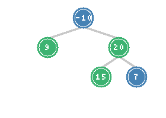

# Binary Tree Maximum Path Sum

> **Finding optimal paths in trees with negative values**

This is one of the most challenging tree problems frequently asked in interviews. It requires careful handling of negative values, understanding what constitutes a valid path, and using DFS with global state tracking.

---

## Problem Statement

A **path** in a binary tree is a sequence of nodes where each pair of adjacent nodes in the sequence has an edge connecting them. A node can only appear in the sequence **at most once**. Note that the path does not need to pass through the root.

The **path sum** of a path is the sum of the node's values in the path.

Given the root of a binary tree, return the maximum path sum of any **non-empty** path.

**LeetCode Problem:** [124. Binary Tree Maximum Path Sum](https://leetcode.com/problems/binary-tree-maximum-path-sum/)

---

## Visualization



*In this tree, the maximum path sum is 9 + 20 + 15 = 42 (nodes highlighted in green)*

### Example Cases

```
Example 1:          Example 2:          Example 3:
    1                  -10                  -3
   / \                /    \
  2   3              9      20
                          /    \
                         15     7

Max: 6 (2->1->3)    Max: 42 (15->20->9)  Max: -3 (single node)
```

---

## Key Insight

### Two Types of Paths to Consider

For each node, we need to distinguish between:

1. **Path through this node (can bend)**: The path that includes both left and right subtrees
   - This could be the maximum path in the entire tree
   - Formula: `node.val + max_gain(left) + max_gain(right)`

2. **Path continuing upward (cannot bend)**: The maximum sum we can contribute to the parent
   - Can only include one child (left OR right), not both
   - Formula: `node.val + max(max_gain(left), max_gain(right))`

### Handling Negative Values

- If a subtree's gain is negative, we can choose not to include it (return 0 instead)
- This is why we use `max(0, gain)` when computing contributions
- A single node might be the maximum path if all other paths are more negative

---

## Solution

::: code-group
```python [Python]
def maxPathSum(root) -> int:
    max_sum = float('-inf')  # Global maximum path sum

    def max_gain(node):
        nonlocal max_sum

        if not node:
            return 0

        # Recursively get maximum gain from left and right subtrees
        # Use max(0, ...) to handle negative subtrees
        left_gain = max(0, max_gain(node.left))
        right_gain = max(0, max_gain(node.right))

        # Path sum through this node (potentially the answer)
        path_through_node = node.val + left_gain + right_gain

        # Update global maximum
        max_sum = max(max_sum, path_through_node)

        # Return maximum gain if continuing upward (can only go one direction)
        return node.val + max(left_gain, right_gain)

    max_gain(root)
    return max_sum
```
```java [Java]
private int maxSum = Integer.MIN_VALUE;

public int maxPathSum(TreeNode root) {
    maxSum = Integer.MIN_VALUE;
    maxGain(root);
    return maxSum;
}

private int maxGain(TreeNode node) {
    if (node == null) return 0;

    int leftGain = Math.max(0, maxGain(node.left));
    int rightGain = Math.max(0, maxGain(node.right));

    // Path through this node (potentially the answer)
    int pathThroughNode = node.val + leftGain + rightGain;
    maxSum = Math.max(maxSum, pathThroughNode);

    // Return max gain continuing upward (only one direction)
    return node.val + Math.max(leftGain, rightGain);
}
```
:::

::: info Complexity: Time O(n) · Space O(h)
- **Time:** O(n) because we visit each node exactly once, computing gains bottom-up
- **Space:** O(h) for recursion stack; global max_sum uses O(1) extra space
:::

---

## Step-by-Step Example

Consider the tree:
```
       -10
      /    \
     9      20
           /  \
          15   7
```

**Traversal (postorder-like, children before parent):**

1. **Node 9** (leaf):
   - left_gain = 0, right_gain = 0
   - path_through_node = 9 + 0 + 0 = 9
   - max_sum = max(-inf, 9) = 9
   - returns 9 (to parent)

2. **Node 15** (leaf):
   - left_gain = 0, right_gain = 0
   - path_through_node = 15
   - max_sum = max(9, 15) = 15
   - returns 15

3. **Node 7** (leaf):
   - path_through_node = 7
   - max_sum = max(15, 7) = 15
   - returns 7

4. **Node 20**:
   - left_gain = 15, right_gain = 7
   - path_through_node = 20 + 15 + 7 = 42
   - max_sum = max(15, 42) = **42**
   - returns 20 + max(15, 7) = 35

5. **Node -10** (root):
   - left_gain = max(0, 9) = 9
   - right_gain = max(0, 35) = 35
   - path_through_node = -10 + 9 + 35 = 34
   - max_sum = max(42, 34) = 42
   - returns -10 + 35 = 25

**Final answer: 42**

---

## Alternative: Without Global Variable

```python
def maxPathSum_no_global(root) -> int:
    def dfs(node):
        """Returns (max_path_sum_in_subtree, max_gain_continuing_up)"""
        if not node:
            return float('-inf'), 0

        left_max, left_gain = dfs(node.left)
        right_max, right_gain = dfs(node.right)

        # Don't take negative gains
        left_gain = max(0, left_gain)
        right_gain = max(0, right_gain)

        # Path through this node
        path_through = node.val + left_gain + right_gain

        # Maximum in this subtree
        subtree_max = max(left_max, right_max, path_through)

        # Gain if continuing upward
        continuing_gain = node.val + max(left_gain, right_gain)

        return subtree_max, continuing_gain

    return dfs(root)[0]
```

::: info Complexity: Time O(n) · Space O(h)
- **Time:** O(n) because each node is visited once; tuple return propagates both values
- **Space:** O(h) for recursion stack; no global variable needed
:::

---

## Common Mistakes

### 1. Forgetting to Handle Negative Subtrees

```python
# WRONG: Doesn't handle negative subtrees
def max_gain_wrong(node):
    if not node:
        return 0
    left_gain = max_gain_wrong(node.left)
    right_gain = max_gain_wrong(node.right)
    return node.val + max(left_gain, right_gain)

# CORRECT: Use max(0, ...) to optionally exclude negative subtrees
left_gain = max(0, max_gain(node.left))
```

### 2. Returning Path Through Node Instead of Single Direction

```python
# WRONG: Path through node can't be returned upward
return node.val + left_gain + right_gain  # Wrong!

# CORRECT: Only one direction when continuing up
return node.val + max(left_gain, right_gain)
```

### 3. Initializing max_sum to 0

```python
# WRONG: All nodes could be negative
max_sum = 0

# CORRECT: Initialize to negative infinity
max_sum = float('-inf')
```

### 4. Not Considering Single Node as Valid Path

The problem states the path must be non-empty, so a single node is always valid:
- Even if all values are negative, the answer is the maximum single node value
- Our algorithm handles this because `path_through_node = node.val + 0 + 0 = node.val` when both subtrees are negative

---

## Complexity Analysis

- **Time:** O(n) - visit each node exactly once
- **Space:** O(h) - recursion stack depth, where h is the height of the tree
  - O(log n) for balanced trees
  - O(n) for skewed trees

---

## Related Problems

::: details Diameter of Binary Tree (LeetCode 543)
**Problem:** Find the length of the longest path between any two nodes in a tree. The path length is the number of edges.

**Key Insight:** Same pattern as max path sum, but count edges instead of summing values. Diameter through node = left_height + right_height.

**Approach:** DFS returning height. At each node, update global diameter with left_height + right_height. Return 1 + max(left_height, right_height).

**Complexity:** Time O(n), Space O(h)

```python
def diameterOfBinaryTree(root) -> int:
    diameter = 0

    def height(node):
        nonlocal diameter
        if not node:
            return 0

        left_h = height(node.left)
        right_h = height(node.right)

        # Update diameter (edges = left_h + right_h)
        diameter = max(diameter, left_h + right_h)

        return 1 + max(left_h, right_h)

    height(root)
    return diameter
```

::: info Complexity: Time O(n) · Space O(h)
- **Time:** O(n) because we visit each node once computing heights bottom-up
- **Space:** O(h) for recursion stack depth
:::
:::

::: details Longest Univalue Path (LeetCode 687)
**Problem:** Find the longest path where all nodes have the same value. Length is measured in edges.

**Key Insight:** Extend path only when child value matches current node value. Use same DFS with global state pattern.

**Approach:** DFS returning path length that can extend upward. Only extend if values match. Update global longest with path through current node.

**Complexity:** Time O(n), Space O(h)

```python
def longestUnivaluePath(root) -> int:
    longest = 0

    def dfs(node):
        nonlocal longest
        if not node:
            return 0

        left = dfs(node.left)
        right = dfs(node.right)

        # Extend path only if values match
        left_path = left + 1 if node.left and node.left.val == node.val else 0
        right_path = right + 1 if node.right and node.right.val == node.val else 0

        # Update longest (path through this node)
        longest = max(longest, left_path + right_path)

        # Return single direction
        return max(left_path, right_path)

    dfs(root)
    return longest
```

::: info Complexity: Time O(n) · Space O(h)
- **Time:** O(n) because each node is visited once with O(1) value comparisons
- **Space:** O(h) for recursion stack depth
:::
:::

---

## Pattern: DFS with Global State

This problem exemplifies a common pattern:

```python
def tree_optimization_problem(root):
    global_optimum = initial_value

    def dfs(node):
        nonlocal global_optimum

        if not node:
            return base_value

        left_result = dfs(node.left)
        right_result = dfs(node.right)

        # Compute value through this node (using both subtrees)
        value_through_node = combine(node.val, left_result, right_result)

        # Update global optimum
        global_optimum = optimize(global_optimum, value_through_node)

        # Return value for parent (using at most one subtree)
        return extend(node.val, left_result, right_result)

    dfs(root)
    return global_optimum
```

---

## Interview Applications

### Common Variations

1. **Return the actual path**: Track nodes that form the maximum path
2. **K maximum paths**: Find top k path sums
3. **Path with constraints**: Maximum path sum where length <= k
4. **Negative weight edges**: Similar problem on graphs

### Follow-up Questions

| Question | Approach |
|----------|----------|
| What if we need the actual path nodes? | Track path during DFS, update when max changes |
| What if there are millions of nodes? | Consider iterative approach with explicit stack |
| What about N-ary trees? | Extend to consider all children, take top 2 for "through node" |
| What if path must include root? | Simpler: just compute max of (left path + root + right path) |

### Interview Tips

1. **Clarify path definition**: Can it be a single node? Does it need to go through root?
2. **Handle negatives explicitly**: State that you're using max(0, gain) to handle negative subtrees
3. **Distinguish two cases**: Make clear the difference between "path through node" and "path continuing up"
4. **Trace through example**: Walk through a small tree to demonstrate your algorithm

---

## Summary

| Aspect | Details |
|--------|---------|
| **Difficulty** | Hard |
| **Pattern** | DFS with global state tracking |
| **Key Insight** | Distinguish between path through node vs. path continuing up |
| **Time Complexity** | O(n) |
| **Space Complexity** | O(h) |
| **Common Mistake** | Forgetting max(0, gain) for negative subtrees |

---

## References

- [Binary Tree Maximum Path Sum - LeetCode](https://leetcode.com/problems/binary-tree-maximum-path-sum/)
- [124. Maximum Path Sum - In-Depth Explanation](https://algo.monster/liteproblems/124)
- [Diameter of Binary Tree - LeetCode](https://leetcode.com/problems/diameter-of-binary-tree/)
- [Longest Univalue Path - LeetCode](https://leetcode.com/problems/longest-univalue-path/)
