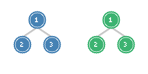
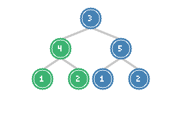
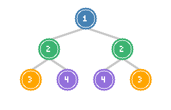
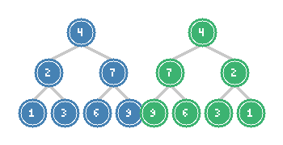

# Same Tree, Subtree, Symmetric Tree & Invert Binary Tree

> **Tree comparison and transformation problems**

These four classic tree problems share a common pattern: comparing tree structures or transforming trees using recursive DFS traversal. Mastering these foundational problems builds intuition for more complex tree manipulation tasks.

---

## Same Tree

### Problem Statement

Given the roots of two binary trees `p` and `q`, write a function to check if they are the same or not. Two binary trees are considered the same if they are structurally identical, and the nodes have the same value.

**LeetCode Problem:** [100. Same Tree](https://leetcode.com/problems/same-tree/)

### Visualization



*Two identical trees: Both have root 1 with left child 2 and right child 3*

### Key Insight

Two trees are the same if and only if:
1. Both roots are null (base case - empty trees are identical)
2. Both roots have the same value AND their left subtrees are the same AND their right subtrees are the same

This naturally leads to a recursive solution where we check the current nodes and delegate subtree comparison to recursive calls.

### Solution

::: code-group
```python [Python]
def isSameTree(p, q) -> bool:
    # Base case: both are null
    if not p and not q:
        return True

    # One is null, the other is not
    if not p or not q:
        return False

    # Both exist: check value and recursively check subtrees
    return (p.val == q.val and
            isSameTree(p.left, q.left) and
            isSameTree(p.right, q.right))
```
```java [Java]
public boolean isSameTree(TreeNode p, TreeNode q) {
    // Base case: both are null
    if (p == null && q == null) return true;

    // One is null, the other is not
    if (p == null || q == null) return false;

    // Both exist: check value and recursively check subtrees
    return p.val == q.val
        && isSameTree(p.left, q.left)
        && isSameTree(p.right, q.right);
}
```
:::

::: info Complexity: Time O(n) · Space O(h)
- **Time:** O(n) where n is the minimum number of nodes in either tree; we compare nodes in parallel
- **Space:** O(h) for recursion stack where h is the minimum height of the two trees
:::

### Iterative Solution with Stack

```python
def isSameTree_iterative(p, q) -> bool:
    stack = [(p, q)]

    while stack:
        node1, node2 = stack.pop()

        # Both null - continue
        if not node1 and not node2:
            continue

        # One null or values differ
        if not node1 or not node2 or node1.val != node2.val:
            return False

        # Push children pairs
        stack.append((node1.left, node2.left))
        stack.append((node1.right, node2.right))

    return True
```

::: info Complexity: Time O(n) · Space O(h)
- **Time:** O(n) because we compare corresponding node pairs until mismatch or completion
- **Space:** O(h) for the stack storing node pairs; at most h pairs on stack at once
:::

### Complexity

- **Time:** O(n) - visit each node at most once
- **Space:** O(h) - recursion stack depth, where h is tree height

---

## Subtree of Another Tree

### Problem Statement

Given the roots of two binary trees `root` and `subRoot`, return `true` if there is a subtree of `root` with the same structure and node values of `subRoot` and `false` otherwise.

**LeetCode Problem:** [572. Subtree of Another Tree](https://leetcode.com/problems/subtree-of-another-tree/)

### Visualization



*The green subtree (rooted at 4) matches the pattern we're looking for*

### Key Insight

A tree is a subtree if either:
1. The current tree is identical to the subtree (use Same Tree check)
2. The subtree exists within the left or right subtree of the current tree

This combines the Same Tree problem with a tree traversal to find potential matching starting points.

### Solution

::: code-group
```python [Python]
def isSubtree(root, subRoot) -> bool:
    def isSameTree(p, q):
        if not p and not q:
            return True
        if not p or not q:
            return False
        return (p.val == q.val and
                isSameTree(p.left, q.left) and
                isSameTree(p.right, q.right))

    def dfs(node):
        if not node:
            return False

        # Check if current subtree matches
        if isSameTree(node, subRoot):
            return True

        # Check left and right subtrees
        return dfs(node.left) or dfs(node.right)

    return dfs(root)
```
```java [Java]
public boolean isSubtree(TreeNode root, TreeNode subRoot) {
    if (root == null) return false;

    if (isSameTree(root, subRoot)) return true;

    return isSubtree(root.left, subRoot) || isSubtree(root.right, subRoot);
}

private boolean isSameTree(TreeNode p, TreeNode q) {
    if (p == null && q == null) return true;
    if (p == null || q == null) return false;
    return p.val == q.val
        && isSameTree(p.left, q.left)
        && isSameTree(p.right, q.right);
}
```
:::

::: info Complexity: Time O(m * n) · Space O(max(h1, h2))
- **Time:** O(m * n) worst case where m is nodes in root, n in subRoot; we may call isSameTree (O(n)) for each node (O(m))
- **Space:** O(max(h1, h2)) for recursion stack combining outer DFS and inner isSameTree
:::

### Optimized Solution with String Serialization

```python
def isSubtree_optimized(root, subRoot) -> bool:
    def serialize(node):
        if not node:
            return "#"
        return f"^{node.val},{serialize(node.left)},{serialize(node.right)}"

    root_str = serialize(root)
    sub_str = serialize(subRoot)

    return sub_str in root_str
```

::: info Complexity: Time O(m + n) · Space O(m + n)
- **Time:** O(m + n) for serialization, then O(m + n) for substring search (with KMP/Rabin-Karp)
- **Space:** O(m + n) for storing the serialized strings of both trees
:::

**Note:** The `^` prefix prevents false matches like `12` containing `2`.

### Complexity

- **Time:** O(m * n) where m and n are node counts (naive), O(m + n) for string serialization
- **Space:** O(max(h1, h2)) for recursion, O(m + n) for string serialization

---

## Symmetric Tree

### Problem Statement

Given the root of a binary tree, check whether it is a mirror of itself (i.e., symmetric around its center).

**LeetCode Problem:** [101. Symmetric Tree](https://leetcode.com/problems/symmetric-tree/)

### Visualization



*A symmetric tree: mirror image around the center vertical axis*

### Key Insight

A tree is symmetric if the left subtree is a mirror reflection of the right subtree. Two trees are mirror reflections if:
1. Both roots are null (base case)
2. Both roots have the same value AND left-of-left mirrors right-of-right AND right-of-left mirrors left-of-right

### Solution

::: code-group
```python [Python]
def isSymmetric(root) -> bool:
    def isMirror(left, right):
        # Base case: both null
        if not left and not right:
            return True

        # One is null, the other is not
        if not left or not right:
            return False

        # Check value and mirror property of children
        return (left.val == right.val and
                isMirror(left.left, right.right) and
                isMirror(left.right, right.left))

    if not root:
        return True

    return isMirror(root.left, root.right)
```
```java [Java]
public boolean isSymmetric(TreeNode root) {
    if (root == null) return true;
    return isMirror(root.left, root.right);
}

private boolean isMirror(TreeNode left, TreeNode right) {
    if (left == null && right == null) return true;
    if (left == null || right == null) return false;
    return left.val == right.val
        && isMirror(left.left, right.right)
        && isMirror(left.right, right.left);
}
```
:::

::: info Complexity: Time O(n) · Space O(h)
- **Time:** O(n) because we compare each node pair once, checking mirror relationships
- **Space:** O(h) for recursion stack; we traverse both halves simultaneously at each depth
:::

### Iterative BFS Solution

```python
from collections import deque

def isSymmetric_bfs(root) -> bool:
    if not root:
        return True

    queue = deque([(root.left, root.right)])

    while queue:
        left, right = queue.popleft()

        if not left and not right:
            continue

        if not left or not right or left.val != right.val:
            return False

        # Enqueue mirrored pairs
        queue.append((left.left, right.right))
        queue.append((left.right, right.left))

    return True
```

::: info Complexity: Time O(n) · Space O(w)
- **Time:** O(n) because we process each node pair once level by level
- **Space:** O(w) where w is maximum tree width; queue stores node pairs at current level
:::

### Complexity

- **Time:** O(n) - visit each node once
- **Space:** O(h) for recursion, O(w) for BFS where w is max width

---

## Invert Binary Tree

### Problem Statement

Given the root of a binary tree, invert the tree, and return its root. Inverting a binary tree means swapping the left and right children of every node.

**LeetCode Problem:** [226. Invert Binary Tree](https://leetcode.com/problems/invert-binary-tree/)

### Visualization



*Original tree (left) and inverted tree (right): children are swapped at every level*

### Key Insight

To invert a tree:
1. Swap the left and right children of the current node
2. Recursively invert the left subtree
3. Recursively invert the right subtree

The order of these operations doesn't matter for DFS, but understanding the transformation is key.

### Solution

::: code-group
```python [Python]
def invertTree(root):
    if not root:
        return None

    # Swap left and right children
    root.left, root.right = root.right, root.left

    # Recursively invert subtrees
    invertTree(root.left)
    invertTree(root.right)

    return root
```
```java [Java]
public TreeNode invertTree(TreeNode root) {
    if (root == null) return null;

    // Swap left and right children
    TreeNode tmp = root.left;
    root.left = root.right;
    root.right = tmp;

    // Recursively invert subtrees
    invertTree(root.left);
    invertTree(root.right);

    return root;
}
```
:::

::: info Complexity: Time O(n) · Space O(h)
- **Time:** O(n) because we visit and swap children at each node exactly once
- **Space:** O(h) for recursion stack; swap operation is O(1) per node
:::

### Alternative: Swap After Recursion

```python
def invertTree_postorder(root):
    if not root:
        return None

    # Invert subtrees first
    left = invertTree_postorder(root.left)
    right = invertTree_postorder(root.right)

    # Then swap
    root.left = right
    root.right = left

    return root
```

::: info Complexity: Time O(n) · Space O(h)
- **Time:** O(n) because each node is visited once; postorder processes children before swap
- **Space:** O(h) for recursion stack depth
:::

### Iterative BFS Solution

```python
from collections import deque

def invertTree_bfs(root):
    if not root:
        return None

    queue = deque([root])

    while queue:
        node = queue.popleft()

        # Swap children
        node.left, node.right = node.right, node.left

        # Add children to queue
        if node.left:
            queue.append(node.left)
        if node.right:
            queue.append(node.right)

    return root
```

::: info Complexity: Time O(n) · Space O(w)
- **Time:** O(n) because each node is dequeued and processed exactly once
- **Space:** O(w) where w is maximum width; at most one level of nodes in queue at a time
:::

### Complexity

- **Time:** O(n) - visit each node once
- **Space:** O(h) for recursion, O(w) for BFS

---

## Pattern Recognition

### Common Thread

All four problems share the "dual traversal" pattern - comparing or operating on corresponding nodes from two trees (or two subtrees of the same tree).

| Problem | Comparison Type | Key Check |
|---------|----------------|-----------|
| Same Tree | Direct comparison | p.val == q.val AND left matches left AND right matches right |
| Subtree | Contains comparison | Any node in root matches subRoot completely |
| Symmetric | Mirror comparison | left.val == right.val AND outer matches outer AND inner matches inner |
| Invert | Transformation | Swap left and right at every node |

### Template for Tree Comparison

```python
def compare_trees(tree1, tree2):
    # Base case: both null
    if not tree1 and not tree2:
        return True  # or appropriate base value

    # Base case: exactly one null
    if not tree1 or not tree2:
        return False  # or appropriate mismatch value

    # Compare current nodes and recurse
    return (current_node_check(tree1, tree2) and
            compare_trees(tree1.child1, tree2.child1) and
            compare_trees(tree1.child2, tree2.child2))
```

---

## Interview Applications

### Common Variations

1. **Same Tree with threshold**: Check if two trees are "approximately" the same (values within epsilon)
2. **Subtree with wildcards**: Subtree matching where certain nodes can match any value
3. **Symmetric with relaxed constraints**: Tree is symmetric ignoring leaf values
4. **Partial inversion**: Invert only nodes at certain depths or with certain values

### Follow-up Questions

| Problem | Follow-up |
|---------|-----------|
| Same Tree | What if the tree is stored in a database? How to compare efficiently? |
| Subtree | How to find ALL occurrences of the subtree pattern? |
| Symmetric | How to make a non-symmetric tree symmetric with minimum changes? |
| Invert | What if we want to invert only the left half of the tree? |

### Interview Tips

1. **Clarify the definition**: For Same Tree, ask about value types (integers? strings?)
2. **Discuss iterative vs recursive**: Show awareness of stack overflow for deep trees
3. **Consider serialization**: For Subtree, mention the string matching optimization
4. **Edge cases**: Always mention empty trees, single nodes, and skewed trees

---

## Summary Table

| Problem | Difficulty | Pattern | Time | Space |
|---------|-----------|---------|------|-------|
| Same Tree | Easy | Dual DFS | O(n) | O(h) |
| Subtree of Another Tree | Easy | DFS + Same Tree | O(m*n) | O(h) |
| Symmetric Tree | Easy | Mirror DFS | O(n) | O(h) |
| Invert Binary Tree | Easy | DFS Transform | O(n) | O(h) |

---

## References

- [Same Tree - LeetCode](https://leetcode.com/problems/same-tree/)
- [Subtree of Another Tree - LeetCode](https://leetcode.com/problems/subtree-of-another-tree/)
- [Symmetric Tree - LeetCode](https://leetcode.com/problems/symmetric-tree/)
- [Invert Binary Tree - LeetCode](https://leetcode.com/problems/invert-binary-tree/)
- [100. Same Tree - In-Depth Explanation](https://algo.monster/liteproblems/100)
- [572. Subtree of Another Tree - In-Depth Explanation](https://algo.monster/liteproblems/572)
- [101. Symmetric Tree - In-Depth Explanation](https://algo.monster/liteproblems/101)
- [226. Invert Binary Tree - In-Depth Explanation](https://algo.monster/liteproblems/226)
